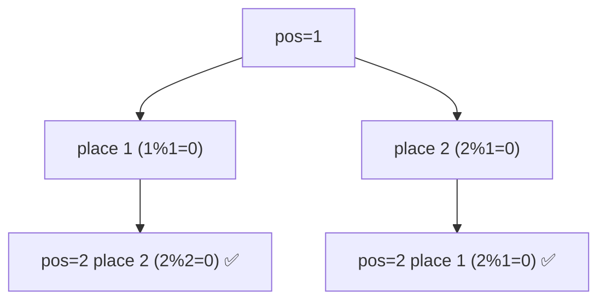

# Beautiful Arrangement

> Count permutations satisfying a divisibility rule. LC 526 · 🟡 Medium

## Problem
Count permutations `perm` of `1…n` such that for every position `i` (1-indexed), either `perm[i] % i == 0` or `i % perm[i] == 0`. For `n=2`: 2 arrangements (`[1,2]`, `[2,1]`).

## 🧮 Math / Recurrence
Backtrack position by position, placing only values that satisfy the divisibility test:

$$
\text{dfs}(pos) = \begin{cases}
1 & pos > n \\
\displaystyle\sum_{\substack{v:\ \neg used_v \\ v\,\%\,pos = 0\ \vee\ pos\,\%\,v = 0}} \text{dfs}(pos+1) & pos \le n
\end{cases}
$$

## 🧠 Logic
Build the arrangement left to right. At position `pos`, only try unused values `v` that are "compatible" (`v % pos == 0` or `pos % v == 0`). The divisibility test prunes most branches early, so far fewer than `n!` nodes are explored. Counting bottoms out when all `n` positions are filled.

> Filling from the **high** end (large `pos` first) prunes even harder, since large positions have fewer divisors.

## 🔢 Iteration trace (`n=2`)

Count = 2.

## 🐍 Python
```python
def count_arrangement(n: int) -> int:
    used = [False] * (n + 1)

    def dfs(pos: int) -> int:
        if pos > n:
            return 1
        total = 0
        for v in range(1, n + 1):
            if not used[v] and (v % pos == 0 or pos % v == 0):
                used[v] = True
                total += dfs(pos + 1)
                used[v] = False
        return total

    return dfs(1)


if __name__ == "__main__":
    print(count_arrangement(2))   # 2
```

## ⚙️ C++
```cpp
#include <iostream>
#include <vector>
using namespace std;

int dfs(int pos, int n, vector<bool>& used) {
    if (pos > n) return 1;
    int total = 0;
    for (int v = 1; v <= n; ++v) {
        if (!used[v] && (v % pos == 0 || pos % v == 0)) {
            used[v] = true;
            total += dfs(pos + 1, n, used);
            used[v] = false;
        }
    }
    return total;
}

int countArrangement(int n) {
    vector<bool> used(n + 1, false);
    return dfs(1, n, used);
}

int main() {
    cout << countArrangement(2) << "\n";   // 2
}
```

## ⏱️ Complexity
- **Time:** `O(k)` where `k` ≪ `n!` is the number of valid prefixes explored (pruning is strong).
- **Space:** `O(n)` recursion depth + `used` array.
