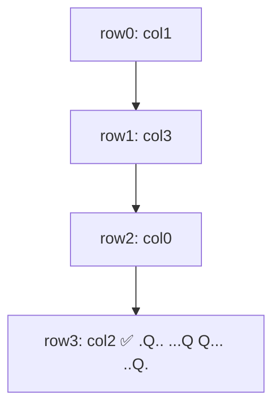

# N-Queens

> Place `n` non-attacking queens on an `n×n` board. LC 51 · 🔴 Hard

## Problem
Place `n` queens on an `n×n` chessboard so that no two attack each other (no shared row, column, or diagonal). Return all distinct board configurations.

## 🧮 Math / Recurrence
Place exactly one queen per row. A queen at `(r, c)` is safe iff its column and both diagonals are free:

$$
\text{safe}(r,c) \iff c \notin \text{cols} \ \wedge\ (r-c) \notin d_1 \ \wedge\ (r+c) \notin d_2
$$

The two diagonal keys are constant along a diagonal: `r−c` for ↘ and `r+c` for ↙.

## 🧠 Logic
Row-by-row placement removes the row conflict automatically. For columns and diagonals, keep three sets and test membership in `O(1)`. On placing a queen, add its keys; on backtracking, remove them. The diagonal identities `r−c` and `r+c` are the clever part — they turn an `O(n)` diagonal scan into an `O(1)` lookup.

## 🔢 Iteration trace (`n=4`, first solution)

`n=4` has 2 solutions: `.Q.. / ...Q / Q... / ..Q.` and its mirror.

## 🐍 Python
```python
def solve_n_queens(n: int) -> list[list[str]]:
    res = []
    cols, d1, d2 = set(), set(), set()
    board = [["."] * n for _ in range(n)]

    def dfs(r: int) -> None:
        if r == n:
            res.append(["".join(row) for row in board])
            return
        for c in range(n):
            if c in cols or (r - c) in d1 or (r + c) in d2:
                continue                         # prune attacked cell
            cols.add(c); d1.add(r - c); d2.add(r + c); board[r][c] = "Q"
            dfs(r + 1)
            cols.discard(c); d1.discard(r - c); d2.discard(r + c); board[r][c] = "."

    dfs(0)
    return res


if __name__ == "__main__":
    for sol in solve_n_queens(4):
        print("\n".join(sol), "\n")
```

## ⚙️ C++
```cpp
#include <iostream>
#include <set>
#include <string>
#include <vector>
using namespace std;

void dfs(int r, int n, vector<string>& board,
         set<int>& cols, set<int>& d1, set<int>& d2,
         vector<vector<string>>& res) {
    if (r == n) { res.push_back(board); return; }
    for (int c = 0; c < n; ++c) {
        if (cols.count(c) || d1.count(r - c) || d2.count(r + c)) continue;
        cols.insert(c); d1.insert(r - c); d2.insert(r + c); board[r][c] = 'Q';
        dfs(r + 1, n, board, cols, d1, d2, res);
        cols.erase(c); d1.erase(r - c); d2.erase(r + c); board[r][c] = '.';
    }
}

vector<vector<string>> solveNQueens(int n) {
    vector<vector<string>> res;
    vector<string> board(n, string(n, '.'));
    set<int> cols, d1, d2;
    dfs(0, n, board, cols, d1, d2, res);
    return res;
}

int main() {
    cout << solveNQueens(4).size() << " solutions\n";   // 2
}
```

## ⏱️ Complexity
- **Time:** `O(n!)` upper bound (heavy pruning makes it far less in practice).
- **Space:** `O(n)` for the sets and recursion.
