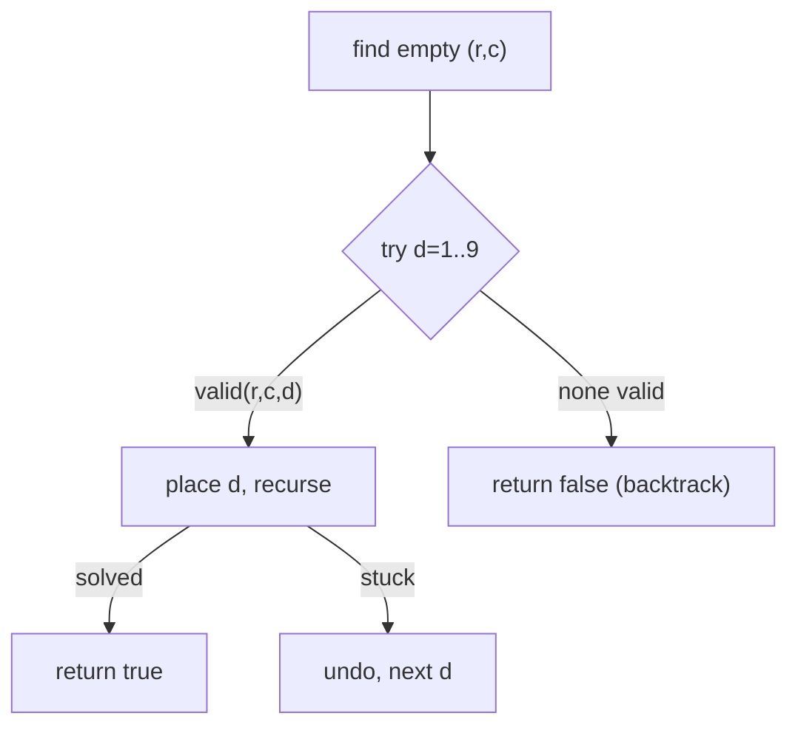

# Sudoku Solver

> Fill a 9×9 grid by constraint backtracking. LC 37 · 🔴 Hard

## Problem
Fill the empty cells (`.`) of a partially completed 9×9 Sudoku so that every row, column, and 3×3 box contains the digits `1–9` exactly once. A unique solution is guaranteed.

## 🧮 Math / Recurrence
Find the next empty cell `(r,c)`; try each digit `d` that is valid there, recurse, and undo on failure:

$$
\text{solve}() = \begin{cases}
\text{true} & \text{no empty cell} \\
\exists\, d \in \{1..9\}\ \text{valid}(r,c,d):\ \text{place } d,\ \text{solve}() & \text{otherwise}
\end{cases}
$$

`valid(r,c,d)` checks the row, column, and the `3×3` box `(3⌊r/3⌋, 3⌊c/3⌋)`.

## 🧠 Logic
This is pure constraint backtracking: the three Sudoku rules **are** the pruning. We place a digit only if it doesn't already appear in its row, column, or box; if a later cell gets stuck, we backtrack and try the next digit. Returning `true` up the stack short-circuits once the board is full.

## 🔢 Iteration trace (a single empty cell)


## 🐍 Python
```python
def solve_sudoku(board: list[list[str]]) -> None:
    def valid(r: int, c: int, d: str) -> bool:
        b = (r // 3) * 3, (c // 3) * 3
        for i in range(9):
            if board[r][i] == d or board[i][c] == d:
                return False
            if board[b[0] + i // 3][b[1] + i % 3] == d:
                return False
        return True

    def solve() -> bool:
        for r in range(9):
            for c in range(9):
                if board[r][c] == ".":
                    for d in "123456789":
                        if valid(r, c, d):
                            board[r][c] = d
                            if solve():
                                return True
                            board[r][c] = "."   # backtrack
                    return False
        return True

    solve()
```

## ⚙️ C++
```cpp
#include <vector>
using namespace std;

bool valid(vector<vector<char>>& b, int r, int c, char d) {
    int br = (r / 3) * 3, bc = (c / 3) * 3;
    for (int i = 0; i < 9; ++i) {
        if (b[r][i] == d || b[i][c] == d) return false;
        if (b[br + i / 3][bc + i % 3] == d) return false;
    }
    return true;
}

bool solve(vector<vector<char>>& b) {
    for (int r = 0; r < 9; ++r)
        for (int c = 0; c < 9; ++c)
            if (b[r][c] == '.') {
                for (char d = '1'; d <= '9'; ++d)
                    if (valid(b, r, c, d)) {
                        b[r][c] = d;
                        if (solve(b)) return true;
                        b[r][c] = '.';          // backtrack
                    }
                return false;
            }
    return true;
}

void solveSudoku(vector<vector<char>>& board) { solve(board); }
```

## ⏱️ Complexity
- **Time:** exponential worst case `O(9^(empty cells))`, but constraint pruning makes real puzzles fast.
- **Space:** `O(1)` extra (recursion up to 81 deep).

> Optimization: track row/col/box usage with bitmasks and always fill the most-constrained cell first.
