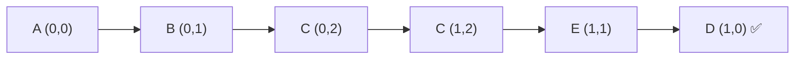

# Word Search

> Find a word by DFS on a grid. LC 79 · 🟡 Medium

## Problem
Given a 2D board of characters and a `word`, return `true` if the word exists as a path of horizontally/vertically adjacent cells, each cell used at most once. E.g. find `"ABCCED"` in a letter grid.

## 🧮 Math / Recurrence
DFS from each cell, matching one character per step:

$$
\text{dfs}(r,c,i) = \begin{cases}
\text{true} & i = |word| \\
\text{false} & \text{out of bounds} \vee board_{r,c} \neq word_i \\
\bigvee_{(dr,dc)} \text{dfs}(r{+}dr,\ c{+}dc,\ i{+}1) & \text{otherwise}
\end{cases}
$$

## 🧠 Logic
Treat each cell as a possible start of the word. Match `word[i]` against the current cell, then branch into the 4 neighbors for `word[i+1]`. **Mark** the cell visited (e.g. temporarily blank it) before recursing so the same cell isn't reused in this path, and **unmark** on return so other paths can use it. Success short-circuits up the stack.

## 🔢 Iteration trace (`"ABCCED"`)

Each step moves to an adjacent unvisited cell matching the next letter.

## 🐍 Python
```python
def exist(board: list[list[str]], word: str) -> bool:
    rows, cols = len(board), len(board[0])

    def dfs(r: int, c: int, i: int) -> bool:
        if i == len(word):
            return True
        if r < 0 or r >= rows or c < 0 or c >= cols or board[r][c] != word[i]:
            return False
        board[r][c], tmp = "#", board[r][c]      # mark visited
        found = (dfs(r + 1, c, i + 1) or dfs(r - 1, c, i + 1) or
                 dfs(r, c + 1, i + 1) or dfs(r, c - 1, i + 1))
        board[r][c] = tmp                        # unmark (backtrack)
        return found

    return any(dfs(r, c, 0) for r in range(rows) for c in range(cols))


if __name__ == "__main__":
    grid = [["A", "B", "C", "E"],
            ["S", "F", "C", "S"],
            ["A", "D", "E", "E"]]
    print(exist(grid, "ABCCED"))   # True
```

## ⚙️ C++
```cpp
#include <iostream>
#include <vector>
#include <string>
using namespace std;

bool dfs(vector<vector<char>>& b, const string& w, int r, int c, int i) {
    if (i == (int)w.size()) return true;
    if (r < 0 || r >= (int)b.size() || c < 0 || c >= (int)b[0].size() ||
        b[r][c] != w[i]) return false;
    char tmp = b[r][c]; b[r][c] = '#';           // mark
    bool found = dfs(b, w, r + 1, c, i + 1) || dfs(b, w, r - 1, c, i + 1) ||
                 dfs(b, w, r, c + 1, i + 1) || dfs(b, w, r, c - 1, i + 1);
    b[r][c] = tmp;                               // unmark
    return found;
}

bool exist(vector<vector<char>>& board, string word) {
    for (int r = 0; r < (int)board.size(); ++r)
        for (int c = 0; c < (int)board[0].size(); ++c)
            if (dfs(board, word, r, c, 0)) return true;
    return false;
}

int main() {
    vector<vector<char>> g = {{'A','B','C','E'},{'S','F','C','S'},{'A','D','E','E'}};
    cout << exist(g, "ABCCED") << "\n";          // 1
}
```

## ⏱️ Complexity
- **Time:** `O(m · n · 4^L)` where `L = |word|` (4 directions per step).
- **Space:** `O(L)` recursion depth.
