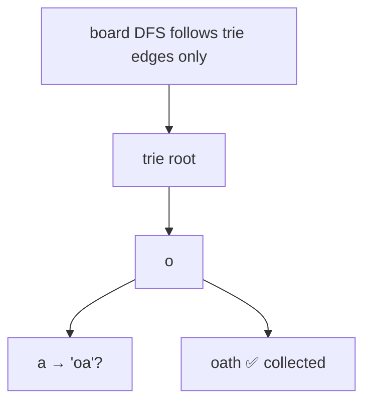

# Word Search II

> Match many words at once with a trie. LC 212 · 🔴 Hard

## Problem
Given a board and a list of `words`, return **all** words that appear on the board (same adjacency rule as [Word Search](29-word-search.md)). Doing a separate DFS per word is too slow when there are many words.

## 🧮 Math / Recurrence
Insert all words into a **trie**, then DFS the board following trie edges. At a cell, recurse only if the trie has a child for that letter:

$$
\text{dfs}(r,c,\text{node}) \to \text{node} = \text{node.child}[board_{r,c}],\quad \text{collect if node.word}
$$

## 🧠 Logic
A trie lets one board traversal test *all* words simultaneously. The trie prunes hard: if no word has the current prefix, the branch dies immediately. When a trie node marks the end of a word, record it (and null it out to avoid duplicates). Mark/unmark visited cells exactly as in single-word search.

## 🔢 Iteration trace

Only prefixes present in the trie are ever explored.

## 🐍 Python
```python
def find_words(board: list[list[str]], words: list[str]) -> list[str]:
    trie: dict = {}
    for w in words:                              # build trie
        node = trie
        for ch in w:
            node = node.setdefault(ch, {})
        node["$"] = w                            # store full word at end

    rows, cols, res = len(board), len(board[0]), []

    def dfs(r: int, c: int, node: dict) -> None:
        ch = board[r][c]
        if ch not in node:
            return
        nxt = node[ch]
        if "$" in nxt:
            res.append(nxt.pop("$"))             # collect once
        board[r][c] = "#"                        # mark
        for dr, dc in ((1, 0), (-1, 0), (0, 1), (0, -1)):
            nr, nc = r + dr, c + dc
            if 0 <= nr < rows and 0 <= nc < cols and board[nr][nc] != "#":
                dfs(nr, nc, nxt)
        board[r][c] = ch                         # unmark

    for r in range(rows):
        for c in range(cols):
            dfs(r, c, trie)
    return res


if __name__ == "__main__":
    g = [["o", "a", "a", "n"], ["e", "t", "a", "e"],
         ["i", "h", "k", "r"], ["i", "f", "l", "v"]]
    print(find_words(g, ["oath", "pea", "eat", "rain"]))   # ['oath', 'eat']
```

## ⚙️ C++
```cpp
#include <iostream>
#include <string>
#include <vector>
using namespace std;

struct Node { Node* ch[26] = {}; string word; };

void insert(Node* root, const string& w) {
    Node* cur = root;
    for (char c : w) {
        if (!cur->ch[c - 'a']) cur->ch[c - 'a'] = new Node();
        cur = cur->ch[c - 'a'];
    }
    cur->word = w;
}

void dfs(vector<vector<char>>& b, int r, int c, Node* node, vector<string>& res) {
    char ch = b[r][c];
    if (ch == '#' || !node->ch[ch - 'a']) return;
    node = node->ch[ch - 'a'];
    if (!node->word.empty()) { res.push_back(node->word); node->word.clear(); }
    b[r][c] = '#';
    int dr[] = {1, -1, 0, 0}, dc[] = {0, 0, 1, -1};
    for (int k = 0; k < 4; ++k) {
        int nr = r + dr[k], nc = c + dc[k];
        if (nr >= 0 && nr < (int)b.size() && nc >= 0 && nc < (int)b[0].size())
            dfs(b, nr, nc, node, res);
    }
    b[r][c] = ch;
}

vector<string> findWords(vector<vector<char>>& board, vector<string>& words) {
    Node* root = new Node();
    for (auto& w : words) insert(root, w);
    vector<string> res;
    for (int r = 0; r < (int)board.size(); ++r)
        for (int c = 0; c < (int)board[0].size(); ++c)
            dfs(board, r, c, root, res);
    return res;
}
```

## ⏱️ Complexity
- **Time:** `O(m · n · 4^L)` worst case, but the trie prunes most branches.
- **Space:** `O(total letters)` for the trie.
