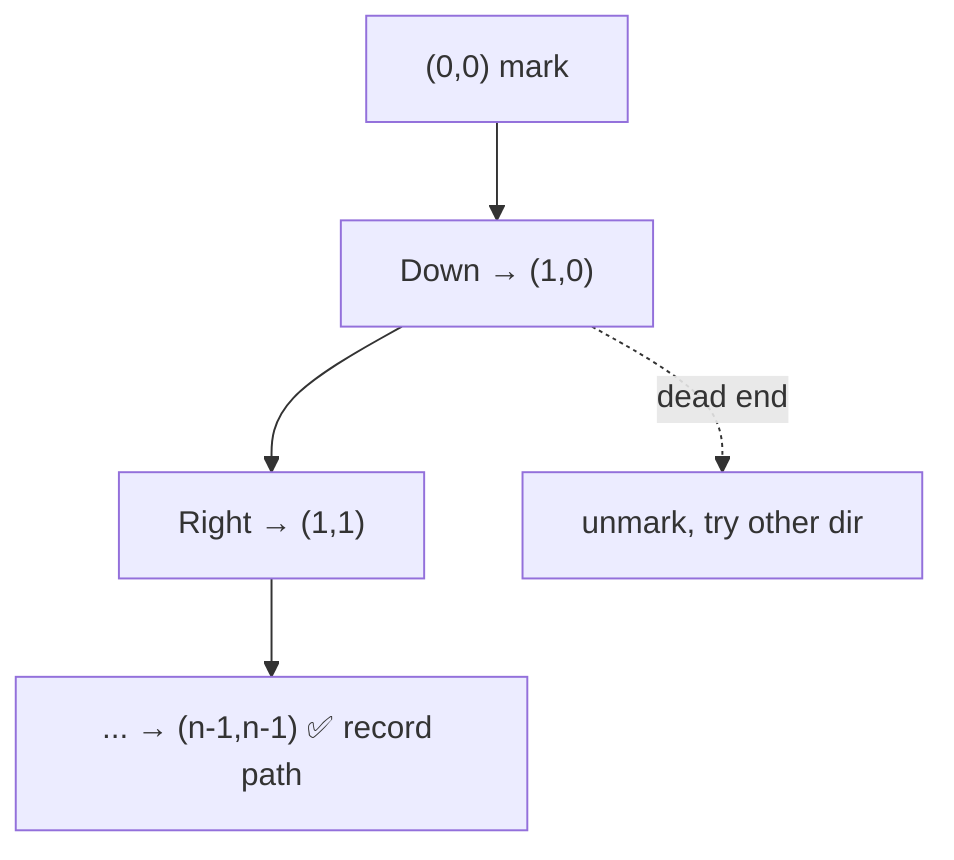

# Rat in a Maze

> Find paths from top-left to bottom-right. GFG · 🟡 Medium

## Problem
Given an `n×n` 0/1 maze (`1` = open, `0` = blocked), a rat starts at `(0,0)` and must reach `(n-1,n-1)` moving in allowed directions (commonly Down, Left, Right, Up). Return all paths as direction strings (e.g. `"DDRDRR"`).

## 🧮 Math / Recurrence
DFS marking the current cell on the path; recurse to the 4 neighbors, unmark on return:

$$
\text{dfs}(r,c,path) = \begin{cases}
\text{record } path & (r,c) = (n{-}1,n{-}1) \\
\bigcup_{(dir)} \text{dfs}(r{+}dr,\ c{+}dc,\ path{+}dir) & \text{if open \& unvisited}
\end{cases}
$$

## 🧠 Logic
Backtracking explores every route. Mark a cell `visited` before moving so the path never loops through it; unmark when retreating so other paths can reuse the cell. Try directions in a fixed order (D, L, R, U) to get lexicographically sorted output. A cell is usable only if in bounds, open (`==1`), and unvisited.

## 🔢 Iteration trace


## 🐍 Python
```python
def find_paths(maze: list[list[int]]) -> list[str]:
    n = len(maze)
    res = []
    if maze[0][0] == 0 or maze[n - 1][n - 1] == 0:
        return res
    visited = [[False] * n for _ in range(n)]
    moves = [("D", 1, 0), ("L", 0, -1), ("R", 0, 1), ("U", -1, 0)]

    def dfs(r: int, c: int, path: list[str]) -> None:
        if r == n - 1 and c == n - 1:
            res.append("".join(path))
            return
        visited[r][c] = True
        for ch, dr, dc in moves:
            nr, nc = r + dr, c + dc
            if 0 <= nr < n and 0 <= nc < n and not visited[nr][nc] and maze[nr][nc] == 1:
                path.append(ch)
                dfs(nr, nc, path)
                path.pop()
        visited[r][c] = False                # backtrack

    dfs(0, 0, [])
    return res


if __name__ == "__main__":
    maze = [[1, 0, 0, 0],
            [1, 1, 0, 1],
            [1, 1, 0, 0],
            [0, 1, 1, 1]]
    print(find_paths(maze))   # ['DDRDRR', 'DRDDRR']
```

## ⚙️ C++
```cpp
#include <iostream>
#include <string>
#include <vector>
using namespace std;

int n;
void dfs(vector<vector<int>>& maze, vector<vector<bool>>& vis,
         int r, int c, string& path, vector<string>& res) {
    if (r == n - 1 && c == n - 1) { res.push_back(path); return; }
    vis[r][c] = true;
    int dr[] = {1, 0, 0, -1}, dc[] = {0, -1, 1, 0};
    char ch[] = {'D', 'L', 'R', 'U'};
    for (int k = 0; k < 4; ++k) {
        int nr = r + dr[k], nc = c + dc[k];
        if (nr >= 0 && nr < n && nc >= 0 && nc < n && !vis[nr][nc] && maze[nr][nc] == 1) {
            path.push_back(ch[k]);
            dfs(maze, vis, nr, nc, path, res);
            path.pop_back();
        }
    }
    vis[r][c] = false;                       // backtrack
}

vector<string> findPaths(vector<vector<int>>& maze) {
    n = maze.size();
    vector<string> res;
    if (maze[0][0] == 0) return res;
    vector<vector<bool>> vis(n, vector<bool>(n, false));
    string path;
    dfs(maze, vis, 0, 0, path, res);
    return res;
}
```

## ⏱️ Complexity
- **Time:** `O(4^(n²))` worst case (exponential, paths through open cells).
- **Space:** `O(n²)` visited grid + recursion.
