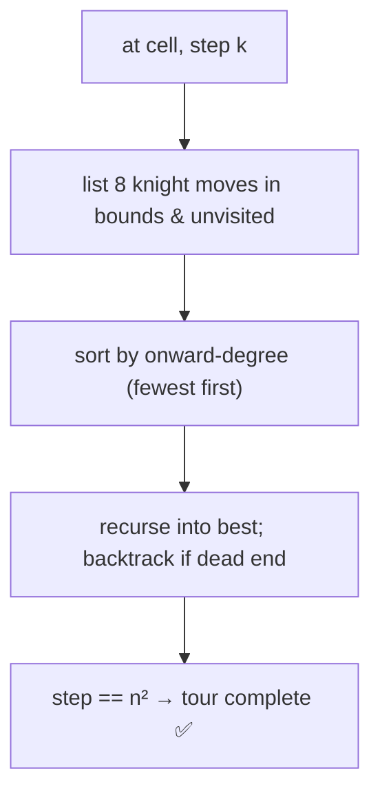

# Knight's Tour

> Visit every board cell once via knight moves. Classic · 🔴 Hard

## Problem
On an `n×n` board, find a sequence of knight moves starting from a given cell that visits **every** cell exactly once (an open tour). Return the move-order grid.

## 🧮 Math / Recurrence
DFS labeling cells with the visit order; backtrack when stuck:

$$
\text{dfs}(r,c,step) = \begin{cases}
\text{true} & step = n^2 \\
\exists\ \text{move}:\ \text{dfs}(nr,nc,step+1) & \text{otherwise}
\end{cases}
$$

A knight has up to **8** moves: `(±1,±2)` and `(±2,±1)`.

## 🧠 Logic
Pure backtracking is exponential, so use **Warnsdorff's heuristic**: from the current cell, always move next to the onward cell with the **fewest** future moves. This greedy ordering steers the knight toward corners early and finds a tour with almost no backtracking on typical board sizes.

## 🔢 Iteration trace (Warnsdorff ordering)


## 🐍 Python
```python
MOVES = [(1, 2), (2, 1), (2, -1), (1, -2),
         (-1, -2), (-2, -1), (-2, 1), (-1, 2)]


def knights_tour(n: int, sr: int = 0, sc: int = 0) -> list[list[int]] | None:
    board = [[-1] * n for _ in range(n)]
    board[sr][sc] = 0

    def degree(r: int, c: int) -> int:
        cnt = 0
        for dr, dc in MOVES:
            nr, nc = r + dr, c + dc
            if 0 <= nr < n and 0 <= nc < n and board[nr][nc] == -1:
                cnt += 1
        return cnt

    def dfs(r: int, c: int, step: int) -> bool:
        if step == n * n:
            return True
        nbrs = []
        for dr, dc in MOVES:
            nr, nc = r + dr, c + dc
            if 0 <= nr < n and 0 <= nc < n and board[nr][nc] == -1:
                nbrs.append((degree(nr, nc), nr, nc))
        nbrs.sort()                          # Warnsdorff: fewest onward first
        for _, nr, nc in nbrs:
            board[nr][nc] = step
            if dfs(nr, nc, step + 1):
                return True
            board[nr][nc] = -1               # backtrack
        return False

    return board if dfs(sr, sc, 1) else None


if __name__ == "__main__":
    tour = knights_tour(5)
    for row in tour:
        print(row)
```

## ⚙️ C++
```cpp
#include <algorithm>
#include <iostream>
#include <vector>
using namespace std;

int n;
int MR[] = {1, 2, 2, 1, -1, -2, -2, -1};
int MC[] = {2, 1, -1, -2, -2, -1, 1, 2};

int degree(vector<vector<int>>& b, int r, int c) {
    int cnt = 0;
    for (int k = 0; k < 8; ++k) {
        int nr = r + MR[k], nc = c + MC[k];
        if (nr >= 0 && nr < n && nc >= 0 && nc < n && b[nr][nc] == -1) ++cnt;
    }
    return cnt;
}

bool dfs(vector<vector<int>>& b, int r, int c, int step) {
    if (step == n * n) return true;
    vector<array<int, 3>> nbrs;
    for (int k = 0; k < 8; ++k) {
        int nr = r + MR[k], nc = c + MC[k];
        if (nr >= 0 && nr < n && nc >= 0 && nc < n && b[nr][nc] == -1)
            nbrs.push_back({degree(b, nr, nc), nr, nc});
    }
    sort(nbrs.begin(), nbrs.end());          // Warnsdorff
    for (auto& v : nbrs) {
        b[v[1]][v[2]] = step;
        if (dfs(b, v[1], v[2], step + 1)) return true;
        b[v[1]][v[2]] = -1;                  // backtrack
    }
    return false;
}

int main() {
    n = 5;
    vector<vector<int>> b(n, vector<int>(n, -1));
    b[0][0] = 0;
    if (dfs(b, 0, 0, 1))
        for (auto& row : b) { for (int x : row) cout << x << '\t'; cout << "\n"; }
}
```

## ⏱️ Complexity
- **Time:** `O(8^(n²))` worst case; Warnsdorff makes it near-linear in practice.
- **Space:** `O(n²)` board + recursion.
