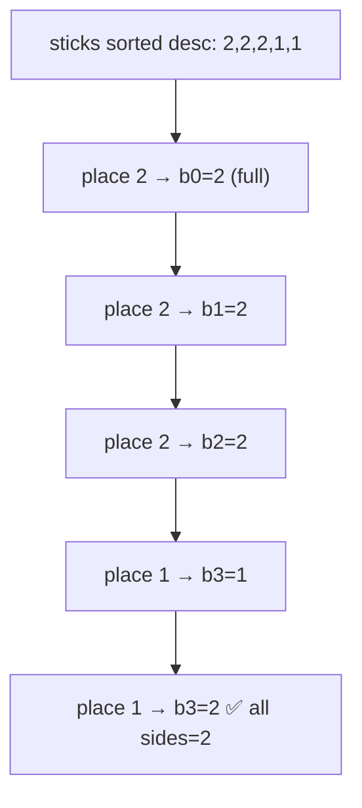

# Matchsticks to Square

> Partition sticks into 4 equal sides. LC 473 · 🟡 Medium

## Problem
Given an array of matchstick lengths, determine if you can use **all** of them (no breaking) to form a square — i.e. partition them into 4 groups of equal sum.

## 🧮 Math / Recurrence
Let `side = sum / 4`. Backtrack assigning each stick to one of 4 buckets without exceeding `side`:

$$
\text{dfs}(i,\ b_0,b_1,b_2,b_3) = \begin{cases}
\text{true} & i = n \ (\text{all buckets} = side) \\
\exists\, k:\ b_k + len_i \le side \ \wedge\ \text{dfs}(i+1, \dots b_k{+}len_i \dots) & \text{otherwise}
\end{cases}
$$

Feasible only if `sum % 4 == 0` and `max(stick) ≤ side`.

## 🧠 Logic
Each stick must land in exactly one of the four sides. Prune aggressively:
- **Sort descending** so big sticks (which constrain most) are placed first.
- **Skip equal buckets:** if two buckets currently have the same length, trying the stick in both is redundant — only try one.
- A bucket that would overflow `side` is rejected immediately.

## 🔢 Iteration trace (`[1,1,2,2,2], side=2`)


## 🐍 Python
```python
def makesquare(matchsticks: list[int]) -> bool:
    total = sum(matchsticks)
    if total % 4 != 0:
        return False
    side = total // 4
    matchsticks.sort(reverse=True)
    if matchsticks[0] > side:
        return False
    buckets = [0] * 4

    def dfs(i: int) -> bool:
        if i == len(matchsticks):
            return True                       # all sticks placed, sums equal
        for k in range(4):
            if buckets[k] + matchsticks[i] <= side:
                buckets[k] += matchsticks[i]
                if dfs(i + 1):
                    return True
                buckets[k] -= matchsticks[i]  # backtrack
            if buckets[k] == 0:               # skip symmetric empty buckets
                break
        return False

    return dfs(0)


if __name__ == "__main__":
    print(makesquare([1, 1, 2, 2, 2]))   # True
```

## ⚙️ C++
```cpp
#include <algorithm>
#include <iostream>
#include <numeric>
#include <vector>
using namespace std;

vector<int> sticks;
int side;
int buckets[4] = {0, 0, 0, 0};

bool dfs(int i) {
    if (i == (int)sticks.size()) return true;
    for (int k = 0; k < 4; ++k) {
        if (buckets[k] + sticks[i] <= side) {
            buckets[k] += sticks[i];
            if (dfs(i + 1)) return true;
            buckets[k] -= sticks[i];          // backtrack
        }
        if (buckets[k] == 0) break;           // skip symmetric empties
    }
    return false;
}

bool makesquare(vector<int>& matchsticks) {
    int total = accumulate(matchsticks.begin(), matchsticks.end(), 0);
    if (total % 4) return false;
    side = total / 4;
    sticks = matchsticks;
    sort(sticks.rbegin(), sticks.rend());
    if (sticks[0] > side) return false;
    return dfs(0);
}

int main() {
    vector<int> m = {1, 1, 2, 2, 2};
    cout << makesquare(m) << "\n";            // 1
}
```

## ⏱️ Complexity
- **Time:** `O(4ⁿ)` worst case, drastically reduced by sorting + symmetry pruning.
- **Space:** `O(n)` recursion depth.
