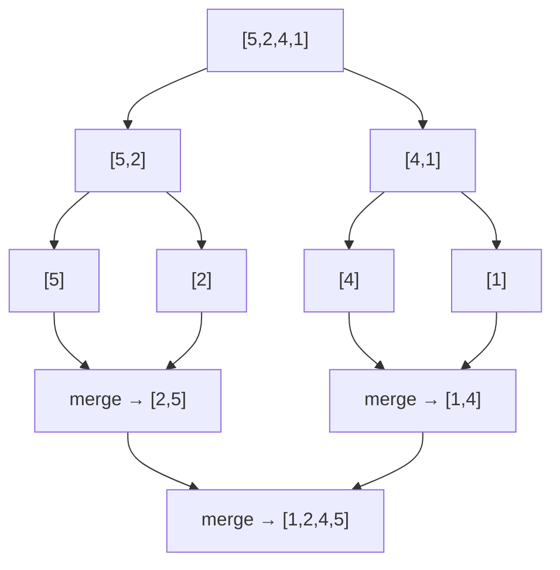

# Merge Sort

> Sort by splitting, sorting halves, and merging. Classic · 🟡 Medium

## Problem
Sort an array in ascending order using the divide-and-conquer merge sort.

## 🧮 Math / Recurrence
$$
\text{sort}(a) = \text{merge}\big(\text{sort}(a_{\text{left}}),\ \text{sort}(a_{\text{right}})\big)
$$

The recurrence and its solution (by the Master Theorem):

$$
T(n) = 2\,T(n/2) + O(n) = O(n \log n)
$$

## 🧠 Logic
Split the array in half, recursively sort each half, then **merge** the two sorted halves in linear time by repeatedly taking the smaller front element. The `O(n)` merge times `O(log n)` levels of halving gives `O(n log n)` — guaranteed, regardless of input order. It's also **stable**.

## 🔢 Iteration trace (`[5,2,4,1]`)


## 🐍 Python
```python
def merge_sort(a: list[int]) -> list[int]:
    if len(a) <= 1:
        return a
    mid = len(a) // 2
    left = merge_sort(a[:mid])
    right = merge_sort(a[mid:])
    # merge
    res, i, j = [], 0, 0
    while i < len(left) and j < len(right):
        if left[i] <= right[j]:
            res.append(left[i]); i += 1
        else:
            res.append(right[j]); j += 1
    res.extend(left[i:]); res.extend(right[j:])
    return res


if __name__ == "__main__":
    print(merge_sort([5, 2, 4, 1]))   # [1, 2, 4, 5]
```

## ⚙️ C++
```cpp
#include <iostream>
#include <vector>
using namespace std;

void mergeSort(vector<int>& a, int lo, int hi) {
    if (hi - lo <= 1) return;
    int mid = (lo + hi) / 2;
    mergeSort(a, lo, mid);
    mergeSort(a, mid, hi);
    vector<int> tmp;
    int i = lo, j = mid;
    while (i < mid && j < hi)
        tmp.push_back(a[i] <= a[j] ? a[i++] : a[j++]);
    while (i < mid) tmp.push_back(a[i++]);
    while (j < hi)  tmp.push_back(a[j++]);
    for (int k = 0; k < (int)tmp.size(); ++k) a[lo + k] = tmp[k];
}

int main() {
    vector<int> a = {5, 2, 4, 1};
    mergeSort(a, 0, a.size());
    for (int x : a) cout << x << ' ';        // 1 2 4 5
    cout << "\n";
}
```

## ⏱️ Complexity
- **Time:** `O(n log n)` in all cases.
- **Space:** `O(n)` auxiliary for merging.
