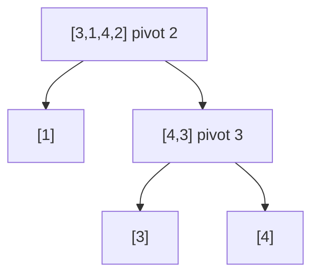

# Quick Sort

> Sort by partitioning around a pivot. Classic · 🟡 Medium

## Problem
Sort an array in place using quicksort.

## 🧮 Math / Recurrence
Partition around a pivot `p`, then recurse on both sides:

$$
T(n) = T(k) + T(n-1-k) + O(n)
$$

- **Balanced** (`k ≈ n/2`): `O(n log n)`.
- **Worst** (already sorted, bad pivot): `O(n²)`.

## 🧠 Logic
Choose a pivot and **partition** so all smaller elements go left and larger go right; the pivot lands in its final sorted position. Recurse on the two sides. Unlike merge sort there is no merge step — the partition does the ordering work in place. A randomized or median-of-three pivot avoids the `O(n²)` worst case on sorted input.

## 🔢 Iteration trace (Lomuto, pivot = last, `[3,1,4,2]`)
| pivot | array | partition result |
|-------|-------|------------------|
| 2 | `[3,1,4,2]` | `[1,2,4,3]`, pivot at idx 1 |
| left `[1]` | sorted | — |
| right `[4,3]` pivot 3 | `[3,4]`, pivot idx 2 | — |

Final: `[1,2,3,4]`.



## 🐍 Python
```python
import random


def quick_sort(a: list[int], lo: int = 0, hi: int | None = None) -> None:
    if hi is None:
        hi = len(a) - 1
    if lo >= hi:
        return
    # randomized pivot → swap to end
    p = random.randint(lo, hi)
    a[p], a[hi] = a[hi], a[p]
    pivot, i = a[hi], lo
    for j in range(lo, hi):                  # Lomuto partition
        if a[j] < pivot:
            a[i], a[j] = a[j], a[i]; i += 1
    a[i], a[hi] = a[hi], a[i]
    quick_sort(a, lo, i - 1)
    quick_sort(a, i + 1, hi)


if __name__ == "__main__":
    arr = [3, 1, 4, 2]
    quick_sort(arr)
    print(arr)   # [1, 2, 3, 4]
```

## ⚙️ C++
```cpp
#include <cstdlib>
#include <iostream>
#include <vector>
using namespace std;

void quickSort(vector<int>& a, int lo, int hi) {
    if (lo >= hi) return;
    int p = lo + rand() % (hi - lo + 1);     // randomized pivot
    swap(a[p], a[hi]);
    int pivot = a[hi], i = lo;
    for (int j = lo; j < hi; ++j)            // Lomuto partition
        if (a[j] < pivot) swap(a[i++], a[j]);
    swap(a[i], a[hi]);
    quickSort(a, lo, i - 1);
    quickSort(a, i + 1, hi);
}

int main() {
    vector<int> a = {3, 1, 4, 2};
    quickSort(a, 0, a.size() - 1);
    for (int x : a) cout << x << ' ';        // 1 2 3 4
    cout << "\n";
}
```

## ⏱️ Complexity
- **Time:** `O(n log n)` average, `O(n²)` worst (mitigated by random pivot).
- **Space:** `O(log n)` average recursion depth.
