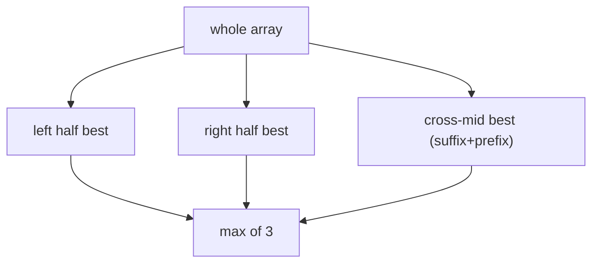

# Maximum Subarray (Divide & Conquer)

> Best contiguous sum via left/right/cross. LC 53 · 🟡 Medium

## Problem
Find the contiguous subarray with the largest sum. (Kadane solves this in `O(n)`; here we use the instructive divide-and-conquer view.)

## 🧮 Math / Recurrence
The best subarray is entirely left, entirely right, or **crosses** the midpoint:

$$
\text{best}(lo, hi) = \max\big(\text{best}(\text{left}),\ \text{best}(\text{right}),\ \text{cross}(mid)\big)
$$

The crossing max extends greedily from `mid` outward:

$$
\text{cross} = \max_{i \le mid} \text{sum}(i..mid) + \max_{j > mid} \text{sum}(mid+1..j)
$$

## 🧠 Logic
Split at the midpoint. A maximum subarray that doesn't lie wholly in one half must *straddle* the boundary — so compute the best suffix sum of the left half plus the best prefix sum of the right half (each `O(n)`). The overall answer is the max of the three candidates. The recurrence `T(n)=2T(n/2)+O(n)` gives `O(n log n)`.

## 🔢 Iteration trace (`[-2,1,-3,4,-1,2,1,-5,4]`)
The optimal subarray `[4,-1,2,1]` (sum 6) **crosses** several midpoints — found by combining best suffix on the left with best prefix on the right at the splitting level containing it.



## 🐍 Python
```python
def max_subarray(a: list[int]) -> int:
    def solve(lo: int, hi: int) -> int:
        if lo == hi:
            return a[lo]
        mid = (lo + hi) // 2
        # best crossing sum
        left_best = float("-inf"); s = 0
        for i in range(mid, lo - 1, -1):
            s += a[i]; left_best = max(left_best, s)
        right_best = float("-inf"); s = 0
        for j in range(mid + 1, hi + 1):
            s += a[j]; right_best = max(right_best, s)
        cross = left_best + right_best
        return max(solve(lo, mid), solve(mid + 1, hi), cross)

    return solve(0, len(a) - 1)


if __name__ == "__main__":
    print(max_subarray([-2, 1, -3, 4, -1, 2, 1, -5, 4]))   # 6
```

## ⚙️ C++
```cpp
#include <algorithm>
#include <iostream>
#include <vector>
using namespace std;

int solve(vector<int>& a, int lo, int hi) {
    if (lo == hi) return a[lo];
    int mid = (lo + hi) / 2;
    int leftBest = INT_MIN, s = 0;
    for (int i = mid; i >= lo; --i) { s += a[i]; leftBest = max(leftBest, s); }
    int rightBest = INT_MIN; s = 0;
    for (int j = mid + 1; j <= hi; ++j) { s += a[j]; rightBest = max(rightBest, s); }
    int cross = leftBest + rightBest;
    return max({solve(a, lo, mid), solve(a, mid + 1, hi), cross});
}

int main() {
    vector<int> a = {-2, 1, -3, 4, -1, 2, 1, -5, 4};
    cout << solve(a, 0, a.size() - 1) << "\n";   // 6
}
```

## ⏱️ Complexity
- **Time:** `O(n log n)` (D&C). Kadane does the same in `O(n)`.
- **Space:** `O(log n)` recursion depth.
