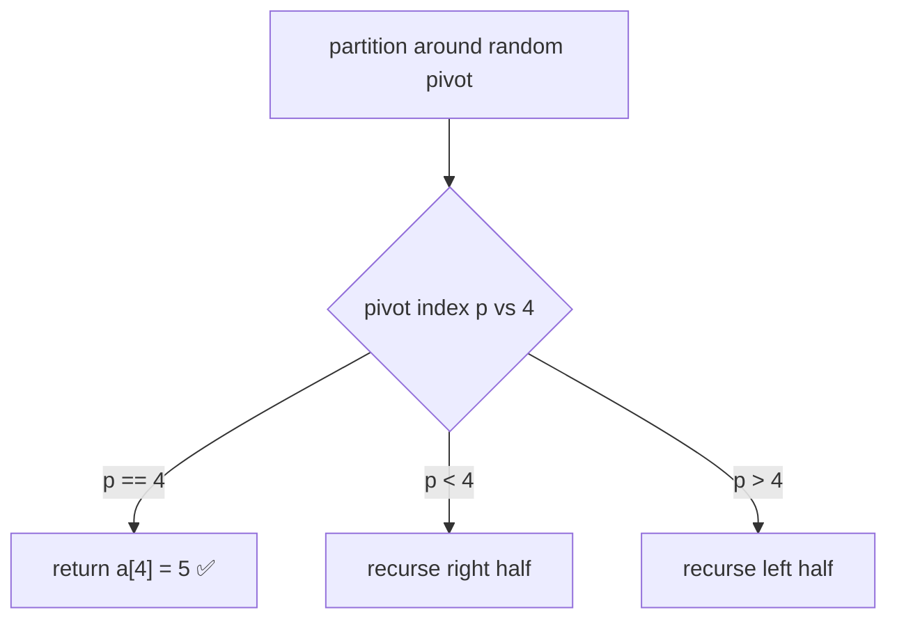

# Kth Largest Element (Quickselect)

> Find rank `k` in average `O(n)`. LC 215 · 🟡 Medium

## Problem
Return the `k`-th largest element in an unsorted array (not the `k`-th distinct — the `k`-th in sorted order).

## 🧮 Math / Recurrence
Quickselect = quicksort that recurses into **one** side only. The `k`-th largest is the `(n−k)`-th smallest index after partitioning:

$$
T(n) = T(n/2) + O(n) = O(n) \ \text{(average)}
$$

## 🧠 Logic
Partition around a pivot so it sits at its final sorted index `p`. If `p` equals the target index, we're done. Otherwise recurse into **only** the half that contains the target rank — discarding the other half is what turns sorting's `O(n log n)` into average `O(n)`. A random pivot avoids the `O(n²)` worst case.

## 🔢 Iteration trace (2nd largest of `[3,2,1,5,6,4]`)
Target index = `n - k = 6 - 2 = 4` (0-based) in ascending order.

Answer: `5`.

## 🐍 Python
```python
import random


def find_kth_largest(nums: list[int], k: int) -> int:
    target = len(nums) - k                   # k-th largest = target-th smallest

    def quickselect(lo: int, hi: int) -> int:
        p = random.randint(lo, hi)
        nums[p], nums[hi] = nums[hi], nums[p]
        pivot, i = nums[hi], lo
        for j in range(lo, hi):
            if nums[j] < pivot:
                nums[i], nums[j] = nums[j], nums[i]; i += 1
        nums[i], nums[hi] = nums[hi], nums[i]
        if i == target:
            return nums[i]
        return quickselect(lo, i - 1) if i > target else quickselect(i + 1, hi)

    return quickselect(0, len(nums) - 1)


if __name__ == "__main__":
    print(find_kth_largest([3, 2, 1, 5, 6, 4], 2))   # 5
```

## ⚙️ C++
```cpp
#include <cstdlib>
#include <iostream>
#include <vector>
using namespace std;

int quickselect(vector<int>& a, int lo, int hi, int target) {
    int p = lo + rand() % (hi - lo + 1);
    swap(a[p], a[hi]);
    int pivot = a[hi], i = lo;
    for (int j = lo; j < hi; ++j)
        if (a[j] < pivot) swap(a[i++], a[j]);
    swap(a[i], a[hi]);
    if (i == target) return a[i];
    return i > target ? quickselect(a, lo, i - 1, target)
                      : quickselect(a, i + 1, hi, target);
}

int findKthLargest(vector<int>& nums, int k) {
    return quickselect(nums, 0, nums.size() - 1, nums.size() - k);
}

int main() {
    vector<int> a = {3, 2, 1, 5, 6, 4};
    cout << findKthLargest(a, 2) << "\n";    // 5
}
```

## ⏱️ Complexity
- **Time:** `O(n)` average, `O(n²)` worst (random pivot makes worst case unlikely).
- **Space:** `O(1)` extra (in-place partition).

> A heap of size `k` gives a deterministic `O(n log k)` alternative.
