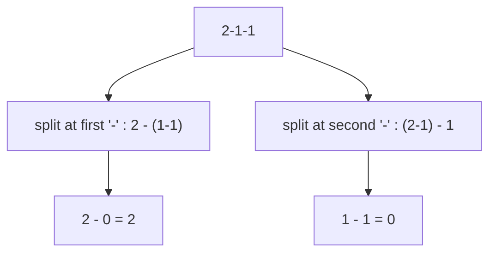

# Different Ways to Add Parentheses

> Evaluate all parenthesizations of an expression. LC 241 · 🟡 Medium

## Problem
Given a string of numbers and operators (`+`, `-`, `*`), return all possible results from inserting parentheses in every valid way. For `"2-1-1"`: `[0, 2]`.

## 🧮 Math / Recurrence
Split at **every** operator; the operator is the last operation, combining all left results with all right results:

$$
\text{solve}(s) = \bigcup_{\text{op at } k} \big\{\, l \mathbin{\text{op}} r : l \in \text{solve}(s_{<k}),\ r \in \text{solve}(s_{>k}) \,\big\}
$$

Base case: a pure number returns `[number]`. The number of results follows the Catalan numbers.

## 🧠 Logic
Each operator could be the **outermost** (last-evaluated) one. Recursively evaluate the left and right substrings into lists of all their possible values, then combine every pair with the operator. Different choices of "outermost operator" correspond to different parenthesizations. Memoizing on substrings removes the heavy overlap.

## 🔢 Iteration trace (`"2-1-1"`)

Results: `{2, 0}`.

## 🐍 Python
```python
from functools import lru_cache


def diff_ways_to_compute(expression: str) -> list[int]:
    @lru_cache(maxsize=None)
    def solve(s: str) -> tuple[int, ...]:
        if s.isdigit():
            return (int(s),)
        res = []
        for i, ch in enumerate(s):
            if ch in "+-*":
                left = solve(s[:i])
                right = solve(s[i + 1:])
                for l in left:
                    for r in right:
                        res.append(l + r if ch == "+" else
                                   l - r if ch == "-" else l * r)
        return tuple(res)

    return list(solve(expression))


if __name__ == "__main__":
    print(diff_ways_to_compute("2-1-1"))   # [2, 0]
```

## ⚙️ C++
```cpp
#include <iostream>
#include <string>
#include <vector>
#include <unordered_map>
using namespace std;

unordered_map<string, vector<int>> memo;

vector<int> solve(const string& s) {
    if (memo.count(s)) return memo[s];
    vector<int> res;
    bool isNum = true;
    for (char c : s) if (!isdigit(c)) { isNum = false; break; }
    if (isNum) return memo[s] = {stoi(s)};
    for (int i = 0; i < (int)s.size(); ++i) {
        char ch = s[i];
        if (ch == '+' || ch == '-' || ch == '*') {
            auto L = solve(s.substr(0, i));
            auto R = solve(s.substr(i + 1));
            for (int l : L) for (int r : R)
                res.push_back(ch == '+' ? l + r : ch == '-' ? l - r : l * r);
        }
    }
    return memo[s] = res;
}

int main() {
    auto r = solve("2-1-1");
    for (int x : r) cout << x << ' ';        // 2 0
    cout << "\n";
}
```

## ⏱️ Complexity
- **Time:** `O(Catalan(n))` results; memoization makes substring work polynomial.
- **Space:** `O(n²)` distinct substrings memoized.
