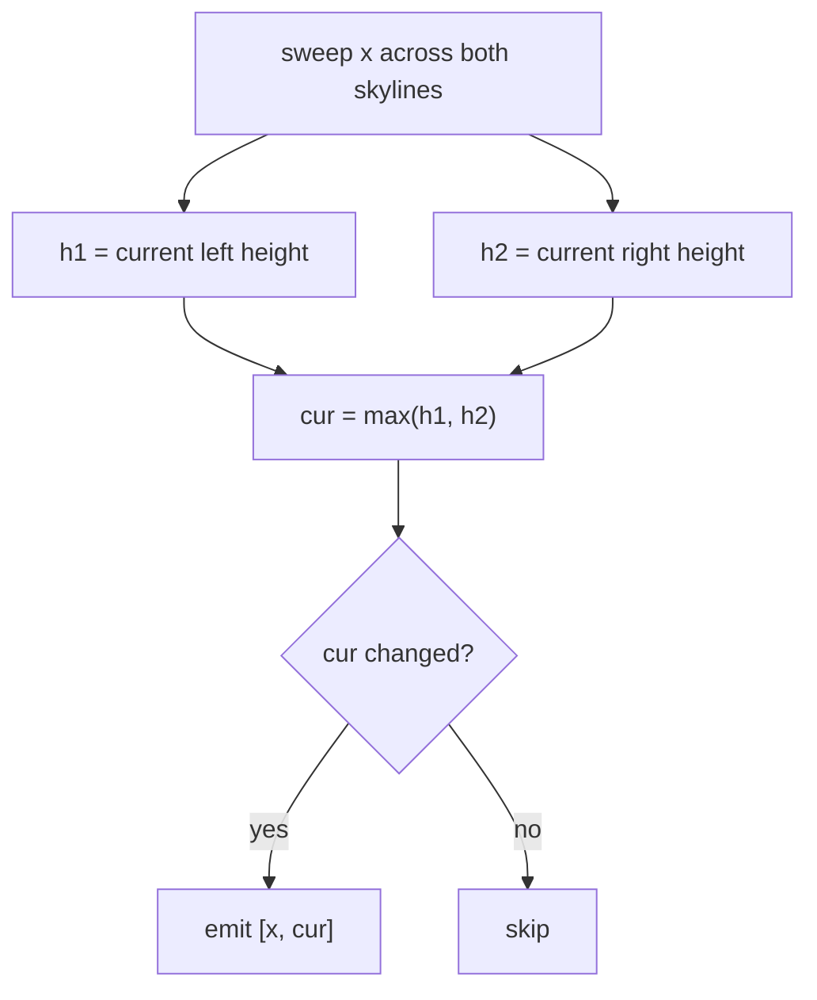

# The Skyline Problem

> Merge building outlines with divide & conquer. LC 218 · 🔴 Hard

## Problem
Given buildings as `[left, right, height]`, output the skyline as a list of "key points" `[x, height]` where the visible outline changes.

## 🧮 Math / Recurrence
Divide the buildings into two halves, recursively compute each skyline, then **merge** them like merge sort — but tracking the running max height of both:

$$
\text{skyline}(B) = \text{merge}\big(\text{skyline}(B_{\text{left}}),\ \text{skyline}(B_{\text{right}})\big)
$$

$$
T(n) = 2\,T(n/2) + O(n) = O(n \log n)
$$

## 🧠 Logic
A single building's skyline is trivial: `[[L,H],[R,0]]`. To merge two skylines, sweep through both by x-coordinate keeping the current height of each side; the output height at any x is the **max** of the two current heights. Emit a key point only when that max actually changes. This is exactly merge sort's merge, generalized to "height profiles."

## 🔢 Iteration trace (merge two outlines)


## 🐍 Python
```python
def get_skyline(buildings: list[list[int]]) -> list[list[int]]:
    if not buildings:
        return []
    if len(buildings) == 1:
        l, r, h = buildings[0]
        return [[l, h], [r, 0]]

    mid = len(buildings) // 2
    left = get_skyline(buildings[:mid])
    right = get_skyline(buildings[mid:])

    # merge two skylines
    res, i, j, h1, h2 = [], 0, 0, 0, 0
    while i < len(left) and j < len(right):
        if left[i][0] < right[j][0]:
            x, h1 = left[i][0], left[i][1]; i += 1
        elif left[i][0] > right[j][0]:
            x, h2 = right[j][0], right[j][1]; j += 1
        else:
            x, h1, h2 = left[i][0], left[i][1], right[j][1]; i += 1; j += 1
        cur = max(h1, h2)
        if not res or res[-1][1] != cur:
            res.append([x, cur])
    res.extend(left[i:]); res.extend(right[j:])
    return res


if __name__ == "__main__":
    print(get_skyline([[2, 9, 10], [3, 7, 15], [5, 12, 12]]))
```

## ⚙️ C++
```cpp
#include <algorithm>
#include <iostream>
#include <vector>
using namespace std;

vector<vector<int>> getSkyline(vector<vector<int>>& buildings) {
    if (buildings.empty()) return {};
    if (buildings.size() == 1) {
        auto& b = buildings[0];
        return {{b[0], b[2]}, {b[1], 0}};
    }
    int mid = buildings.size() / 2;
    vector<vector<int>> L(buildings.begin(), buildings.begin() + mid);
    vector<vector<int>> R(buildings.begin() + mid, buildings.end());
    auto left = getSkyline(L), right = getSkyline(R);

    vector<vector<int>> res;
    int i = 0, j = 0, h1 = 0, h2 = 0;
    while (i < (int)left.size() && j < (int)right.size()) {
        int x;
        if (left[i][0] < right[j][0]) { x = left[i][0]; h1 = left[i][1]; ++i; }
        else if (left[i][0] > right[j][0]) { x = right[j][0]; h2 = right[j][1]; ++j; }
        else { x = left[i][0]; h1 = left[i][1]; h2 = right[j][1]; ++i; ++j; }
        int cur = max(h1, h2);
        if (res.empty() || res.back()[1] != cur) res.push_back({x, cur});
    }
    while (i < (int)left.size()) res.push_back(left[i++]);
    while (j < (int)right.size()) res.push_back(right[j++]);
    return res;
}

int main() {
    vector<vector<int>> b = {{2, 9, 10}, {3, 7, 15}, {5, 12, 12}};
    for (auto& p : getSkyline(b)) cout << "[" << p[0] << "," << p[1] << "] ";
    cout << "\n";
}
```

## ⏱️ Complexity
- **Time:** `O(n log n)`.
- **Space:** `O(n)` for the merged output and recursion.
