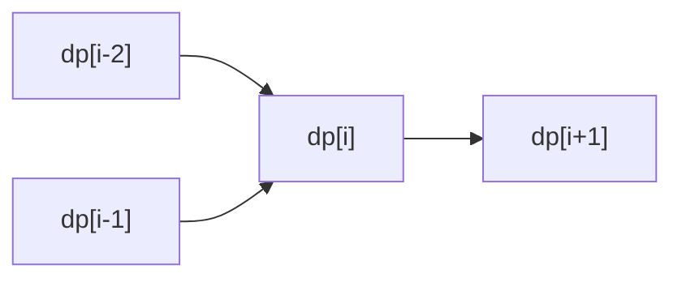
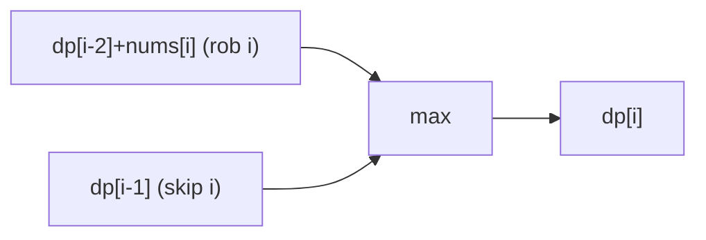
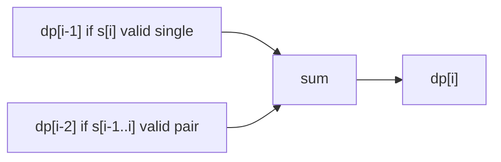
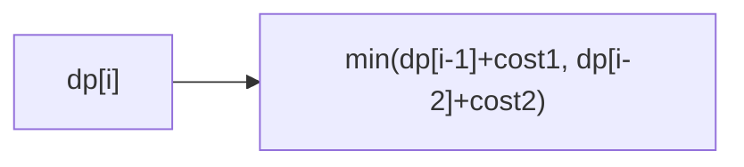
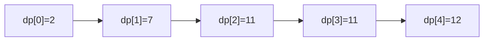
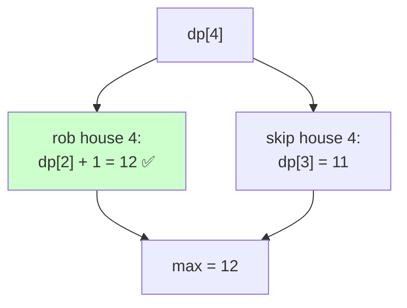
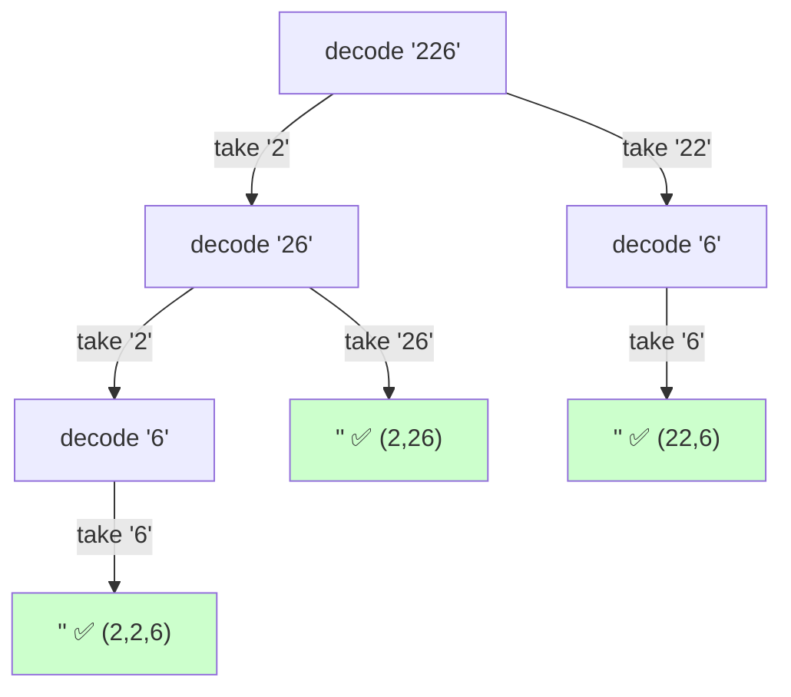

# 02 — Linear (1D) DP Problems

> The answer at index `i` depends on a constant number of earlier indices. Master the "naive → memo → 2 variables" collapse here.



---

## A. Fibonacci / stairs family

| # | Problem | Src | Diff | State & transition |
|---|---|---|---|---|
| 1 | Climbing Stairs | LC 70 | 🟢 | `dp[i]=dp[i-1]+dp[i-2]` |
| 2 | Fibonacci Number | LC 509 | 🟢 | same; $O(1)$ space |
| 3 | N‑th Tribonacci | LC 1137 | 🟢 | `dp[i]=dp[i-1]+dp[i-2]+dp[i-3]` |
| 4 | Min Cost Climbing Stairs | LC 746 | 🟢 | `dp[i]=cost[i]+min(dp[i-1],dp[i-2])` |
| 5 | Count ways with steps {1,2,3} | GFG | 🟢 | sum of last 3 |
| 6 | Get Maximum in Generated Array | LC 1646 | 🟢 | rule-based recurrence |

```python
def climb(n):
    a, b = 1, 1
    for _ in range(n):
        a, b = b, a + b
    return a
```

### 💡 Problem-by-problem
1. **Climbing Stairs** — you reach step `i` from `i−1` (one step) or `i−2` (two steps), so `ways(i)=ways(i−1)+ways(i−2)` — Fibonacci. Two scalars give `O(1)` space.
2. **Fibonacci Number** — the definition itself; iterate keeping only the last two values.
3. **N-th Tribonacci** — same idea with a window of three: `T(i)=T(i−1)+T(i−2)+T(i−3)`.
4. **Min Cost Climbing Stairs** — now you *minimize* cost: `dp[i]=cost[i]+min(dp[i−1],dp[i−2])`, paying `cost[i]` to stand on step `i` and arriving from the cheaper predecessor.
5. **Count ways with steps {1,2,3}** — sum of the last three reachable counts, a Tribonacci-shaped recurrence.
6. **Get Maximum in Generated Array** — follow the construction rule (`a[2i]=a[i]`, `a[2i+1]=a[i]+a[i+1]`) to fill the array, then take the max — a directed recurrence, not a plain sum.

---

## B. House Robber family (non‑adjacent)



| # | Problem | Src | Diff | Idea |
|---|---|---|---|---|
| 7 | House Robber | LC 198 | 🟡 | `dp[i]=max(dp[i-1],dp[i-2]+a[i])` |
| 8 | House Robber II (circular) | LC 213 | 🟡 | run twice: exclude first / exclude last |
| 9 | House Robber III (tree) | LC 337 | 🟡 | tree DP (see file 08) |
| 10 | Delete and Earn | LC 740 | 🟡 | bucket by value → robber on counts |
| 11 | Max sum non-adjacent (GFG) | GFG | 🟡 | same as robber |
| 12 | Wiggle Subsequence | LC 376 | 🟡 | two states: up/down |

### 💡 Problem-by-problem
7. **House Robber** — can't rob adjacent houses: `dp[i]=max(dp[i−1], dp[i−2]+a[i])` (full trace in Deep Dive 1).
8. **House Robber II (circular)** — first and last are now adjacent, so no plan includes both. Run the linear robber twice — once on houses `0..n−2`, once on `1..n−1` — and take the max; each run forbids one endpoint, together covering all valid plans.
9. **House Robber III (tree)** — houses form a tree; each node returns two values (rob it / skip it) computed from its children — see file 08.
10. **Delete and Earn** — taking value `v` deletes all `v±1`. Bucket earnings by value (`gain[v]=v×count`), turning it into House Robber on the value axis where adjacent *values* conflict.
11. **Max sum non-adjacent (GFG)** — identical recurrence to House Robber.
12. **Wiggle Subsequence** — track two states, `up` and `down`: the longest wiggle ending on a rising vs falling step. Each new element can only extend the opposite state.

---

## C. Maximum subarray / product (Kadane)

| # | Problem | Src | Diff | Idea |
|---|---|---|---|---|
| 13 | Maximum Subarray | LC 53 | 🟡 | `cur=max(x,cur+x)` |
| 14 | Maximum Product Subarray | LC 152 | 🟡 | track max & min (signs flip) |
| 15 | Maximum Sum Circular Subarray | LC 918 | 🟡 | max(Kadane, total−minKadane) |
| 16 | Best Sightseeing Pair | LC 1014 | 🟡 | keep best `a[i]+i` so far |
| 17 | Maximum Absolute Sum of Subarray | LC 1749 | 🟡 | max of Kadane & −Kadane |
| 18 | K-Concatenation Maximum Sum | LC 1191 | 🟡 | Kadane + total-sum logic |

```python
def max_product(nums):
    best = cur_max = cur_min = nums[0]
    for x in nums[1:]:
        cands = (x, cur_max*x, cur_min*x)
        cur_max, cur_min = max(cands), min(cands)
        best = max(best, cur_max)
    return best
```

### 💡 Problem-by-problem
13. **Maximum Subarray** — Kadane: `cur=max(x, cur+x)` either extends the running subarray or restarts at `x`; the answer is the best `cur` ever seen. You restart precisely when the running sum would hurt you.
14. **Maximum Product Subarray** — signs flip products, so track both the running max *and* min; a negative `x` swaps their roles (see the code above).
15. **Maximum Sum Circular Subarray** — the best is either a normal Kadane max or a wrap-around equal to `total − (minimum subarray)`; take the larger, but guard the all-negative case.
16. **Best Sightseeing Pair** — score `a[i]+a[j]+i−j`; keep the best `a[i]+i` so far and combine with `a[j]−j` at each `j` — an `O(n)` running-best DP.
17. **Maximum Absolute Sum** — the largest `|subarray sum|` is `max(maxKadane, −minKadane)`, so run Kadane for both the maximum and minimum subarray sums.
18. **K-Concatenation Maximum Sum** — combine Kadane over one/two copies with the effect of repeating the array `k` times; the inner copies contribute `(k−2)×max(0, total)`.

---

## D. Decode / partition‑style linear DP



| # | Problem | Src | Diff | Idea |
|---|---|---|---|---|
| 19 | Decode Ways | LC 91 | 🟡 | `dp[i]=valid1·dp[i-1]+valid2·dp[i-2]` |
| 20 | Decode Ways II (wildcards) | LC 639 | 🔴 | count `*` expansions |
| 21 | Word Break | LC 139 | 🟡 | `dp[i]=any(dp[j] and s[j:i] in dict)` |
| 22 | Word Break II | LC 140 | 🔴 | DP + backtracking reconstruction |
| 23 | Number of Ways to Split a String | LC 1573 | 🟡 | counting partitions |
| 24 | Student Attendance Record II | LC 552 | 🔴 | state machine over A/L counts |

### 💡 Problem-by-problem
19. **Decode Ways** — count decodings: add `dp[i−1]` if the single digit is valid (`1..9`) and `dp[i−2]` if the two-digit pair is `10..26` (full trace in Deep Dive 2).
20. **Decode Ways II (wildcards)** — `*` stands for `1..9`, so each term is multiplied by how many concrete digits/pairs the wildcard can represent; same add-two-terms shape with counted multipliers.
21. **Word Break** — `dp[i]` is true if some split `j` makes `dp[j]` true *and* `s[j:i]` is a dictionary word: `dp[i]=any(dp[j] and s[j:i]∈dict)`.
22. **Word Break II** — first compute reachability with the Word Break DP, then backtrack through the valid split points to reconstruct every sentence.
23. **Number of Ways to Split a String** — count cut positions so each part satisfies the constraint; a counting DP over partitions.
24. **Student Attendance Record II** — a state machine over (total absences `0/1`, trailing late streak `0/1/2`); transitions count valid next characters, summed with modular arithmetic.

---

## E. Jump / reachability

| # | Problem | Src | Diff | Idea |
|---|---|---|---|---|
| 25 | Jump Game | LC 55 | 🟡 | track furthest reachable |
| 26 | Jump Game II | LC 45 | 🟡 | BFS-like greedy levels (min jumps) |
| 27 | Jump Game III | LC 1306 | 🟡 | DFS/BFS reachability |
| 28 | Frog Jump | LC 403 | 🔴 | `dp[stone]={possible jump sizes}` |
| 29 | Minimum Jumps (GFG) | GFG | 🟡 | dp min over reachable |
| 30 | Geek Jump / Frog 1 (AtCoder) | AtCoder | 🟢 | `dp[i]=min(dp[i-1]+|h_i−h_{i-1}|, …)` |



### 💡 Problem-by-problem
25. **Jump Game** — greedily track the furthest index reachable so far; if your current index ever passes it you're stuck, otherwise the end is reachable. `O(n)`.
26. **Jump Game II** — minimize jumps by treating reachable ranges as BFS "levels": each time you exhaust the current range you spend one jump and extend to the furthest reach — `O(n)`.
27. **Jump Game III** — from index `i` you may move to `i±a[i]`; DFS/BFS marks reachable indices and checks whether any zero is reached.
28. **Frog Jump** — state is `(stone, last jump size)`; from a stone you may jump `k−1, k, k+1`. Memoize `(stone,k)` since the same pair recurs across paths.
29. **Minimum Jumps (GFG)** — `dp[i]` = fewest jumps to reach `i`, the min over all earlier indices that can reach `i`.
30. **Geek Jump / Frog 1** — `dp[i]=min(dp[i−1]+|h_i−h_{i−1}|, dp[i−2]+|h_i−h_{i−2}|)`: reach stone `i` from one or two back, paying the height difference.

---

## F. Misc linear DP

| # | Problem | Src | Diff | Idea |
|---|---|---|---|---|
| 31 | Paint House | LC 256 | 🟡 | `dp[i][c]=cost+min(other colors)` |
| 32 | Paint House II (k colors) | LC 265 | 🔴 | track best & 2nd-best |
| 33 | Paint Fence | LC 276 | 🟡 | same/diff color recurrence |
| 34 | Domino and Tromino Tiling | LC 790 | 🟡 | tiling recurrence |
| 35 | Ugly Number II | LC 264 | 🟡 | 3-pointer DP merge |
| 36 | Perfect Squares | LC 279 | 🟡 | `dp[i]=min(dp[i-k²])+1` (unbounded) |
| 37 | Count Vowels Permutation | LC 1220 | 🟡 | state machine per vowel |
| 38 | Min Cost to Cut a Stick | LC 1547 | 🔴 | interval (see file 07) |

### 💡 Problem-by-problem
31. **Paint House** — `dp[i][c]` = min cost to paint house `i` color `c`: add `cost[i][c]` to the cheapest of the *other* two colors at `i−1` (adjacent houses must differ).
32. **Paint House II (k colors)** — the naive `O(nk²)` drops to `O(nk)` by tracking the best and second-best previous color: any color except the previous best pairs with the best, and the previous best pairs with the second-best.
33. **Paint Fence** — count colorings where no three posts in a row share a color: split each post into "same as previous" vs "different" counts and recur.
34. **Domino and Tromino Tiling** — a tiling recurrence `dp[i]=2·dp[i−1]+dp[i−3]` derived from how the L-shaped tromino and dominoes complete a partially filled column.
35. **Ugly Number II** — merge the three sequences ×2, ×3, ×5 with three pointers, each step emitting the smallest next multiple — a DP "merge."
36. **Perfect Squares** — unbounded coin change over square coins: `dp[i]=min(dp[i−k²])+1`, the fewest squares summing to `i`.
37. **Count Vowels Permutation** — a state machine where each vowel may be followed only by specific vowels; `dp[i][v]` sums the counts of its allowed predecessors.
38. **Min Cost to Cut a Stick** — the cut *order* matters, making it interval DP; fully treated in file 07.

---

## 🔬 Deep Dive 1 — House Robber, table filled step by step

**Problem:** `nums = [2, 7, 9, 3, 1]`. Rob houses for maximum money, but you **cannot rob two adjacent** houses.

### The recurrence and *why* it is shaped this way
At house `i` you face exactly **two mutually exclusive choices**:

1. **Rob house `i`** — then you may not touch `i-1`, so the best you can add is the answer up to `i-2`: value `dp[i-2] + nums[i]`.
2. **Skip house `i`** — then you keep whatever was best up to `i-1`: value `dp[i-1]`.

You want the larger of the two, which gives:

$$dp[i] = \max\big(\underbrace{dp[i-1]}_{\text{skip } i},\ \underbrace{dp[i-2] + nums[i]}_{\text{rob } i}\big)$$

$$\text{base: } dp[0] = nums[0],\quad dp[1] = \max(nums[0], nums[1])$$

> **Why max of just those two?** The "no adjacency" rule means the only thing that constrains house `i` is whether `i-1` was taken. That single bit of history is fully captured by comparing `dp[i-1]` (i-1 possibly used) against `dp[i-2]` (i-1 guaranteed free). No other past detail matters → 1D DP suffices.

### Filling the table, one cell per iteration

| i | nums[i] | rob i → `dp[i-2]+nums[i]` | skip i → `dp[i-1]` | `dp[i]` = max | meaning |
|---|---------|--------------------------|--------------------|---------------|---------|
| 0 | 2 | — | — | **2** | only house 0 |
| 1 | 7 | — | — | **7** | max(2,7) |
| 2 | 9 | `dp[0]+9 = 2+9 = 11` | `dp[1] = 7` | **11** | rob 0 & 2 |
| 3 | 3 | `dp[1]+3 = 7+3 = 10` | `dp[2] = 11` | **11** | keep {0,2} |
| 4 | 1 | `dp[2]+1 = 11+1 = 12` | `dp[3] = 11` | **12** | rob 0,2,4 |

**Answer = `dp[4] = 12`** (rob houses with values 2, 9, 1).

### How `dp` evolves as an array



### Decision diagram for the winning cell `dp[4]`



---

## 🔬 Deep Dive 2 — Decode Ways, recurrence + trace

**Problem:** `s = "226"`. How many ways to decode it where `A=1 … Z=26`? Answer: `3` → `"BBF"(2 2 6)`, `"BZ"(2 26)`, `"VF"(22 6)`.

### Why the recurrence adds two terms
To decode the prefix ending at position `i`, the **last letter** was formed either from:

1. **one digit** `s[i-1]` — valid if it is `1..9` (not `0`). Then the rest is `dp[i-1]`.
2. **two digits** `s[i-2..i-1]` — valid if that number is `10..26`. Then the rest is `dp[i-2]`.

These are disjoint ways to finish, so we **add** their counts:

$$dp[i] = \underbrace{dp[i-1]\cdot[\,s_{i}\in 1..9\,]}_{\text{single digit}} + \underbrace{dp[i-2]\cdot[\,s_{i-1}s_{i}\in 10..26\,]}_{\text{two digits}}$$

$$\text{base: } dp[0] = 1 \text{ (empty string, one way)},\quad dp[1] = [s_0 \ne 0]$$

> **Why add instead of max?** Decode Ways is a **counting** problem (how *many* ways), not an optimization. Counting partitions of independent suffixes ⇒ sum the sub-counts. (Contrast with House Robber, which optimizes ⇒ uses `max`.)

### Table trace for `"226"`

| i | char(s) considered | single ok? add `dp[i-1]` | pair ok? add `dp[i-2]` | `dp[i]` |
|---|--------------------|--------------------------|------------------------|---------|
| 0 | "" | — | — | **1** |
| 1 | `2` | `2`→yes, +`dp[0]=1` | — | **1** |
| 2 | `2`,`22` | `2`→yes, +`dp[1]=1` | `22`→yes (10–26), +`dp[0]=1` | **2** |
| 3 | `6`,`26` | `6`→yes, +`dp[2]=2` | `26`→yes (≤26), +`dp[1]=1` | **3** |

**Answer = `dp[3] = 3`.** ✅



Three green leaves = three decodings — exactly `dp[3]`.

---

## 🔑 Linear DP checklist
- [ ] Identify how many previous terms the recurrence needs (1, 2, 3…).
- [ ] Collapse the array to that many **scalars** for $O(1)$ space.
- [ ] Handle **base cases / empty input** explicitly.

➡️ Next: [03 — Knapsack & Subset](03-knapsack-subset.md)
