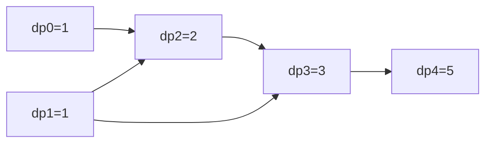

# Climbing Stairs

> Count ways to climb taking 1 or 2 steps. LC 70 · 🟢 Easy

## Problem
You climb a staircase of `n` steps, moving `1` or `2` steps at a time. Count the distinct ways to reach the top.

## 🧮 Math / Recurrence
$$
dp[i] = dp[i-1] + dp[i-2], \qquad dp[0] = 1,\ dp[1] = 1
$$

The last move into step `i` came from `i−1` (a single) or `i−2` (a double). This is the Fibonacci recurrence, so `dp[n] = fib(n+1)`.

## 🧠 Logic
Counting splits by the **final** step. The two groups (arriving via a 1-step vs a 2-step) are disjoint and exhaustive, so we **add** them. Only the previous two values are ever needed → roll two scalars for `O(1)` space.

## 🔢 Iteration trace (`n = 5`)
| step `i` | 0 | 1 | 2 | 3 | 4 | 5 |
|----------|---|---|---|---|---|---|
| `dp[i]`  | 1 | 1 | 2 | 3 | 5 | **8** |

Each cell = sum of the two before it. **Answer = 8.**



## 🐍 Python
```python
def climb_stairs(n: int) -> int:
    a, b = 1, 1                  # dp[0], dp[1]
    for _ in range(n):
        a, b = b, a + b
    return a


if __name__ == "__main__":
    print(climb_stairs(5))      # 8
```

## ⚙️ C++
```cpp
#include <iostream>
using namespace std;

long long climbStairs(int n) {
    long long a = 1, b = 1;     // dp[0], dp[1]
    for (int i = 0; i < n; ++i) {
        long long next = a + b;
        a = b; b = next;
    }
    return a;
}

int main() {
    cout << climbStairs(5) << "\n";   // 8
}
```

## ⏱️ Complexity
- **Time:** `O(n)`.
- **Space:** `O(1)` with two rolling variables.
