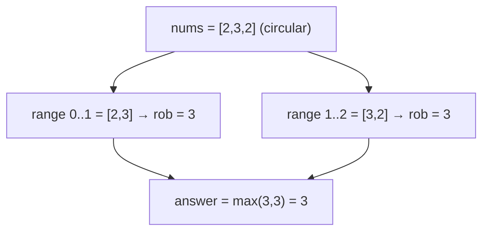

# House Robber II (Circular)

> Houses in a circle: run the linear robber twice. LC 213 · 🟡 Medium

## Problem
Same as [House Robber](07-house-robber.md), but the houses are arranged in a **circle** — the first and last are adjacent.

## 🧮 Math / Recurrence
Because houses `0` and `n−1` are now adjacent, no valid plan robs **both**. Split into two open ranges and reuse linear robbing `R(·)`:

$$
\text{ans} = \max\big(R(nums[0..n-2]),\ R(nums[1..n-1])\big)
$$

with the edge case `n == 1 ⟹ nums[0]`.

## 🧠 Logic
Every legal selection must exclude at least one of the two endpoints. Run the linear robber once **forbidding the last house** (`0..n−2`) and once **forbidding the first** (`1..n−1`). Their union covers all valid plans, and the maximum of the two is optimal.

## 🔢 Iteration trace (`nums = [2, 3, 2]`)

Without the circular rule the linear answer would be `2+2=4`, but houses 0 and 2 are adjacent — so **3** is correct.

## 🐍 Python
```python
def rob_linear(nums: list[int]) -> int:
    prev2, prev1 = 0, 0
    for x in nums:
        prev2, prev1 = prev1, max(prev1, prev2 + x)
    return prev1


def rob(nums: list[int]) -> int:
    if len(nums) == 1:
        return nums[0]
    return max(rob_linear(nums[:-1]), rob_linear(nums[1:]))


if __name__ == "__main__":
    print(rob([2, 3, 2]))       # 3
```

## ⚙️ C++
```cpp
#include <algorithm>
#include <iostream>
#include <vector>
using namespace std;

int robLinear(const vector<int>& a, int lo, int hi) {  // [lo, hi)
    int prev2 = 0, prev1 = 0;
    for (int i = lo; i < hi; ++i) {
        int cur = max(prev1, prev2 + a[i]);
        prev2 = prev1; prev1 = cur;
    }
    return prev1;
}

int rob(vector<int>& nums) {
    int n = nums.size();
    if (n == 1) return nums[0];
    return max(robLinear(nums, 0, n - 1), robLinear(nums, 1, n));
}

int main() {
    vector<int> nums = {2, 3, 2};
    cout << rob(nums) << "\n";   // 3
}
```

## ⏱️ Complexity
- **Time:** `O(n)` (two linear passes).
- **Space:** `O(1)`.
