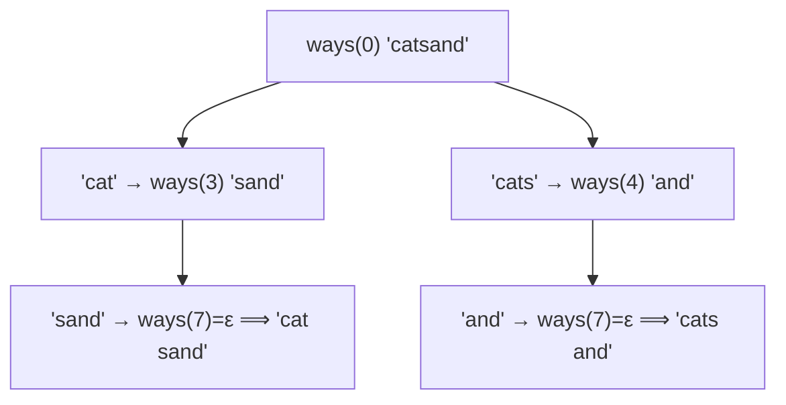

# Word Break II

> Word Break reachability + backtracking to list every sentence. LC 140 · 🔴 Hard

## Problem
Return **all** sentences formed by segmenting `s` into dictionary words (in any order, each word reusable).

## 🧮 Math / Recurrence
First compute the [Word Break](21-word-break.md) reachability `dp[]`, then enumerate via memoized recursion:

$$
\text{ways}(i) = \bigcup_{\substack{j > i \\ s[i:j]\,\in\,\text{dict}}} \{\, s[i:j] + w : w \in \text{ways}(j) \,\}, \qquad \text{ways}(n) = \{\varepsilon\}
$$

## 🧠 Logic
Decision (can it be broken?) is solved by the boolean DP; **construction** needs backtracking. `ways(i)` returns every sentence for suffix `s[i:]` by trying each dictionary word starting at `i` and prepending it to all completions of the remainder. Memoizing `ways(i)` avoids recomputation across overlapping suffixes. Pruning with reachability stops dead-end branches early.

## 🔢 Iteration trace (`s = "catsand"`, dict = {cat, cats, and, sand})

**Answers:** `["cat sand", "cats and"]`.

## 🐍 Python
```python
def word_break(s: str, word_dict: list[str]) -> list[str]:
    words = set(word_dict)
    memo: dict[int, list[str]] = {}

    def ways(i: int) -> list[str]:
        if i == len(s):
            return [""]
        if i in memo:
            return memo[i]
        res: list[str] = []
        for j in range(i + 1, len(s) + 1):
            if s[i:j] in words:
                for tail in ways(j):
                    res.append(s[i:j] + ("" if tail == "" else " " + tail))
        memo[i] = res
        return res

    return ways(0)


if __name__ == "__main__":
    print(word_break("catsand", ["cat", "cats", "and", "sand"]))
    # ['cat sand', 'cats and']
```

## ⚙️ C++
```cpp
#include <iostream>
#include <string>
#include <unordered_map>
#include <unordered_set>
#include <vector>
using namespace std;

unordered_set<string> words;
unordered_map<int, vector<string>> memo;
string S;

vector<string> ways(int i) {
    if (i == (int)S.size()) return {""};
    if (memo.count(i)) return memo[i];
    vector<string> res;
    for (int j = i + 1; j <= (int)S.size(); ++j) {
        string w = S.substr(i, j - i);
        if (words.count(w))
            for (auto& tail : ways(j))
                res.push_back(tail.empty() ? w : w + " " + tail);
    }
    return memo[i] = res;
}

int main() {
    S = "catsand";
    words = {"cat", "cats", "and", "sand"};
    for (auto& sentence : ways(0)) cout << sentence << "\n";
    // cat sand / cats and
}
```

## ⏱️ Complexity
- **Time:** exponential in the worst case (number of valid sentences can blow up), but memo bounds repeated work per suffix.
- **Space:** `O(n²)` memo + output size.
