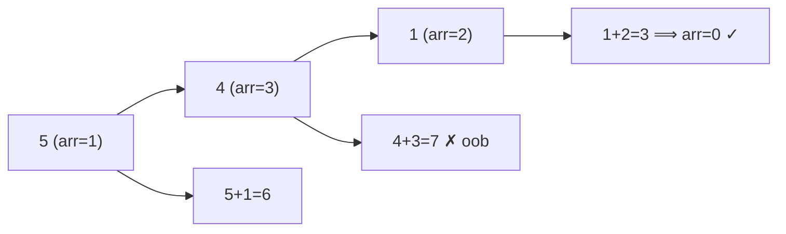

# Jump Game III

> Two-direction reachability via BFS/DFS. LC 1306 · 🟡 Medium

## Problem
Start at index `start`. From `i` you may move to `i + arr[i]` or `i − arr[i]` (within bounds). Can you reach **any** index whose value is `0`?

## 🧮 Math / Recurrence
Reachability over a graph with edges `i → i ± arr[i]`:

$$
\text{reach}(i) = \big(arr[i] = 0\big) \ \vee\ \text{reach}(i+arr[i]) \ \vee\ \text{reach}(i-arr[i])
$$

with a `visited` set to stop cycles.

## 🧠 Logic
Each index has at most two outgoing moves, so this is plain graph traversal. BFS/DFS from `start`, marking visited indices to avoid infinite loops; success when a visited index holds `0`. No ordering/optimization needed — just connectivity.

## 🔢 Iteration trace (`arr = [4,2,3,0,3,1,2], start = 5`)

Reaches index 3 (value 0) ⟹ **true**.

## 🐍 Python
```python
from collections import deque

def can_reach(arr: list[int], start: int) -> bool:
    n = len(arr)
    seen = [False] * n
    q = deque([start])
    while q:
        i = q.popleft()
        if arr[i] == 0:
            return True
        if seen[i]:
            continue
        seen[i] = True
        for nxt in (i + arr[i], i - arr[i]):
            if 0 <= nxt < n and not seen[nxt]:
                q.append(nxt)
    return False


if __name__ == "__main__":
    print(can_reach([4, 2, 3, 0, 3, 1, 2], 5))   # True
```

## ⚙️ C++
```cpp
#include <iostream>
#include <queue>
#include <vector>
using namespace std;

bool canReach(vector<int>& arr, int start) {
    int n = arr.size();
    vector<bool> seen(n, false);
    queue<int> q; q.push(start);
    while (!q.empty()) {
        int i = q.front(); q.pop();
        if (arr[i] == 0) return true;
        if (seen[i]) continue;
        seen[i] = true;
        for (int nxt : {i + arr[i], i - arr[i]})
            if (nxt >= 0 && nxt < n && !seen[nxt]) q.push(nxt);
    }
    return false;
}

int main() {
    vector<int> arr = {4, 2, 3, 0, 3, 1, 2};
    cout << boolalpha << canReach(arr, 5) << "\n";   // true
}
```

## ⏱️ Complexity
- **Time:** `O(n)` — each index enqueued at most once.
- **Space:** `O(n)`.
