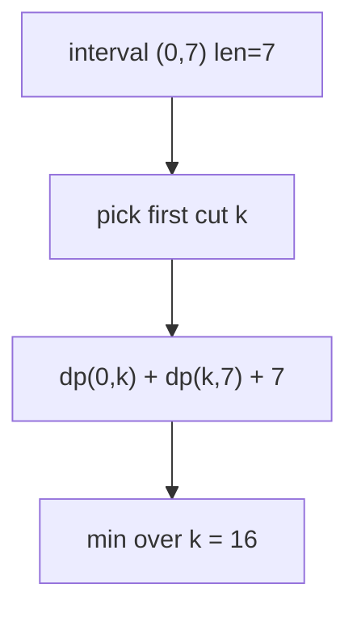

# Minimum Cost to Cut a Stick

> Cut *order* matters → interval DP (not pure linear). LC 1547 · 🔴 Hard

## Problem
A stick of length `n` must be cut at the positions in `cuts` (in any order). Each cut costs the **current length** of the piece being cut. Minimize total cost. (Interval DP; see also topic 07.)

## 🧮 Math / Recurrence
Add sentinels `0` and `n`, sort the cut positions to `p[0..m+1]`. Let `dp[i][j]` = min cost to make all cuts strictly between `p[i]` and `p[j]`:

$$
dp[i][j] = \min_{i < k < j}\big(dp[i][k] + dp[k][j]\big) + (p[j] - p[i])
$$

Base: `dp[i][i+1] = 0` (no interior cut). Answer = `dp[0][m+1]`.

## 🧠 Logic
The cost of a cut depends on the piece's length, which depends on the **order** of earlier cuts — so this is interval DP, not linear. Fix the *first* cut `k` made inside `(p[i], p[j])`: it costs the full sub-length `p[j]−p[i]`, then the two resulting pieces are solved independently. Minimizing over the first cut yields the optimum.

## 🔢 Iteration trace (`n = 7, cuts = [1, 3, 4, 5]`)
Positions with sentinels: `[0,1,3,4,5,7]`. Solving inner intervals and combining (classic interval DP fill by increasing length) gives optimal cost **16** (one optimal order: cut at 3, then 1,4, then 5).



## 🐍 Python
```python
from functools import lru_cache

def min_cost(n: int, cuts: list[int]) -> int:
    p = sorted([0] + cuts + [n])

    @lru_cache(maxsize=None)
    def solve(i: int, j: int) -> int:
        if j - i <= 1:
            return 0
        return min(solve(i, k) + solve(k, j) for k in range(i + 1, j)) + (p[j] - p[i])

    return solve(0, len(p) - 1)


if __name__ == "__main__":
    print(min_cost(7, [1, 3, 4, 5]))   # 16
```

## ⚙️ C++
```cpp
#include <algorithm>
#include <iostream>
#include <vector>
using namespace std;

int minCost(int n, vector<int>& cuts) {
    vector<int> p = cuts;
    p.push_back(0); p.push_back(n);
    sort(p.begin(), p.end());
    int m = p.size();
    vector<vector<int>> dp(m, vector<int>(m, 0));
    for (int len = 2; len < m; ++len)
        for (int i = 0; i + len < m; ++i) {
            int j = i + len, best = INT_MAX;
            for (int k = i + 1; k < j; ++k)
                best = min(best, dp[i][k] + dp[k][j]);
            dp[i][j] = best + (p[j] - p[i]);
        }
    return dp[0][m - 1];
}

int main() {
    vector<int> cuts = {1, 3, 4, 5};
    cout << minCost(7, cuts) << "\n";   // 16
}
```

## ⏱️ Complexity
- **Time:** `O(m³)` where `m = len(cuts)`.
- **Space:** `O(m²)`.
