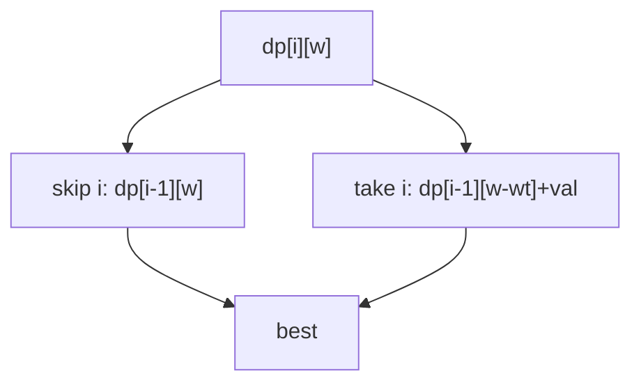
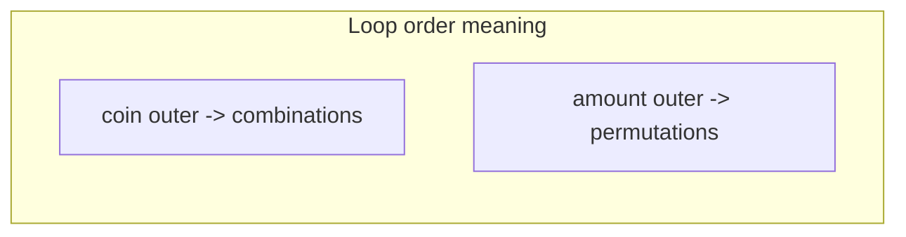
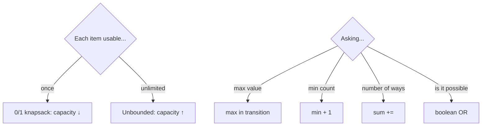
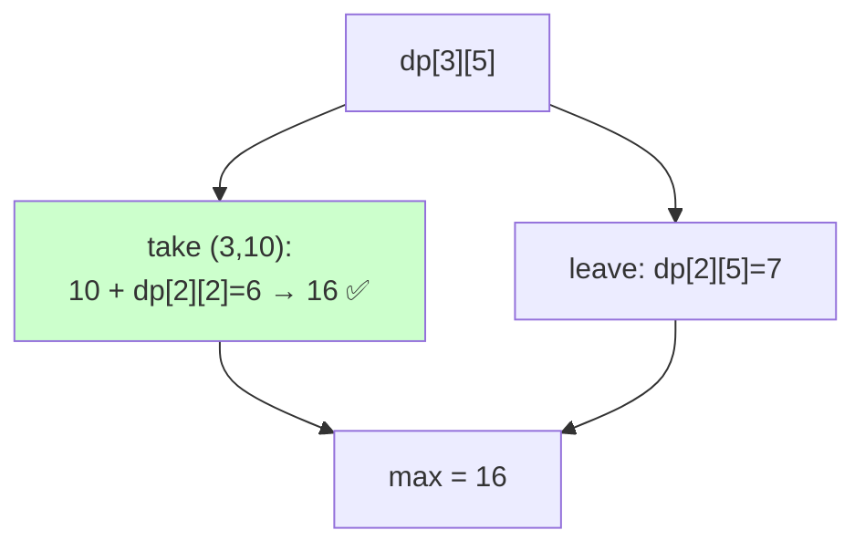
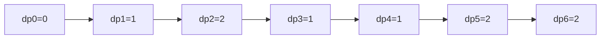

# 03 — Knapsack & Subset DP Problems

> The "choose items under a constraint" family — arguably the highest‑value DP pattern. Master the **take/skip** transition and the **loop‑direction** rule.



> 🔑 **Loop direction:** 0/1 (item once) → capacity **decreasing**; Unbounded (reusable) → capacity **increasing**.

---

## A. Classic 0/1 Knapsack

| # | Problem | Src | Diff | State / transition |
|---|---|---|---|---|
| 1 | 0/1 Knapsack | GFG/Classic | 🟡 | `dp[w]=max(dp[w], dp[w-wt]+val)` (w↓) |
| 2 | Subset Sum | GFG | 🟡 | boolean `dp[w]|=dp[w-num]` |
| 3 | Partition Equal Subset Sum | LC 416 | 🟡 | subset sum to `total/2` |
| 4 | Count of Subsets with Sum S | GFG | 🟡 | `dp[w]+=dp[w-num]` |
| 5 | Minimum Subset Sum Difference | GFG | 🟡 | reachable sums; min |sum−2s| |
| 6 | Last Stone Weight II | LC 1049 | 🟡 | minimize |total−2·subset| |
| 7 | Target Sum (+/−) | LC 494 | 🟡 | `P−N=target`, `P=(target+sum)/2` → count subsets |
| 8 | Ones and Zeroes | LC 474 | 🟡 | 2D capacity (zeros, ones) |
| 9 | Partition to K Equal Subsets | LC 698 | 🔴 | bitmask (file 09) |
| 10 | Tallest Billboard | LC 956 | 🔴 | dp over height-difference |

```python
# Target Sum reduced to subset-count
def find_target_sum_ways(nums, target):
    total = sum(nums)
    if (total + target) % 2 or abs(target) > total:
        return 0
    s = (total + target) // 2
    dp = [1] + [0]*s
    for num in nums:
        for w in range(s, num-1, -1):
            dp[w] += dp[w-num]
    return dp[s]
```

### 💡 Problem-by-problem
1. **0/1 Knapsack** — each item used once: `dp[w]=max(dp[w], dp[w−wt]+val)` with capacity looped *downward* (Deep Dive 1).
2. **Subset Sum** — can a subset hit exactly `S`? Boolean DP `dp[w] |= dp[w−num]`: `w` is reachable if it already was, or `w−num` was. OR because we only need feasibility, not a max.
3. **Partition Equal Subset Sum** — splitting into two equal halves ⇔ a subset sums to `total/2`; odd `total` is impossible. Reduces to Subset Sum.
4. **Count of Subsets with Sum S** — like Subset Sum but *count* the ways: `dp[w] += dp[w−num]` (sum instead of OR).
5. **Minimum Subset Sum Difference** — find every reachable subset sum `s ≤ total/2`; the best split has difference `total − 2s`, minimized over reachable `s`.
6. **Last Stone Weight II** — smashing stones assigns each a ± sign; the smallest residual is `min|total − 2·subset|`, identical to problem 5.
7. **Target Sum (+/−)** — with plus-set `P`: `P−N=target` and `P+N=sum` give `P=(target+sum)/2`, so *count subsets* summing to `P` (code above).
8. **Ones and Zeroes** — two simultaneous capacities (counts of 0s and 1s); a 2D knapsack `dp[zeros][ones]` maximizing strings chosen.
9. **Partition to K Equal Subsets** — assign items to `k` equal-sum buckets; best done with bitmask DP (file 09).
10. **Tallest Billboard** — build two equal-height supports; DP over the *difference* of the two heights, maximizing the common height when the difference returns to 0.

---

## B. Unbounded knapsack / coin change



| # | Problem | Src | Diff | Idea |
|---|---|---|---|---|
| 11 | Coin Change (min coins) | LC 322 | 🟡 | `dp[a]=min(dp[a-c]+1)` |
| 12 | Coin Change II (count ways) | LC 518 | 🟡 | coin outer → combinations |
| 13 | Combination Sum IV (ordered) | LC 377 | 🟡 | amount outer → permutations |
| 14 | Perfect Squares | LC 279 | 🟡 | items = square numbers |
| 15 | Rod Cutting | GFG/Classic | 🟡 | unbounded knapsack on lengths |
| 16 | Integer Break | LC 343 | 🟡 | `dp[i]=max(j*(i-j), j*dp[i-j])` |
| 17 | Unbounded Knapsack | GFG | 🟡 | capacity increasing |
| 18 | Maximum Ribbon Cut | GFG | 🟡 | max pieces (unbounded) |
| 19 | Minimum Cost For Tickets | LC 983 | 🟡 | dp over days with pass options |
| 20 | Number of Dice Rolls Target Sum | LC 1155 | 🟡 | bounded-count knapsack |

```python
def coin_change(coins, amount):
    INF = float('inf')
    dp = [0] + [INF]*amount
    for a in range(1, amount+1):
        for c in coins:
            if c <= a:
                dp[a] = min(dp[a], dp[a-c]+1)
    return -1 if dp[amount]==INF else dp[amount]
```

### 💡 Problem-by-problem
11. **Coin Change (min coins)** — fewest coins for `amount`: `dp[a]=min(dp[a−c]+1)` over coins; greedy fails, DP tries every last coin (Deep Dive 2).
12. **Coin Change II (count ways)** — count *combinations*: loop coins on the **outside** so each coin is fixed once per amount, preventing `1+2` and `2+1` from both being counted.
13. **Combination Sum IV (ordered)** — count *permutations*: loop amount on the **outside** so different orders count separately. Same recurrence, opposite loop nesting.
14. **Perfect Squares** — unbounded knapsack whose "coins" are square numbers; minimum squares summing to `n`.
15. **Rod Cutting** — each length is unlimited, so unbounded knapsack maximizing price over the rod length.
16. **Integer Break** — split `n` into ≥2 parts maximizing the product: `dp[i]=max_j max(j·(i−j), j·dp[i−j])` (either stop, or break the remainder further).
17. **Unbounded Knapsack** — items reusable: same recurrence as 0/1 but capacity loops *upward* so the current item can be re-taken within one pass.
18. **Maximum Ribbon Cut** — maximize the *number* of pieces of given lengths from a ribbon — unbounded knapsack with a count objective.
19. **Minimum Cost For Tickets** — `dp[day]` = min cost to cover travel through `day`, choosing a 1/7/30-day pass; each pass jumps back a different number of days.
20. **Number of Dice Rolls Target Sum** — bounded-count knapsack: `d` dice each contributing `1..f`; count ways to reach the target sum.

---

## C. Knapsack variations & disguises

| # | Problem | Src | Diff | Why it's knapsack |
|---|---|---|---|---|
| 21 | Profit Assignment / Job scheduling | LC 1235 | 🔴 | weighted interval + DP |
| 22 | Best Team With No Conflicts | LC 1626 | 🟡 | sort + LIS-knapsack hybrid |
| 23 | Form Largest Multiple of Three | LC 1363 | 🔴 | remainder-bucket knapsack |
| 24 | Stickers to Spell Word | LC 691 | 🔴 | bitmask + unbounded knapsack |
| 25 | Shopping Offers | LC 638 | 🟡 | dp over remaining-needs vector |
| 26 | Coin Combinations (CSES) | CSES | 🟡 | same as Coin Change II / IV |
| 27 | Two Sets II (CSES) | CSES | 🟡 | count subsets to half-sum |
| 28 | Money Sums (CSES) | CSES | 🟡 | reachable subset sums |
| 29 | Codeforces Vacations-like | CF | 🟡 | constrained selection DP |
| 30 | Boredom (CF 455A) | CF 455A | 🟡 | delete‑and‑earn / robber on counts |

### 💡 Problem-by-problem
21. **Profit Assignment / Job Scheduling** — sort jobs by end time; `dp[i]` = best profit using jobs up to `i`, choosing to skip job `i` or take it plus the best non-overlapping earlier job (found by binary search) — weighted interval scheduling.
22. **Best Team With No Conflicts** — sort by age then score; a younger-or-equal teammate must not out-score, so it becomes max-sum increasing subsequence (LIS-flavored knapsack).
23. **Form Largest Multiple of Three** — bucket digits by remainder mod 3; remove the fewest digits so the digit-sum is divisible by 3, then sort descending. The remainder buckets are the "knapsack."
24. **Stickers to Spell Word** — unbounded use of stickers; state is the bitmask of letters still needed, minimizing stickers — bitmask + unbounded knapsack.
25. **Shopping Offers** — state is the remaining-needs vector; try each special offer (like an item) or buy singly, minimizing cost — knapsack over a multi-dimensional capacity.
26. **Coin Combinations (CSES)** — identical to Coin Change II/IV depending on whether order matters.
27. **Two Sets II (CSES)** — count ways to split `1..n` into two equal-sum sets: subset-count DP to the half-sum, halved for symmetry.
28. **Money Sums (CSES)** — report all reachable subset sums via a boolean knapsack, then list the true cells.
29. **Vacations-like (CF)** — constrained selection over days with per-day options; a small-state DP where each day's choice depends on the previous day's.
30. **Boredom (CF 455A)** — taking value `v` removes all `v±1`; bucket by value and run delete-and-earn / House Robber on the counts.

---

## 🧠 Knapsack decision helper



---

## 🔬 Deep Dive 1 — 0/1 Knapsack, full 2D table filled

**Problem:** capacity `W = 5`; items = `{(w=1,v=1), (w=2,v=6), (w=3,v=10), (w=5,v=16)}`. Maximize value, each item used **at most once**.

### The recurrence and *why*
For item `i` at capacity `w`, there are exactly two options:

1. **Leave item `i`** → value is whatever `i-1` items achieved at the same capacity: `dp[i-1][w]`.
2. **Take item `i`** (only if it fits, `w ≥ wᵢ`) → gain `vᵢ` plus the best of the remaining items in the **leftover** capacity: `dp[i-1][w-wᵢ] + vᵢ`.

$$dp[i][w] = \max\big(\underbrace{dp[i-1][w]}_{\text{leave}},\ \underbrace{dp[i-1][w-w_i]+v_i}_{\text{take, if } w\ge w_i}\big)$$

> **Why look at `dp[i-1][...]` and not `dp[i][...]`?** Because each item is used **once**: after deciding item `i`, all further decisions must come from *earlier* items only. Referencing row `i-1` guarantees item `i` cannot be picked twice. (The unbounded version references row `i` instead — that single change allows reuse.)

### The table (rows = items considered, columns = capacity 0…5)

| items \ w | 0 | 1 | 2 | 3 | 4 | 5 |
|-----------|---|---|---|---|---|---|
| {} | 0 | 0 | 0 | 0 | 0 | 0 |
| +(1,1) | 0 | **1** | 1 | 1 | 1 | 1 |
| +(2,6) | 0 | 1 | **6** | **7** | 7 | 7 |
| +(3,10) | 0 | 1 | 6 | **10** | **11** | **16** |
| +(5,16) | 0 | 1 | 6 | 10 | 11 | **16** |

**Answer = `dp[4][5] = 16`.**

### How two key cells were computed
- `dp[3][5]` (items up to weight-3 one, capacity 5): take (3,10) → `10 + dp[2][2] = 10 + 6 = 16`; leave → `dp[2][5] = 7`. max → **16**.
- `dp[4][5]`: take (5,16) → `16 + dp[3][0] = 16`; leave → `dp[3][5] = 16`. max → **16** (tie).



### The 1D rolling version & why capacity goes **downward**
```python
dp = [0]*(W+1)
for w_i, v_i in items:
    for w in range(W, w_i-1, -1):   # DOWNWARD
        dp[w] = max(dp[w], dp[w-w_i] + v_i)
```
Iterating `w` from high to low means when we read `dp[w-wᵢ]`, it still holds the value **from the previous item row** (item not yet used in this pass) → enforces "at most once". Going upward would let `dp[w-wᵢ]` already include item `i`, accidentally reusing it (that is exactly the *unbounded* knapsack).

---

## 🔬 Deep Dive 2 — Coin Change (min coins), 1D trace

**Problem:** `coins = [1, 3, 4]`, `amount = 6`. Fewest coins to make 6. Answer: `2` (3+3).

### Recurrence and reasoning
To build amount `a`, the **last coin** used is some `c ≤ a`. Removing it leaves a smaller subproblem `a-c` that we already solved optimally:

$$dp[a] = \min_{c\,\in\,coins,\ c\le a}\big(dp[a-c] + 1\big), \qquad dp[0] = 0$$

> **Why `min` and `+1`?** Each transition uses exactly one extra coin (`+1`), and we want the *fewest* total, so we minimize over which coin was last. `dp[0]=0` because zero coins make amount 0. Unreachable amounts stay `∞`.

### Filling `dp[0..6]` (∞ = not yet reachable)

| a | from `1`: dp[a-1]+1 | from `3`: dp[a-3]+1 | from `4`: dp[a-4]+1 | `dp[a]` (min) |
|---|---------------------|---------------------|---------------------|---------------|
| 0 | — | — | — | **0** |
| 1 | dp[0]+1 = 1 | — | — | **1** |
| 2 | dp[1]+1 = 2 | — | — | **2** |
| 3 | dp[2]+1 = 3 | dp[0]+1 = 1 | — | **1** |
| 4 | dp[3]+1 = 2 | dp[1]+1 = 2 | dp[0]+1 = 1 | **1** |
| 5 | dp[4]+1 = 2 | dp[2]+1 = 3 | dp[1]+1 = 2 | **2** |
| 6 | dp[5]+1 = 3 | dp[3]+1 = 2 | dp[2]+1 = 3 | **2** |

**Answer = `dp[6] = 2`** (the winning transition is `dp[3]+1` using a coin `3`, and `dp[3]` itself was one coin `3`).



> 🔑 **Greedy would fail** here (greedy picks 4+1+1 = 3 coins); DP tries *every* last-coin choice and finds 3+3 = 2 coins. That is why we need DP, not greedy.

---

## 🔑 Checklist
- [ ] Correct **loop direction** for 0/1 vs unbounded.
- [ ] For "count ways" decide **combinations vs permutations** (loop order).
- [ ] Transform "+/−" or "difference" problems into a **subset‑sum target**.
- [ ] Watch integer overflow for counting variants.

➡️ Next: [04 — String DP](04-strings-dp.md)
