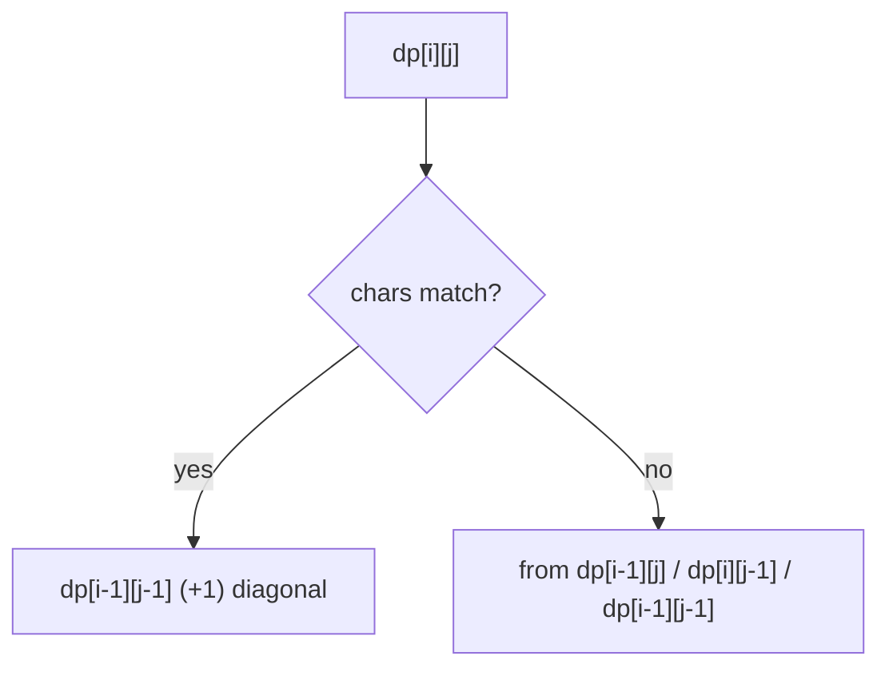
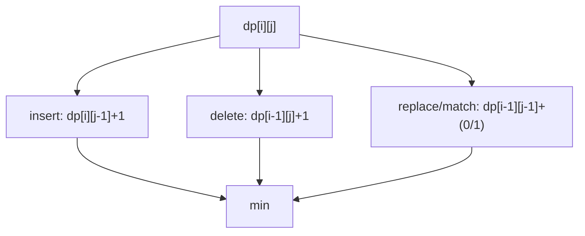
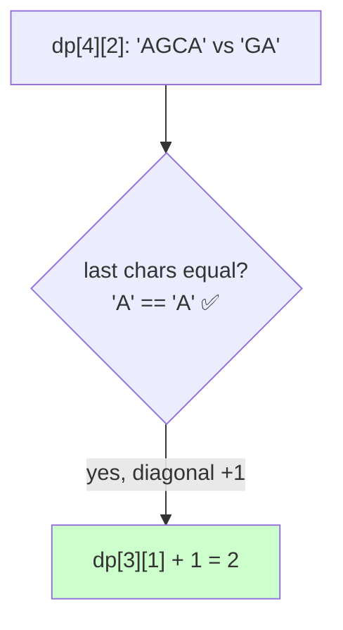
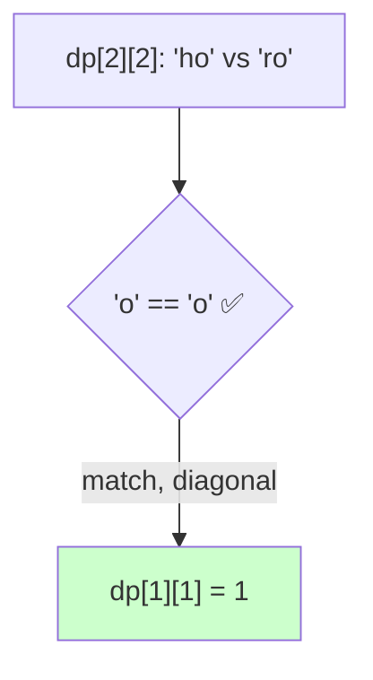

# 04 — String DP Problems

> Two sequences to align/compare/transform, or one string analyzed for palindromes/partitions. The workhorse is the 2D table `dp[i][j]`.



---

## A. LCS family (two sequences)

| # | Problem | Src | Diff | Transition |
|---|---|---|---|---|
| 1 | Longest Common Subsequence | LC 1143 | 🟡 | match→diag+1 else max(up,left) |
| 2 | Longest Common Substring | GFG | 🟡 | match→diag+1 else **reset 0** |
| 3 | Shortest Common Supersequence | LC 1092 | 🔴 | `n+m−LCS`, reconstruct |
| 4 | Longest Common Subsequence of 3 strings | GFG | 🔴 | 3D dp |
| 5 | Delete Operation for Two Strings | LC 583 | 🟡 | `n+m−2·LCS` |
| 6 | Minimum ASCII Delete Sum | LC 712 | 🟡 | LCS weighted by ASCII |
| 7 | Uncrossed Lines | LC 1035 | 🟡 | identical to LCS |
| 8 | Longest Repeating Subsequence | GFG | 🟡 | LCS(s,s) with i≠j |

```python
def lcs(a, b):
    n, m = len(a), len(b)
    prev = [0]*(m+1)
    for i in range(1, n+1):
        cur = [0]*(m+1)
        for j in range(1, m+1):
            cur[j] = prev[j-1]+1 if a[i-1]==b[j-1] else max(prev[j], cur[j-1])
        prev = cur
    return prev[m]
```

### 💡 Problem-by-problem
1. **Longest Common Subsequence** — match → diagonal `+1`, else the larger of up/left (Deep Dive 1).
2. **Longest Common Substring** — must be *contiguous*, so on a mismatch you **reset to 0** instead of carrying neighbors; the answer is the largest cell, not `dp[n][m]`.
3. **Shortest Common Supersequence** — the shortest string containing both has length `n+m−LCS`; reconstruct by walking the LCS table, emitting the unmatched chars from each side.
4. **LCS of 3 strings** — extend to a 3D table `dp[i][j][k]`: `+1` when all three chars match, else max over dropping one index.
5. **Delete Operation for Two Strings** — minimum deletions to make them equal is `n+m−2·LCS` (keep the common subsequence, delete the rest of both).
6. **Minimum ASCII Delete Sum** — like problem 5 but weighted: maximize the ASCII sum of the common subsequence and delete the rest, charging by ASCII value.
7. **Uncrossed Lines** — drawing non-crossing connections between equal numbers is exactly LCS on the two arrays.
8. **Longest Repeating Subsequence** — run LCS of the string with itself but forbid matching a character to itself (`i≠j`), forcing two distinct occurrences.

---

## B. Edit distance & transformation

| # | Problem | Src | Diff | Idea |
|---|---|---|---|---|
| 9 | Edit Distance | LC 72 | 🔴 | insert/delete/replace min |
| 10 | One Edit Distance | LC 161 | 🟡 | check ≤1 difference |
| 11 | Distinct Subsequences | LC 115 | 🔴 | `dp[i][j]=dp[i-1][j-1]·match+dp[i-1][j]` |
| 12 | Interleaving String | LC 97 | 🔴 | `dp[i][j]` from s1/s2 sources |
| 13 | Minimum Window Subsequence | LC 727 | 🔴 | dp + pointer |
| 14 | Edit Distance with ops cost | Variant | 🔴 | weighted transitions |

```python
def edit_distance(a, b):
    n, m = len(a), len(b)
    dp = [[0]*(m+1) for _ in range(n+1)]
    for i in range(n+1): dp[i][0] = i
    for j in range(m+1): dp[0][j] = j
    for i in range(1, n+1):
        for j in range(1, m+1):
            dp[i][j] = dp[i-1][j-1] if a[i-1]==b[j-1] else 1+min(
                dp[i-1][j], dp[i][j-1], dp[i-1][j-1])
    return dp[n][m]
```



---

## C. Pattern matching DP

| # | Problem | Src | Diff | Idea |
|---|---|---|---|---|
| 15 | Regular Expression Matching | LC 10 | 🔴 | `.` any, `*` zero-or-more |
| 16 | Wildcard Matching | LC 44 | 🔴 | `?` one, `*` any sequence |
| 17 | Match subsequence (Is Subsequence) | LC 392 | 🟢 | two pointers / dp |
| 18 | Number of Matching Subsequences | LC 792 | 🟡 | bucket + pointers |

```python
def is_match(s, p):                  # regex with . and *
    n, m = len(s), len(p)
    dp = [[False]*(m+1) for _ in range(n+1)]
    dp[0][0] = True
    for j in range(1, m+1):
        if p[j-1] == '*': dp[0][j] = dp[0][j-2]
    for i in range(1, n+1):
        for j in range(1, m+1):
            if p[j-1] == '*':
                dp[i][j] = dp[i][j-2] or (
                    dp[i-1][j] and (p[j-2]==s[i-1] or p[j-2]=='.'))
            else:
                dp[i][j] = dp[i-1][j-1] and (p[j-1]==s[i-1] or p[j-1]=='.')
    return dp[n][m]
```

### 💡 Problem-by-problem
15. **Regular Expression Matching** — `.` matches any char; `*` means "zero of the preceding" (`dp[i][j-2]`) or "one more of the preceding if it matches" (`dp[i-1][j]`). The code above encodes exactly these two cases.
16. **Wildcard Matching** — `?` matches one char, `*` matches any sequence: `dp[i][j]=dp[i-1][j]` (star absorbs a char) or `dp[i][j-1]` (star matches empty).
17. **Is Subsequence** — walk two pointers; `t` is a subsequence of `s` if its pointer reaches the end. DP is overkill here but mirrors LCS.
18. **Number of Matching Subsequences** — to test many words against `s`, bucket each word by its next needed letter and advance buckets as you scan `s` once — far faster than per-word DP.

---

## D. Palindrome DP (one string, `dp[i][j]` over substring)

```mermaid
flowchart TD
    A["dp[i][j] on s[i..j]"] --> M{s[i]==s[j]?}
    M -- yes --> D["use dp[i+1][j-1]"]
    M -- no --> N["max(dp[i+1][j], dp[i][j-1])"]
```

| # | Problem | Src | Diff | Idea |
|---|---|---|---|---|
| 19 | Longest Palindromic Substring | LC 5 | 🟡 | expand around center / dp |
| 20 | Longest Palindromic Subsequence | LC 516 | 🟡 | LCS(s, reverse s) |
| 21 | Palindromic Substrings (count) | LC 647 | 🟡 | count all palindromic ranges |
| 22 | Palindrome Partitioning II (min cuts) | LC 132 | 🔴 | `cut[i]=min(cut[j]+1)` if pal |
| 23 | Minimum Insertions to Palindrome | LC 1312 | 🔴 | `n−LPS` |
| 24 | Count Different Palindromic Subsequences | LC 730 | 🔴 | interval dp with dedup |
| 25 | Valid Palindrome III | LC 1216 | 🔴 | `n−LPS ≤ k` |
| 26 | Palindrome Partitioning (all) | LC 131 | 🟡 | backtracking (file 01) |

```python
def longest_palindromic_substring(s):
    n = len(s)
    if n < 2: return s
    start, maxlen = 0, 1
    dp = [[False]*n for _ in range(n)]
    for i in range(n): dp[i][i] = True
    for length in range(2, n+1):
        for i in range(n-length+1):
            j = i+length-1
            if s[i]==s[j] and (length==2 or dp[i+1][j-1]):
                dp[i][j] = True
                if length > maxlen: start, maxlen = i, length
    return s[start:start+maxlen]
```

### 💡 Problem-by-problem
19. **Longest Palindromic Substring** — `dp[i][j]` is true when `s[i]==s[j]` *and* the inside `dp[i+1][j-1]` is already a palindrome; iterate by increasing length (code above). Expand-around-center is the `O(1)`-space alternative.
20. **Longest Palindromic Subsequence** — equals `LCS(s, reverse(s))`: a subsequence reading the same both ways is common to the string and its reverse.
21. **Palindromic Substrings (count)** — count every `(i,j)` range that is a palindrome with the same `dp[i][j]` recurrence, incrementing on each true cell.
22. **Palindrome Partitioning II (min cuts)** — `cut[i]=min(cut[j]+1)` over every `j` where `s[j+1..i]` is a palindrome (precompute palindromes with the range DP). Two DP layers cooperate.
23. **Minimum Insertions to Palindrome** — answer is `n − LPS(s)`: keep the longest palindromic subsequence and mirror the remaining characters.
24. **Count Different Palindromic Subsequences** — interval DP that dedups by the boundary character so identical palindromes aren't counted twice.
25. **Valid Palindrome III** — `s` is a `k`-palindrome iff `n − LPS(s) ≤ k` (at most `k` deletions reach a palindrome).
26. **Palindrome Partitioning (all)** — enumerate *every* palindrome partition via backtracking (file 01); the listing counterpart of problem 22.

---

## 🔬 Deep Dive 1 — Longest Common Subsequence (LCS), full grid

**Problem:** `A = "AGCAT"`, `B = "GAC"`. Longest subsequence appearing in **both** (not necessarily contiguous). Answer length: `2` (e.g. `"AC"` or `"GA"`... actually `"GC"`/`"AC"`, length 2).

### Recurrence and *why*
Compare the **last characters** of the two prefixes `A[0..i-1]` and `B[0..j-1]`:

- If `A[i-1] == B[j-1]`, that shared char **must end** an LCS, so we add 1 to the LCS of the shorter prefixes: `dp[i-1][j-1] + 1`.
- If they differ, the last char of at least one string is **not used**, so we drop one and take the better: `max(dp[i-1][j], dp[i][j-1])`.

$$dp[i][j] = \begin{cases} dp[i-1][j-1] + 1 & A_{i-1} = B_{j-1} \\[4pt] \max\big(dp[i-1][j],\ dp[i][j-1]\big) & A_{i-1} \ne B_{j-1} \end{cases}$$

$$\text{base: } dp[0][j] = dp[i][0] = 0 \text{ (empty string shares nothing)}$$

> **Why the diagonal on a match?** Matching one char consumes the last char of **both** strings, so the remaining problem shrinks in both dimensions → go diagonally up-left and `+1`. A mismatch only lets us discard from **one** side → move up or left (whichever is larger).

### The table (rows = prefixes of `A`, cols = prefixes of `B`)

| | "" | G | A | C |
|------|----|----|----|----|
| **""** | 0 | 0 | 0 | 0 |
| **A** | 0 | 0 | ↖1 | 1 |
| **G** | 0 | ↖1 | 1 | 1 |
| **C** | 0 | 1 | 1 | ↖2 |
| **A** | 0 | 1 | ↖2 | 2 |
| **T** | 0 | 1 | 2 | 2 |

**Answer = `dp[5][3] = 2`.** Each `↖` marks a cell filled by the *match* (diagonal `+1`) rule; the LCS length grows exactly at those diagonal steps.

### How `dp[4][2]` (`A` vs `GA`) was computed
`A[3]='A'` equals `B[1]='A'` → match → `dp[3][1] + 1 = 1 + 1 = 2`.



---

## 🔬 Deep Dive 2 — Edit Distance (Levenshtein), grid trace

**Problem:** turn `A = "horse"` into `B = "ros"` with fewest insert / delete / replace operations. Answer: `3`.

### Recurrence and reasoning
Look at the last chars of `A[0..i-1]` and `B[0..j-1]`:

- **Match** (`A[i-1]==B[j-1]`): no cost for this position → `dp[i-1][j-1]`.
- **Mismatch**: take the cheapest of three edits, each `+1`:
  - **replace** `A[i-1]→B[j-1]`: `dp[i-1][j-1] + 1`
  - **delete** `A[i-1]`: `dp[i-1][j] + 1`
  - **insert** `B[j-1]`: `dp[i][j-1] + 1`

$$dp[i][j] = \begin{cases} dp[i-1][j-1] & A_{i-1}=B_{j-1} \\[4pt] 1 + \min\big(dp[i-1][j-1],\ dp[i-1][j],\ dp[i][j-1]\big) & \text{otherwise} \end{cases}$$

$$\text{base: } dp[i][0] = i \text{ (delete all)},\quad dp[0][j] = j \text{ (insert all)}$$

> **Why these three neighbors?** Every edit changes the problem size in exactly one way: replace shrinks both prefixes (diagonal), delete shrinks `A` only (up), insert shrinks `B` only (left). The three DP neighbors are literally the three edit operations.

### The table (rows = `horse`, cols = `ros`)

| | "" | r | o | s |
|------|----|----|----|----|
| **""** | 0 | 1 | 2 | 3 |
| **h** | 1 | 1 | 2 | 3 |
| **o** | 2 | 2 | **1** | 2 |
| **r** | 3 | **2** | 2 | 2 |
| **s** | 4 | 3 | 3 | **2** |
| **e** | 5 | 4 | 4 | **3** |

**Answer = `dp[5][3] = 3`** → replace `h→r`, delete `r` (the one before `s`)… concretely: `horse → rorse (replace h) → rose (delete r) → ros (delete e)` = 3 edits.



---

## 🔑 String DP checklist
- [ ] Two strings → 2D `dp[i][j]`; one string palindrome → range `dp[i][j]`.
- [ ] **Substring** resets on mismatch; **subsequence** takes max of neighbors.
- [ ] Initialize first row/column carefully (empty‑string base cases).
- [ ] Palindrome/range DP must iterate by **increasing length** (or `i` down, `j` up).

➡️ Next: [05 — Sequences & LIS](05-sequences-lis.md)
