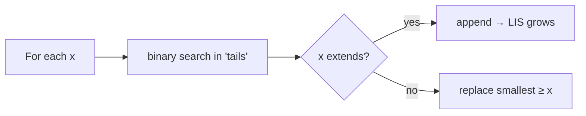
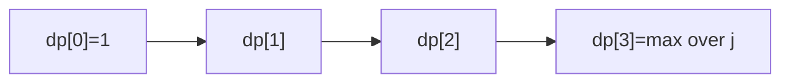
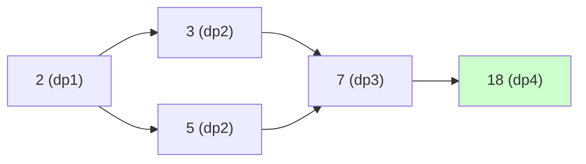

# 05 — Sequences & LIS Problems

> Longest Increasing Subsequence and its many disguises. Know both the $O(n^2)$ DP and the $O(n\log n)$ patience/binary‑search method.



---

## A. Core LIS

| # | Problem | Src | Diff | Idea |
|---|---|---|---|---|
| 1 | Longest Increasing Subsequence | LC 300 | 🟡 | tails + binary search → $O(n\log n)$ |
| 2 | Number of LIS | LC 673 | 🟡 | track length + count per index |
| 3 | Longest Non-decreasing Subseq | GFG | 🟡 | `bisect_right` |
| 4 | Russian Doll Envelopes | LC 354 | 🔴 | sort w asc, h desc → LIS on h |
| 5 | Maximum Length of Pair Chain | LC 646 | 🟡 | sort + greedy/LIS |
| 6 | Longest Increasing Subseq II | LC 2407 | 🔴 | LIS with gap≤k → segment tree |
| 7 | Make Array Strictly Increasing | LC 1187 | 🔴 | dp with replacement |
| 8 | Minimum Operations to Make Increasing | LC 1827 | 🟢 | greedy linear |

```python
import bisect
def length_of_lis(nums):
    tails = []
    for x in nums:
        i = bisect.bisect_left(tails, x)
        if i == len(tails): tails.append(x)
        else: tails[i] = x
    return len(tails)
```

$O(n^2)$ DP (needed when you must reconstruct / count):
```python
def lis_n2(nums):
    n = len(nums)
    dp = [1]*n
    for i in range(n):
        for j in range(i):
            if nums[j] < nums[i]:
                dp[i] = max(dp[i], dp[j]+1)
    return max(dp, default=0)
```



### 💡 Problem-by-problem
1. **Longest Increasing Subsequence** — the canonical problem; `O(n²)` DP (Deep Dive 1) or `O(n log n)` tails (Deep Dive 2).
2. **Number of LIS** — track *two* values per index: the longest length ending there and how many subsequences achieve it. A strictly longer chain resets the count; an equal-length one adds to it.
3. **Longest Non-decreasing Subsequence** — allow equal values: use `bisect_right` instead of `bisect_left` so duplicates can extend the chain.
4. **Russian Doll Envelopes** — sort width ascending and height *descending* on ties (so equal widths can't nest), then run LIS on heights — reducing 2D nesting to 1D LIS.
5. **Maximum Length of Pair Chain** — sort by second element and greedily chain non-overlapping pairs; equivalently LIS on the pairs.
6. **LIS with gap ≤ k** — only values within `k` may extend; a segment tree queries the best `dp` over the allowed value window in `O(log n)`.
7. **Make Array Strictly Increasing** — `dp` keyed by (replacements used, last value): at each index either keep it (if still increasing) or replace with the smallest larger value from the other array.
8. **Minimum Operations to Make Increasing** — greedily raise each element to at least `prev+1`, summing the increments — a linear scan, no table.

---

## B. LIS-flavored DP

| # | Problem | Src | Diff | Idea |
|---|---|---|---|---|
| 9 | Largest Divisible Subset | LC 368 | 🟡 | sort; LIS on divisibility + reconstruct |
| 10 | Longest Arithmetic Subsequence | LC 1027 | 🟡 | `dp[i][d]` keyed by difference |
| 11 | Longest Arith. Subseq of Given Diff | LC 1218 | 🟡 | hashmap dp |
| 12 | Longest String Chain | LC 1048 | 🟡 | sort by length; dp over predecessors |
| 13 | Box Stacking | GFG | 🔴 | rotations + LIS on base area |
| 14 | Maximum Sum Increasing Subseq | GFG | 🟡 | LIS but maximize sum |
| 15 | Min number of increasing subseqs | Classic | 🟡 | = longest non-increasing (Dilworth) |
| 16 | Minimum Deletions to Sort | Classic | 🟢 | `n − LIS` |
| 17 | Patience Sorting / Card game | CF | 🟡 | LIS structure |
| 18 | Wiggle Subsequence | LC 376 | 🟡 | up/down two-state dp |

```python
# Largest Divisible Subset with reconstruction
def largest_divisible_subset(nums):
    nums.sort()
    n = len(nums)
    dp = [1]*n; parent = [-1]*n
    best = 0
    for i in range(n):
        for j in range(i):
            if nums[i] % nums[j] == 0 and dp[j]+1 > dp[i]:
                dp[i] = dp[j]+1; parent[i] = j
        if dp[i] > dp[best]: best = i
    res = []
    while best != -1:
        res.append(nums[best]); best = parent[best]
    return res[::-1]
```

### 💡 Problem-by-problem
9. **Largest Divisible Subset** — sort, then run LIS where "increasing" means "divisible by the previous"; store parent pointers to rebuild the chain (code above).
10. **Longest Arithmetic Subsequence** — `dp[i][d]` = longest arithmetic run ending at `i` with common difference `d`; extend from any earlier `j` sharing that difference.
11. **Longest Arith. Subseq of Given Diff** — the difference is fixed, so a single hashmap `dp[value] = best length ending at value` suffices in `O(n)`.
12. **Longest String Chain** — sort words by length; `dp[w]` = longest chain ending at `w`, extended from any predecessor formed by deleting one character.
13. **Box Stacking** — generate all rotations, sort by base area, then LIS where each box must strictly fit on the previous (a 2D-constrained LIS maximizing height).
14. **Maximum Sum Increasing Subsequence** — like LIS but `dp[i]` stores the best *sum* ending at `i`, maximizing total instead of length.
15. **Min number of increasing subsequences** — by Dilworth's theorem this equals the length of the longest *non-increasing* subsequence.
16. **Minimum Deletions to Sort** — keep the LIS and delete the rest: answer is `n − LIS`.
17. **Patience Sorting** — the card-dealing process that *is* the `O(n log n)` LIS: the number of piles equals the LIS length.
18. **Wiggle Subsequence** — two-state DP (`up`/`down`) tracking the longest alternating run, each element extending the opposite state.

---

## 🔬 Deep Dive 1 — LIS, the $O(n^2)$ DP traced

**Problem:** `nums = [10, 9, 2, 5, 3, 7, 101, 18]`. Length of the Longest **strictly Increasing** Subsequence. Answer: `4` (e.g. `2,3,7,18` or `2,3,7,101`).

### Recurrence and *why*
Let `dp[i]` = length of the longest increasing subsequence that **ends exactly at index `i`**. To extend to `i`, we look back at every earlier `j` whose value is smaller and append `nums[i]`:

$$dp[i] = 1 + \max_{\substack{j < i \\ nums[j] < nums[i]}} dp[j] \quad(\text{or } 1 \text{ if no such } j)$$

$$\text{answer} = \max_i dp[i]$$

> **Why "ending exactly at `i`"?** It makes subsequences **composable**: any LIS ending at `i` is some shorter LIS ending at an earlier, smaller element plus `nums[i]`. Without fixing the endpoint we couldn't combine subproblems cleanly. The global answer is then the best over all endpoints.

### Step-by-step `dp` fill

| i | nums[i] | smaller earlier elements (`nums[j] < nums[i]`) | best `dp[j]` | `dp[i]` |
|---|---------|-----------------------------------------------|--------------|---------|
| 0 | 10 | — | 0 | **1** |
| 1 | 9 | — | 0 | **1** |
| 2 | 2 | — | 0 | **1** |
| 3 | 5 | 2 (dp=1) | 1 | **2** |
| 4 | 3 | 2 (dp=1) | 1 | **2** |
| 5 | 7 | 2,5,3 (dp=1,2,2) | 2 | **3** |
| 6 | 101 | all (best dp=3 at i=5) | 3 | **4** |
| 7 | 18 | 10,9,2,5,3,7 (best dp=3 at i=5) | 3 | **4** |

**Answer = `max(dp) = 4`.**



---

## 🔬 Deep Dive 2 — LIS in $O(n\log n)$, the `tails` array evolving

Same input `nums = [10, 9, 2, 5, 3, 7, 101, 18]`.

### The idea and its math
Keep an array `tails` where `tails[k]` = the **smallest possible tail value** of any increasing subsequence of length `k+1` seen so far. For each `x`:

- if `x` is larger than every tail → **append** (a longer subsequence is now possible);
- otherwise → **replace** the first tail `≥ x` (found by binary search) with `x`, keeping tails as small as possible for the future.

$$\text{position} = \texttt{bisect\_left}(tails, x), \qquad \text{LIS length} = \texttt{len}(tails)$$

> **Why does keeping tails minimal work?** A smaller tail for a given length can only make it *easier* to extend later. `tails` stays sorted, so binary search ($\log n$) finds the replace point → overall $O(n\log n)$. Note: `tails` is **not** an actual subsequence, but its **length** is provably the LIS length.

### `tails` after processing each element

| x | action | `tails` after |
|----|--------|---------------|
| 10 | append | `[10]` |
| 9 | replace 10 | `[9]` |
| 2 | replace 9 | `[2]` |
| 5 | append | `[2, 5]` |
| 3 | replace 5 | `[2, 3]` |
| 7 | append | `[2, 3, 7]` |
| 101 | append | `[2, 3, 7, 101]` |
| 18 | replace 101 | `[2, 3, 7, 18]` |

**Answer = `len(tails) = 4`.** ✅ Same as the $O(n^2)$ method, but faster.

> 🔑 Each **append** is the only operation that grows the LIS length; **replaces** silently lower future barriers without changing the count.

---

## 🔑 LIS checklist
- [ ] Need only the **length** → $O(n\log n)$ tails.
- [ ] Need **count / reconstruction** → $O(n^2)$ DP with parent pointers.
- [ ] "Strictly" vs "non-decreasing" → `bisect_left` vs `bisect_right`.
- [ ] 2D problems (envelopes/boxes): sort one dimension, LIS on the other (mind tie‑breaking).

➡️ Next: [06 — Grid DP](06-grid-dp.md)
