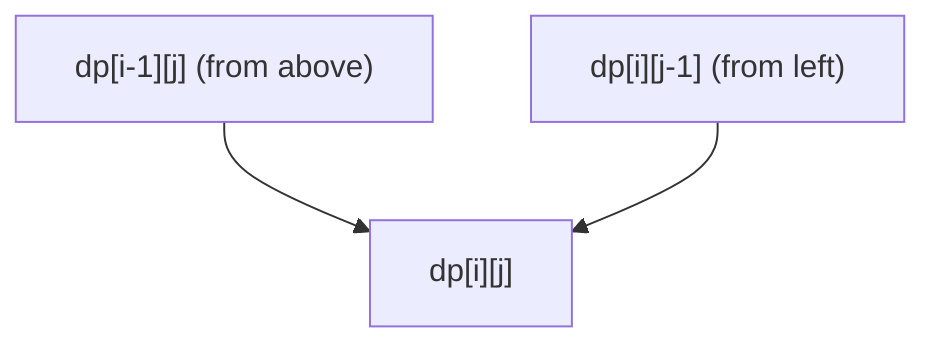
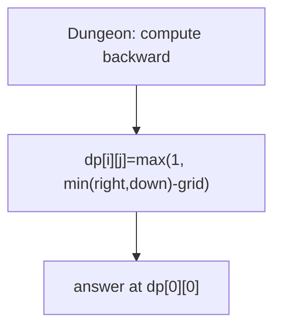
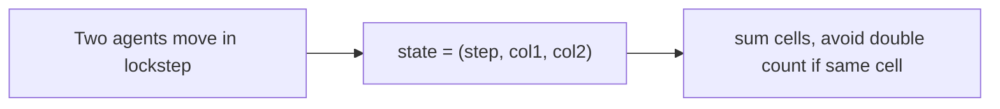
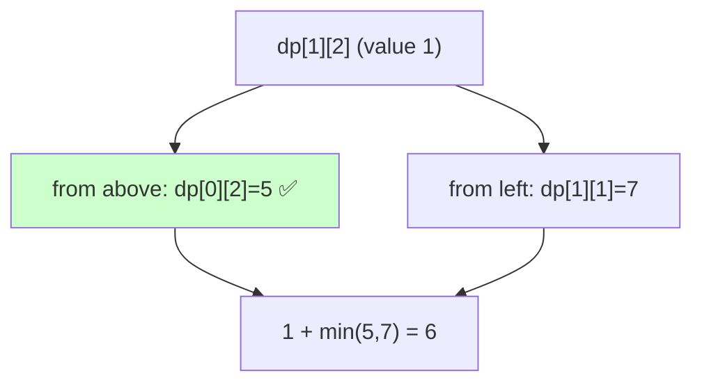
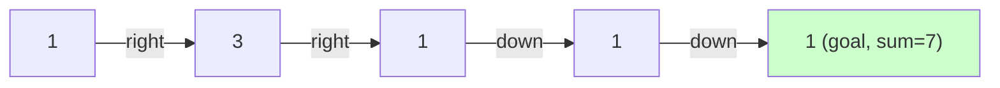

# 06 — Grid / 2D Path DP Problems

> Move on a 2D grid (usually right/down) to count paths or optimize a cost. State is the cell `dp[i][j]`; transition comes from neighbors already computed.



---

## A. Path counting

| # | Problem | Src | Diff | Transition |
|---|---|---|---|---|
| 1 | Unique Paths | LC 62 | 🟡 | `dp[i][j]=dp[i-1][j]+dp[i][j-1]` |
| 2 | Unique Paths II (obstacles) | LC 63 | 🟡 | obstacle → `dp=0` |
| 3 | Unique Paths III (visit all) | LC 980 | 🔴 | backtracking (file 01) |
| 4 | Count paths with k moves | GFG | 🟡 | extend state with step count |
| 5 | Number of Paths with Sum (grid) | Variant | 🟡 | add sum dimension |
| 6 | Out of Boundary Paths | LC 576 | 🟡 | `dp[moves][i][j]` count exits |

```python
def unique_paths(m, n):
    dp = [1]*n
    for _ in range(1, m):
        for j in range(1, n):
            dp[j] += dp[j-1]
    return dp[-1]
```

### 💡 Problem-by-problem
1. **Unique Paths** — count right/down paths: `dp[i][j]=dp[i-1][j]+dp[i][j-1]` (Deep Dive 2); closed form `C(m+n−2, m−1)`.
2. **Unique Paths II (obstacles)** — same recurrence, but an obstacle cell contributes `0` paths (unreachable), which blocks everything downstream.
3. **Unique Paths III (visit all)** — must walk over *every* empty cell exactly once, so counting fails — switch to backtracking (file 01).
4. **Count paths with k moves** — add a step-count dimension `dp[i][j][k]`; only paths using exactly `k` moves are counted.
5. **Number of Paths with Sum** — add a running-sum dimension so the state distinguishes paths by accumulated value.
6. **Out of Boundary Paths** — `dp[moves][i][j]` counts ways to step off the grid within `N` moves; transitions spread to the 4 neighbors, counting an exit whenever a neighbor is out of bounds.

---

## B. Min / max path cost

| # | Problem | Src | Diff | Idea |
|---|---|---|---|---|
| 7 | Minimum Path Sum | LC 64 | 🟡 | `grid+min(up,left)` |
| 8 | Triangle | LC 120 | 🟡 | bottom-up `dp[j]+=min(dp[j],dp[j+1])` |
| 9 | Minimum Falling Path Sum | LC 931 | 🟡 | min of 3 cells above |
| 10 | Minimum Falling Path Sum II | LC 1289 | 🔴 | track best & 2nd-best per row |
| 11 | Maximal Square | LC 221 | 🟡 | `dp=min(top,left,diag)+1` |
| 12 | Maximal Rectangle | LC 85 | 🔴 | histogram + stack per row |
| 13 | Dungeon Game | LC 174 | 🔴 | **reverse** DP (need ≥1 HP) |
| 14 | Cherry Pickup | LC 741 | 🔴 | two paths → `dp[r1][c1][c2]` |
| 15 | Cherry Pickup II (two robots) | LC 1463 | 🔴 | `dp[row][c1][c2]` |
| 16 | Minimum Cost Path (GFG) | GFG | 🟡 | Dijkstra/DP hybrid |
| 17 | Path With Maximum Gold | LC 1219 | 🟡 | DFS backtracking |
| 18 | Where Will the Ball Fall | LC 1706 | 🟡 | simulate per column |

```python
def dungeon(grid):
    m, n = len(grid), len(grid[0])
    INF = float('inf')
    dp = [[INF]*(n+1) for _ in range(m+1)]
    dp[m][n-1] = dp[m-1][n] = 1
    for i in range(m-1, -1, -1):
        for j in range(n-1, -1, -1):
            need = min(dp[i+1][j], dp[i][j+1]) - grid[i][j]
            dp[i][j] = max(1, need)
    return dp[0][0]
```



### 💡 Problem-by-problem
7. **Minimum Path Sum** — `grid[i][j] + min(up, left)`: each cell is entered from above or left, so take the cheaper (Deep Dive 1).
8. **Triangle** — fill bottom-up so each cell adds the smaller of the two cells below: `dp[j]+=min(dp[j], dp[j+1])`, collapsing to one row.
9. **Minimum Falling Path Sum** — falling from the row above, a cell may come from directly above or the two diagonals: `min(up-left, up, up-right)`.
10. **Minimum Falling Path Sum II** — the path can't stay in the same column, so precompute the best and second-best of the previous row; a cell uses the best unless that was its own column, then the second-best — `O(n²)` not `O(n³)`.
11. **Maximal Square** — `dp[i][j]` = side of the largest all-ones square ending at `(i,j)` = `min(top, left, diagonal)+1`, since a square needs all three neighbors to extend.
12. **Maximal Rectangle** — treat each row as the base of a histogram of consecutive ones, then apply largest-rectangle-in-histogram (monotonic stack) per row.
13. **Dungeon Game** — solved **backward** from the princess: `dp[i][j]=max(1, min(right,down)−grid[i][j])` is the minimum HP needed to *enter* `(i,j)`. Forward DP fails because the health you need depends on the *future*, not the past — hence the reverse fill (code above).
14. **Cherry Pickup** — go-and-return equals two simultaneous top-left→bottom-right paths; state `dp[r1][c1][c2]` (the second row is derived), counting a shared cell only once.
15. **Cherry Pickup II (two robots)** — two robots descend row by row; state `dp[row][c1][c2]` tries all 3×3 column-move combinations, avoiding double-count when columns coincide.
16. **Minimum Cost Path (GFG)** — moves in all 4 directions with costs, so a fixed DP order breaks; use a Dijkstra/DP hybrid (priority queue) over cells.
17. **Path With Maximum Gold** — collect maximum gold with 4-directional moves and no revisits; backtracking DFS marking/unmarking cells, since the no-revisit rule forbids plain DP.
18. **Where Will the Ball Fall** — simulate each ball column by column, where each board deflects it left/right; it passes only if adjacent boards agree.

---

## C. Two‑traversal / 3D grid DP



| # | Problem | Src | Diff | Idea |
|---|---|---|---|---|
| Cherry Pickup | LC 741 | 🔴 | go + return = two simultaneous paths |
| Cherry Pickup II | LC 1463 | 🔴 | two robots top→bottom |
| Minimum Falling Path II | LC 1289 | 🔴 | avoid same column |

### 💡 How these 3D problems share one idea
All three move **two coordinates in lockstep** and pack them into one state so both are optimized together:
- **Cherry Pickup** — going down then back up is equivalent to *two* downward paths walked simultaneously; state `(step, col1, col2)`, a shared cell counted once.
- **Cherry Pickup II** — the two robots already are two paths; same `(row, col1, col2)` state, trying all combinations of their next columns.
- **Minimum Falling Path II** — the "second coordinate" is just the rule that consecutive rows use different columns, handled by tracking best/second-best per row.

The common trick: when two traversals interact, make the state the **joint position** of both rather than running them separately.

---

## 🔬 Deep Dive 1 — Minimum Path Sum, grid filled cell by cell

**Problem:** from top-left to bottom-right, moving only **right or down**, minimize the sum of visited cells.

$$grid = \begin{bmatrix} 1 & 3 & 1 \\ 1 & 5 & 1 \\ 4 & 2 & 1 \end{bmatrix}$$

### Recurrence and *why*
A cell `(i,j)` can only be entered from **above** `(i-1,j)` or from the **left** `(i,j-1)`. To minimize the total when arriving at `(i,j)`, pick the cheaper predecessor and add the current cell:

$$dp[i][j] = grid[i][j] + \min\big(\underbrace{dp[i-1][j]}_{\text{came down}},\ \underbrace{dp[i][j-1]}_{\text{came right}}\big)$$

$$\text{edges: top row sums leftward, left column sums downward (only one way in)}$$

> **Why `min` of only two cells?** The move set is "right or down", so the *only* cells that can flow into `(i,j)` are its top and left neighbors. Optimal substructure: the best path to `(i,j)` must use the best path to whichever neighbor it came from.

### Filling the `dp` table

| dp | j=0 | j=1 | j=2 |
|----|-----|-----|-----|
| **i=0** | 1 | 1+3=4 | 4+1=5 |
| **i=1** | 1+1=2 | `5 + min(4,2)=7` | `1 + min(5,7)=6` |
| **i=2** | 2+4=6 | `2 + min(7,6)=8` | `1 + min(6,8)=7` |

**Answer = `dp[2][2] = 7`**, via path `1→3→1→1→1` (right, right, down, down).

### How `dp[1][2]` was decided
Cell value `1`; predecessors `dp[0][2]=5` (above) and `dp[1][1]=7` (left) → `1 + min(5,7) = 6`.





---

## 🔬 Deep Dive 2 — Unique Paths, counting grid

**Problem:** count distinct paths from top-left to bottom-right of a `3×3` grid, moving only right/down. Answer: `6`.

### Recurrence and reasoning
The number of ways to reach `(i,j)` is the **sum** of the ways to reach the two cells that lead into it:

$$dp[i][j] = dp[i-1][j] + dp[i][j-1], \qquad dp[0][j] = dp[i][0] = 1$$

> **Why sum (not min)?** This is **counting**, not optimizing. Paths through the top neighbor and paths through the left neighbor are disjoint sets, so total paths = their sum. The first row/column are all `1` because there is exactly one straight-line way to reach them.
>
> Closed form (combinatorics): for an `m×n` grid you make `(m-1)` downs and `(n-1)` rights in any order:
> $$\text{paths} = \binom{m+n-2}{m-1}$$

### The counting table

| dp | j=0 | j=1 | j=2 |
|----|-----|-----|-----|
| **i=0** | 1 | 1 | 1 |
| **i=1** | 1 | 1+1=2 | 2+1=3 |
| **i=2** | 1 | 1+2=3 | 3+3=**6** |

**Answer = `dp[2][2] = 6`**, matching $\binom{4}{2} = 6$. ✅

---

## 🔑 Grid DP checklist
- [ ] Identify allowed moves (right/down? diagonals? both directions?).
- [ ] Decide **forward** vs **backward** fill (Dungeon needs backward).
- [ ] Obstacles → set those cells to 0 / ∞.
- [ ] Roll to a single row for $O(n)$ space when only the previous row is needed.

➡️ Next: [07 — Interval DP](07-interval-dp.md)
