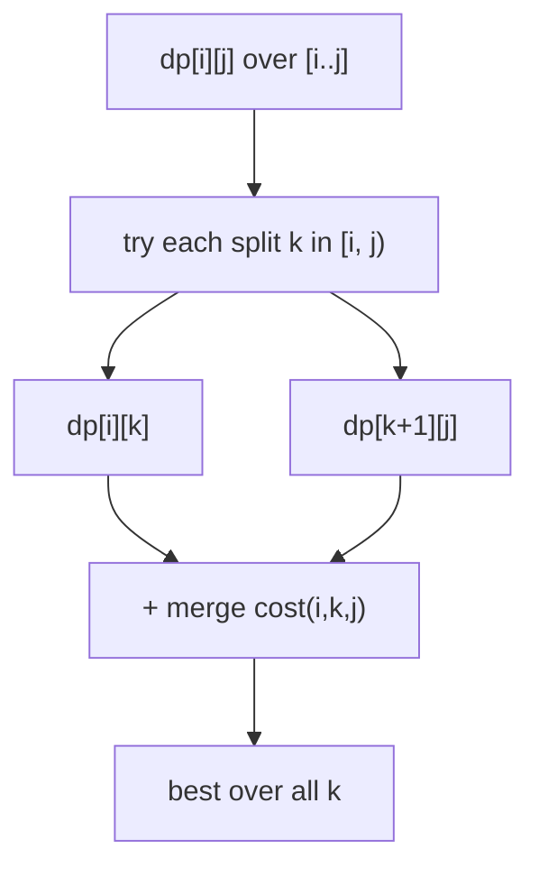
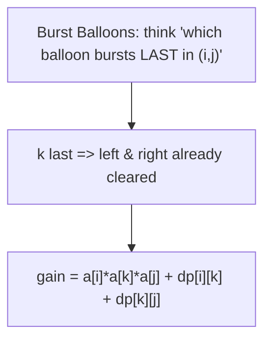
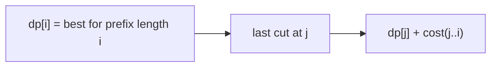
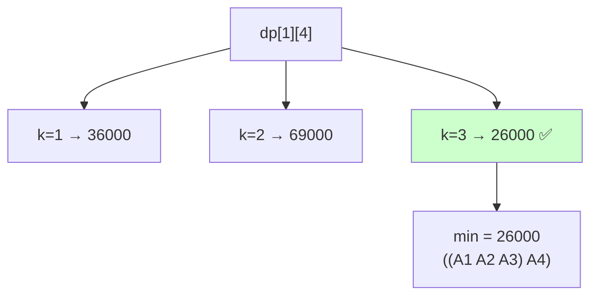

# 07 — Interval / Range DP Problems

> The answer for a range `[i, j]` is built by choosing a split/partition point `k` inside it. Usually $O(n^3)$: $O(n^2)$ states × $O(n)$ splits.



> ⏱️ Iterate by **increasing interval length** so smaller ranges are ready before larger ones.

---

## A. Classic interval DP

| # | Problem | Src | Diff | Merge cost |
|---|---|---|---|---|
| 1 | Matrix Chain Multiplication | Classic/GFG | 🔴 | `dims[i-1]*dims[k]*dims[j]` |
| 2 | Burst Balloons | LC 312 | 🔴 | `nums[i-1]*nums[k]*nums[j+1]` (k bursts last) |
| 3 | Minimum Cost to Cut a Stick | LC 1547 | 🔴 | `(right-left)` per cut |
| 4 | Stone Game (general) | LC 1000 | 🔴 | merge K piles, prefix-sum cost |
| 5 | Minimum Score Triangulation | LC 1039 | 🟡 | `v[i]*v[k]*v[j]` |
| 6 | Remove Boxes | LC 546 | 🔴 | 3D state `dp[i][j][k]` |
| 7 | Strange Printer | LC 664 | 🔴 | interval merge of equal chars |
| 8 | Predict the Winner / Stone Game | LC 486/877 | 🟡 | game theory (file 10) |

```python
def burst_balloons(nums):
    a = [1] + nums + [1]
    n = len(a)
    dp = [[0]*n for _ in range(n)]
    for length in range(2, n):           # gap between boundaries
        for i in range(0, n-length):
            j = i + length
            for k in range(i+1, j):      # k = last balloon burst in (i,j)
                dp[i][j] = max(dp[i][j],
                               dp[i][k] + a[i]*a[k]*a[j] + dp[k][j])
    return dp[0][n-1]
```



### 💡 Problem-by-problem
1. **Matrix Chain Multiplication** — `dp[i][j]` = min cost to multiply `Aᵢ…Aⱼ`; split on the *last* multiply, cost `p[i-1]·p[k]·p[j]` (Deep Dive 1).
2. **Burst Balloons** — ask which balloon bursts *last* in `(i,j)` so its neighbors are the fixed boundaries; gain `a[i]·a[k]·a[j]` plus the two independent sides (Deep Dive 2).
3. **Minimum Cost to Cut a Stick** — add the cut positions as boundaries; `dp[i][j]` = min cost to cut the segment between cuts `i` and `j`, the merge cost being the segment length `(right−left)`.
4. **Stone Game (merge K piles)** — merge contiguous piles; a merge costs the prefix-sum of the range, and the split point chooses where the two sub-merges meet.
5. **Minimum Score Triangulation** — triangulating a polygon, each triangle `(i,k,j)` costs `v[i]·v[k]·v[j]`; pick the apex `k` that splits the polygon into two smaller fans.
6. **Remove Boxes** — needs a 3D state `dp[i][j][k]` where `k` counts boxes equal to box `i` already attached on the left, because the reward (k²) depends on how many same-colored boxes are removed together.
7. **Strange Printer** — `dp[i][j]` = min turns to print `s[i..j]`; if `s[i]==s[k]` they can share one stroke, merging intervals and saving a turn.
8. **Predict the Winner / Stone Game** — two players pick from the ends; `dp[i][j]` = best score *difference* the current player can force (game theory, file 10).

---

## B. Partition / cut DP (1D prefix variant)



| # | Problem | Src | Diff | Idea |
|---|---|---|---|---|
| 9 | Palindrome Partitioning II | LC 132 | 🔴 | `cut[i]=min(cut[j]+1)` if `s[j..i]` pal |
| 10 | Partition Array for Maximum Sum | LC 1043 | 🟡 | last group size ≤ k |
| 11 | Minimum Cost to Merge Stones | LC 1000 | 🔴 | merge in groups of K |
| 12 | Allocate Minimum Pages | GFG | 🟡 | binary search + partition DP |
| 13 | Painter's Partition | GFG | 🟡 | split into k segments, minimize max |
| 14 | Boolean Parenthesization | GFG | 🔴 | count true/false ways over operators |
| 15 | Egg Drop | LC 887 | 🔴 | `dp[k][m]` eggs×moves, or interval form |

```python
# Palindrome Partitioning II
def min_cut(s):
    n = len(s)
    pal = [[False]*n for _ in range(n)]
    for i in range(n-1, -1, -1):
        for j in range(i, n):
            if s[i]==s[j] and (j-i<2 or pal[i+1][j-1]):
                pal[i][j] = True
    cut = list(range(-1, n))             # cut[i] for first i chars
    for i in range(1, n+1):
        for j in range(i):
            if pal[j][i-1]:
                cut[i] = min(cut[i], cut[j]+1)
    return cut[n]
```

### 💡 Problem-by-problem
9. **Palindrome Partitioning II** — `cut[i]` = min cuts for the first `i` chars; extend from any `j` where `s[j..i]` is a palindrome (precomputed), so `cut[i]=min(cut[j]+1)`.
10. **Partition Array for Maximum Sum** — `dp[i]` = best sum for the prefix; the last group has size ≤ k and every element in it becomes the group's max, so try all group sizes.
11. **Minimum Cost to Merge Stones** — merge K-at-a-time; only feasible when `(n−1) % (K−1) == 0`, and the interval state tracks how many piles remain mod `(K−1)`.
12. **Allocate Minimum Pages** — minimize the maximum pages per student; binary-search the answer and greedily check, or partition-DP over books×students.
13. **Painter's Partition** — identical structure to book allocation: split the array into k contiguous segments minimizing the largest segment sum.
14. **Boolean Parenthesization** — count parenthesizations evaluating to true; `dp[i][j][T/F]` combines left/right truth counts across each operator `&`, `|`, `^`.
15. **Egg Drop** — `dp[eggs][moves]` = highest number of floors testable; each move either breaks (test below) or survives (test above): `dp[e][m]=dp[e-1][m-1]+dp[e][m-1]+1`.

---

## 🔬 Deep Dive 1 — Matrix Chain Multiplication, interval table

**Problem:** multiply matrices `A₁·A₂·A₃·A₄` with dimensions given by `p = [40, 20, 30, 10, 30]` (so `Aᵢ` is `p[i-1]×p[i]`). Find the parenthesization minimizing scalar multiplications.

### Recurrence and *why*
Let `dp[i][j]` = minimum cost to multiply `Aᵢ…Aⱼ`. The product is finally formed by **one last multiplication** that joins a left block `Aᵢ…Aₖ` with a right block `Aₖ₊₁…Aⱼ`. We try every split `k`:

$$dp[i][j] = \min_{i \le k < j}\Big(dp[i][k] + dp[k+1][j] + \underbrace{p_{i-1}\cdot p_k \cdot p_j}_{\text{cost of last multiply}}\Big)$$

$$dp[i][i] = 0 \quad(\text{a single matrix needs no multiply})$$

> **Why split on a "last multiply"?** Any full parenthesization has exactly one outermost `·`. Fixing where that split is makes the two sides **independent** subproblems already solved as smaller intervals. The `p[i-1]·p[k]·p[j]` term is the cost of multiplying the two resulting `(p[i-1]×p[k])` and `(p[k]×p[j])` matrices.

### Fill order: by increasing interval length

Indices 1..4. We fill length-2 intervals, then length-3, then length-4.

**Length 2:**
| interval | only split | cost |
|----------|-----------|------|
| dp[1][2] | k=1 | `0+0 + 40·20·30 = 24000` |
| dp[2][3] | k=2 | `0+0 + 20·30·10 = 6000` |
| dp[3][4] | k=3 | `0+0 + 30·10·30 = 9000` |

**Length 3:**
| interval | split k | cost | min |
|----------|---------|------|-----|
| dp[1][3] | k=1 | `0 + 6000 + 40·20·10 = 14000` | **14000** |
| | k=2 | `24000 + 0 + 40·30·10 = 36000` | |
| dp[2][4] | k=2 | `0 + 9000 + 20·30·30 = 27000` | **10000** |
| | k=3 | `6000 + 0 + 20·10·30 = 12000` | (min is 10000? recheck) |

Recomputing `dp[2][4]`: k=2 → `dp[2][2]+dp[3][4]+20·30·30 = 0+9000+18000 = 27000`; k=3 → `dp[2][3]+dp[4][4]+20·10·30 = 6000+0+6000 = 12000`. **min = 12000.**

**Length 4 (the answer):**
| split k | `dp[1][k]+dp[k+1][4]+ p₀·pₖ·p₄` | total |
|---------|-------------------------------|-------|
| k=1 | `0 + 12000 + 40·20·30` | `12000+24000=36000` |
| k=2 | `24000 + 9000 + 40·30·30` | `33000+36000=69000` |
| k=3 | `14000 + 0 + 40·10·30` | `14000+12000=26000` ✅ |

**Answer = `dp[1][4] = 26000`**, achieved by split `k=3`: `((A₁A₂A₃)·A₄)`.



> 🔑 Notice the table is filled **diagonally** (length 2 → 3 → 4). A range can only be computed once *all shorter ranges inside it* are known — that is the defining property of interval DP.

---

## 🔬 Deep Dive 2 — Burst Balloons, "what bursts last"

**Problem:** `nums = [3, 1, 5, 8]`. Bursting balloon `i` earns `left·nums[i]·right` (neighbors in the *current* array). Pad with `1`s on both ends. Maximize total coins. Answer: `167`.

### The clever recurrence and reasoning
Instead of "which balloon bursts **first**" (the array keeps changing — hard), ask **which balloon `k` bursts LAST** in the open interval `(i, j)`. When `k` is last, its neighbors are exactly the boundaries `i` and `j` (everything between already gone):

$$dp[i][j] = \max_{i < k < j}\Big(dp[i][k] + dp[k][j] + nums_i\cdot nums_k\cdot nums_j\Big)$$

with the padded array `[1, 3, 1, 5, 8, 1]` and `dp[i][j]` over **open** interval `(i,j)`.

> **Why "last" not "first"?** If `k` bursts first, its neighbors change for everything after → subproblems are entangled. If `k` bursts **last**, the sub-intervals `(i,k)` and `(k,j)` are fully independent (resolved before `k`), and `k`'s payoff uses the fixed boundaries `i,j`. This decoupling is the whole trick.

### Filling small intervals (padded array `v = [1,3,1,5,8,1]`, indices 0..5)

| interval (i,j) | inner k | `dp[i][k]+dp[k][j]+v[i]·v[k]·v[j]` | dp |
|----------------|---------|-----------------------------------|-----|
| (0,2) | 1 | `0+0+1·3·1 = 3` | **3** |
| (1,3) | 2 | `0+0+3·1·5 = 15` | **15** |
| (2,4) | 3 | `0+0+1·5·8 = 40` | **40** |
| (3,5) | 4 | `0+0+5·8·1 = 40` | **40** |
| (0,3) | 1 → `0+15+1·3·5=30`; 2 → `3+0+1·1·5=8` | max | **30** |
| (1,4) | 2 → `0+40+3·1·8=64`; 3 → `15+0+3·5·8=135` | max | **135** |
| (2,5) | 3 → `0+40+1·5·1=45`; 4 → `40+0+1·8·1=48` | max | **48** |

Continuing up to the full interval `(0,5)` yields **`dp[0][5] = 167`** (burst order ends with balloon `8` then `1` then `3`… last-burst reasoning).

> 🔑 Padding with `1`s removes annoying edge cases: a balloon at the border simply multiplies by `1`, so the same formula works everywhere.

---

## 🔑 Interval DP checklist
- [ ] State is a **range** `dp[i][j]`.
- [ ] Loop by **increasing length**, inner loop over split `k`.
- [ ] For "last action" problems (burst balloons, remove boxes), think *what happens **last*** in the interval.
- [ ] Use **prefix sums** to get merge cost in $O(1)$.
- [ ] Consider Knuth optimization to drop $O(n^3)\to O(n^2)$ when applicable.

➡️ Next: [08 — Tree & Graph DP](08-tree-graph-dp.md)
