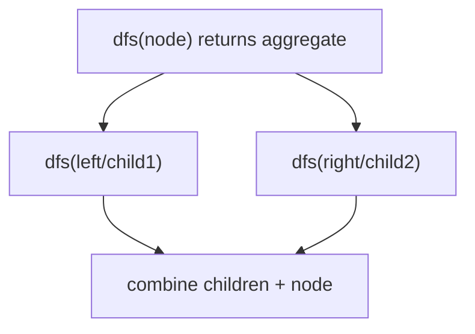
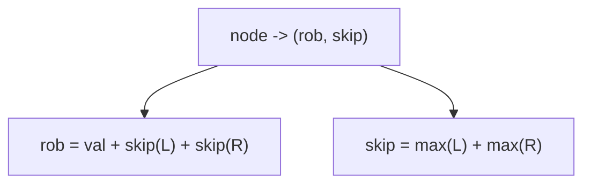
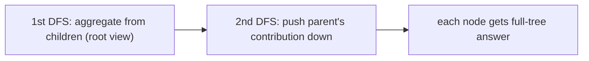
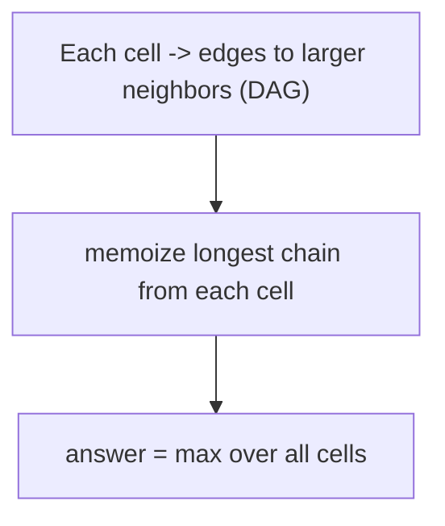
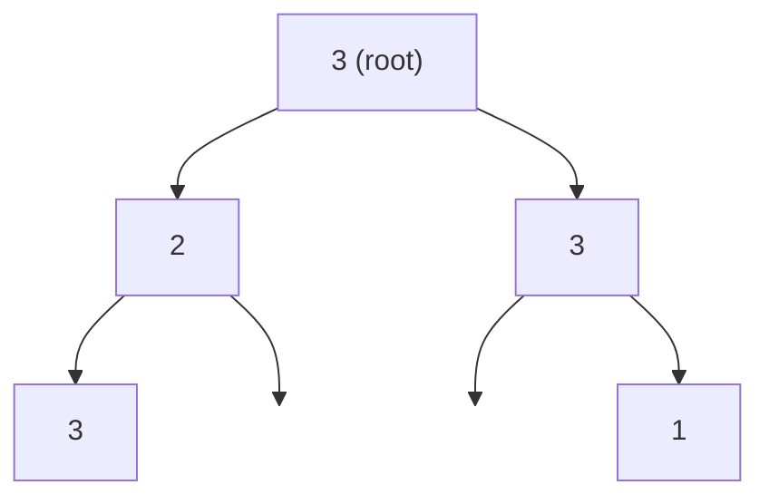
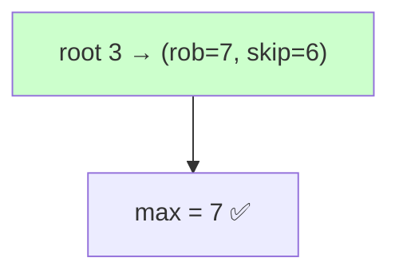

# 08 — Tree & Graph DP Problems

> A node's answer is composed from its children's answers (post‑order). On DAGs, DP follows topological order. Includes rerooting for "answer for every node."



---

## A. Tree DP (single pass, post‑order)

| # | Problem | Src | Diff | State per node |
|---|---|---|---|---|
| 1 | House Robber III | LC 337 | 🟡 | `(rob, skip)` |
| 2 | Binary Tree Maximum Path Sum | LC 124 | 🔴 | best downward chain; update global |
| 3 | Diameter of Binary Tree | LC 543 | 🟢 | height; update max(l+r) |
| 4 | Longest Univalue Path | LC 687 | 🟡 | extend if child==node |
| 5 | Distribute Coins in Binary Tree | LC 979 | 🟡 | balance flow per edge |
| 6 | Binary Tree Cameras | LC 968 | 🔴 | 3-state greedy DP |
| 7 | Count Good Nodes | LC 1448 | 🟡 | pass max-so-far down |
| 8 | Maximum Product of Splitted Tree | LC 1339 | 🟡 | subtree sums |
| 9 | Lowest Common Ancestor | LC 236 | 🟡 | post-order propagation |
| 10 | Sum of Distances in Tree (reroot) | LC 834 | 🔴 | two DFS rerooting |

```python
# House Robber III
def rob(root):
    def dfs(node):
        if not node: return (0, 0)         # (rob_node, skip_node)
        l, r = dfs(node.left), dfs(node.right)
        rob_node  = node.val + l[1] + r[1]
        skip_node = max(l) + max(r)
        return (rob_node, skip_node)
    return max(dfs(root))
```



### 💡 Problem-by-problem
1. **House Robber III** — return `(rob, skip)` per node; robbing forces children skipped, skipping lets each child pick its best (Deep Dive 1).
2. **Binary Tree Maximum Path Sum** — each node returns its best *downward* chain (`val + max(0, child)`), but updates a global with `val + left + right` (a path may bend at this node).
3. **Diameter of Binary Tree** — return height; the diameter through a node is `leftHeight + rightHeight`, tracked globally.
4. **Longest Univalue Path** — like diameter, but a child chain extends only if the child's value equals the node's.
5. **Distribute Coins in Binary Tree** — each edge must carry `|subtreeBalance|` coins; sum those absolute flows as the move count, returning the net excess/deficit upward.
6. **Binary Tree Cameras** — 3-state DP per node (has-camera / covered-no-camera / not-covered); greedily place cameras at parents of uncovered nodes to minimize count.
7. **Count Good Nodes** — pass the maximum-on-path downward; a node is "good" if its value ≥ that running max.
8. **Maximum Product of Splitted Tree** — compute every subtree sum; cutting an edge splits the tree into `subSum` and `total−subSum`, maximize their product.
9. **Lowest Common Ancestor** — post-order returns whether each target lies in a subtree; the node where both sides report found is the LCA.
10. **Sum of Distances in Tree** — the flagship rerooting problem (section B): one DFS for subtree sizes/distances, a second to shift the root.

---

## B. Rerooting DP (answer for every node)



| # | Problem | Src | Diff | Idea |
|---|---|---|---|---|
| 11 | Sum of Distances in Tree | LC 834 | 🔴 | reroot: `ans[child]=ans[par]+(N-2·cnt)` |
| 12 | Tree Distances I/II (CSES) | CSES | 🔴 | max dist / sum dist via reroot |
| 13 | Collecting Numbers (CF style) | CF | 🟡 | reroot accumulation |

### 💡 Why rerooting works (and the 3 problems)
A single DFS gives the answer **only for the chosen root**. Rerooting computes the answer for *every* node in `O(n)` total with two passes:
1. **Down-pass (post-order):** for the fixed root, aggregate each subtree (size, distance sum, etc.).
2. **Up-pass (pre-order):** move the root from a parent to a child with a cheap `O(1)` formula that *adds* what the rest of the tree contributes and *removes* the child's own subtree.

11. **Sum of Distances in Tree** — moving the root across edge `(par→child)`: every node in the child's subtree gets 1 closer and all others 1 farther, so `ans[child] = ans[par] + (N − 2·count[child])`.
12. **Tree Distances I/II (CSES)** — max distance from each node (I) and sum of distances (II); both reroot, combining the best downward branch with the contribution flowing from the parent.
13. **Collecting Numbers / accumulation (CF)** — generic rerooting: accumulate a value down, then redistribute the parent's complementary part during the up-pass.

---

## C. DP on DAG / graph

| # | Problem | Src | Diff | Idea |
|---|---|---|---|---|
| 14 | Longest Path in DAG | Classic | 🟡 | topo order + dp |
| 15 | Longest Increasing Path in Matrix | LC 329 | 🔴 | memoized DFS on implicit DAG |
| 16 | Course Schedule (orderings) | LC 210 | 🟡 | topo sort |
| 17 | Number of Paths in DAG | Classic/CF | 🟡 | dp over topo order |
| 18 | Cheapest Flights Within K Stops | LC 787 | 🟡 | Bellman-Ford style dp `dp[k][node]` |
| 19 | Critical Connections | LC 1192 | 🔴 | bridges (DFS low-link, not DP but related) |
| 20 | Parallel Courses | LC 1136 | 🟡 | topo levels |

```python
# Longest Increasing Path in a Matrix (memoized DFS over DAG)
def longest_increasing_path(matrix):
    if not matrix: return 0
    m, n = len(matrix), len(matrix[0])
    from functools import lru_cache
    @lru_cache(None)
    def dfs(i, j):
        best = 1
        for di, dj in ((1,0),(-1,0),(0,1),(0,-1)):
            x, y = i+di, j+dj
            if 0<=x<m and 0<=y<n and matrix[x][y] > matrix[i][j]:
                best = max(best, 1 + dfs(x, y))
        return best
    return max(dfs(i, j) for i in range(m) for j in range(n))
```



### 💡 Problem-by-problem
14. **Longest Path in DAG** — process nodes in topological order; `dp[v]=1+max(dp[u])` over incoming edges, since predecessors are finalized first.
15. **Longest Increasing Path in Matrix** — each cell points to strictly larger neighbors forming an implicit DAG; memoized DFS caches the longest chain from each cell (code above).
16. **Course Schedule (orderings)** — topological sort via Kahn's algorithm; a valid order exists iff there's no cycle, and that order *is* the schedule.
17. **Number of Paths in DAG** — count paths with `dp[v]=Σ dp[u]` over predecessors in topo order, source nodes seeded at 1.
18. **Cheapest Flights Within K Stops** — `dp[k][node]` = cheapest cost using ≤ k stops; Bellman-Ford-style relaxation bounded to `K+1` rounds.
19. **Critical Connections** — find bridges via DFS low-link values (Tarjan); not classic DP but a related post-order propagation of discovery/low times.
20. **Parallel Courses** — topological *levels*: each round takes all currently-unblocked courses, and the number of rounds equals the longest dependency chain.

---

## 🔬 Deep Dive 1 — House Robber III, post-order tuple propagation

**Problem:** rob a **binary tree** of houses; you cannot rob a node and its direct child together. Maximize total. Example tree:



(root=3, left=2 with right child 3, right=3 with right child 1.)

### Recurrence and *why a tuple*
For each node we return **two numbers**:

- `rob` = best total **if we rob this node** → then both children must be skipped:
  $$rob(node) = node.val + skip(left) + skip(right)$$
- `skip` = best total **if we skip this node** → each child may be robbed *or* skipped, take the better:
  $$skip(node) = \max(rob(left), skip(left)) + \max(rob(right), skip(right))$$

Final answer at the root: $\max(rob(root), skip(root))$.

> **Why return a pair instead of one number?** A parent's decision depends on whether each child was robbed. A single "best for subtree" number loses that information. The pair `(rob, skip)` carries exactly the one bit the parent needs — this is the tree analogue of House Robber's `dp[i-1]` vs `dp[i-2]`.

### Post-order evaluation (children first, leaves → root)

| node | rob = val + skipL + skipR | skip = max(L) + max(R) | (rob, skip) |
|------|---------------------------|------------------------|-------------|
| leaf `3` (under 2) | `3 + 0 + 0 = 3` | `0 + 0 = 0` | **(3, 0)** |
| node `2` (child: that 3) | `2 + skip(3)=0 → 2` | `max(3,0)=3` | **(2, 3)** |
| leaf `1` (under right 3) | `1` | `0` | **(1, 0)** |
| node `3` (right, child 1) | `3 + skip(1)=0 → 3` | `max(1,0)=1` | **(3, 1)** |
| **root `3`** | `3 + skip(2)=3 + skip(3right)=1 = 7` | `max(2,3)=3 + max(3,1)=3 = 6` | **(7, 6)** |

**Answer = `max(rob, skip) at root = max(7, 6) = 7`** → rob {root 3, leaf 3, right 1} = 3+3+1 = 7.



> 🔑 The values flow **upward** in post-order: a node can only be evaluated after both children return their `(rob, skip)` pairs. No explicit `dp` array is needed — the recursion stack *is* the table.

---

## 🔑 Tree/Graph DP checklist
- [ ] Use **post‑order** (compute children before parent).
- [ ] Return a **tuple/struct** when a node needs multiple sub‑answers (e.g., include/exclude).
- [ ] Update a **global** answer for path‑through‑node problems.
- [ ] For "answer at every node" use **rerooting** (two DFS passes).
- [ ] On graphs, ensure a **DAG / topological order** or memoize to avoid cycles.

➡️ Next: [09 — Bitmask DP](09-bitmask-dp.md)
