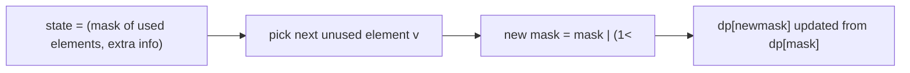
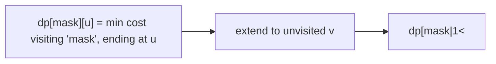
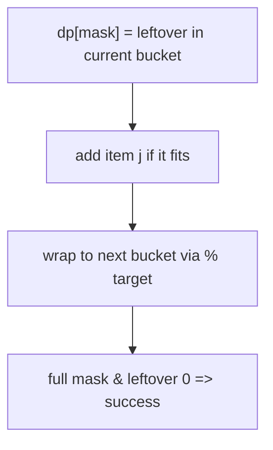
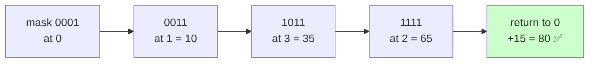

# 09 — Bitmask DP Problems

> When `n ≤ ~20` and you must track **which elements are used** as a set. The set becomes an integer bitmask; bit `j` set ⇒ element `j` is used.



> Bit tricks: `mask & (1<<j)` test · `mask | (1<<j)` set · `mask & ~(1<<j)` clear · `bin(mask).count('1')` popcount · iterate submasks: `s=(s-1)&mask`.

---

## A. Assignment / matching

| # | Problem | Src | Diff | Idea |
|---|---|---|---|---|
| 1 | Assignment Problem (min cost) | Classic | 🔴 | `dp[mask]` = min cost assigning first `popcount(mask)` people |
| 2 | Number of Ways to Wear Hats | LC 1434 | 🔴 | iterate hats, mask over people |
| 3 | Maximum Compatibility Score Sum | LC 1947 | 🟡 | assign students↔mentors |
| 4 | Campus Bikes II | LC 1066 | 🟡 | `dp[mask]` over assigned bikes |
| 5 | Minimum XOR Sum of Two Arrays | LC 1879 | 🔴 | pairing via mask |
| 6 | Fair Distribution of Cookies | LC 2305 | 🟡 | submask enumeration |

```python
# Assignment: cost[i][j] = cost of person i doing job j
def min_assignment(cost):
    n = len(cost)
    INF = float('inf')
    dp = [INF]*(1<<n); dp[0] = 0
    for mask in range(1<<n):
        i = bin(mask).count('1')           # next person to assign
        if i >= n: continue
        for j in range(n):
            if not (mask>>j)&1:
                nm = mask | (1<<j)
                dp[nm] = min(dp[nm], dp[mask] + cost[i][j])
    return dp[(1<<n)-1]
```

### 💡 Problem-by-problem
1. **Assignment Problem** — `dp[mask]` = min cost after assigning the first `popcount(mask)` people; the next person tries every free job `j` (code above).
2. **Number of Ways to Wear Hats** — too many people-masks? invert it: iterate over the 40 hats and let `dp[hat][mask]` track which people already have one.
3. **Maximum Compatibility Score Sum** — assign students to mentors one at a time; `dp[mask]` of assigned mentors, with student index = `popcount(mask)`.
4. **Campus Bikes II** — `dp[mask]` over assigned bikes, worker index = `popcount(mask)`; minimize total Manhattan distance.
5. **Minimum XOR Sum of Two Arrays** — pair element `i` of A (by popcount) with an unused element of B tracked in `mask`, minimizing the XOR sum.
6. **Fair Distribution of Cookies** — distribute bags to k children; enumerate **submasks** of the remaining bags as one child's share (submask trick below).

---

## B. TSP / path over subsets



| # | Problem | Src | Diff | Idea |
|---|---|---|---|---|
| 7 | Travelling Salesman | Classic | 🔴 | `dp[mask][u]`, $O(2^n n^2)$ |
| 8 | Shortest Path Visiting All Nodes | LC 847 | 🔴 | BFS over `(node, mask)` |
| 9 | Find the Shortest Superstring | LC 943 | 🔴 | TSP on overlap graph |
| 10 | Minimum Incompatibility | LC 1681 | 🔴 | partition via masks |

```python
def tsp(dist):
    n = len(dist); INF = float('inf')
    dp = [[INF]*n for _ in range(1<<n)]
    dp[1][0] = 0
    for mask in range(1<<n):
        for u in range(n):
            if dp[mask][u]==INF or not (mask>>u)&1: continue
            for v in range(n):
                if (mask>>v)&1: continue
                nm = mask | (1<<v)
                dp[nm][v] = min(dp[nm][v], dp[mask][u]+dist[u][v])
    full = (1<<n)-1
    return min(dp[full][u]+dist[u][0] for u in range(n))
```

### 💡 Problem-by-problem
7. **Travelling Salesman** — `dp[mask][u]` = min cost to visit set `mask` ending at `u`; the classic `O(2ⁿn²)` (Deep Dive).
8. **Shortest Path Visiting All Nodes** — BFS over states `(node, mask)` since all edges cost 1; the first time `mask` is full gives the answer.
9. **Find the Shortest Superstring** — build an overlap graph (characters saved when string `j` follows `i`), then it's TSP *maximizing* overlap.
10. **Minimum Incompatibility** — partition into k equal-size groups; precompute each valid subset's incompatibility, then DP over masks combining disjoint groups.

---

## C. Partition into groups (submask DP)

| # | Problem | Src | Diff | Idea |
|---|---|---|---|---|
| 11 | Partition to K Equal Sum Subsets | LC 698 | 🔴 | `dp[mask]` reachable, track running sum |
| 12 | Matchsticks to Square | LC 473 | 🟡 | 4 equal subsets |
| 13 | Maximum AND Sum of Array | LC 2172 | 🔴 | slots as base-3/mask |
| 14 | Distribute Repeating Integers | LC 1655 | 🔴 | submask over customer demands |
| 15 | Smallest Sufficient Team | LC 1125 | 🔴 | skills as bitmask, min people |

```python
# Partition to K equal subsets via bitmask
def can_partition_k(nums, k):
    total = sum(nums)
    if total % k: return False
    target = total // k
    n = len(nums); nums.sort(reverse=True)
    if nums[0] > target: return False
    dp = [-1]*(1<<n)                 # dp[mask] = remaining capacity in current bucket
    dp[0] = 0
    for mask in range(1<<n):
        if dp[mask] == -1: continue
        for j in range(n):
            if not (mask>>j)&1 and dp[mask] + nums[j] <= target:
                nm = mask | (1<<j)
                dp[nm] = (dp[mask] + nums[j]) % target
    return dp[(1<<n)-1] == 0
```



### 💡 Enumerating submasks (the key trick for partition DP)
To split a set into groups you often need every **subset of the currently free elements**. The idiom

```text
s = mask
while s > 0:
    # ... use submask s ...
    s = (s - 1) & mask
```

visits every nonzero submask of `mask` exactly once: subtracting 1 borrows through the lowest set bit, and `& mask` snaps back to only `mask`'s bits. Over all masks this costs `O(3ⁿ)` total (each element is in-submask / in-mask-only / absent).

### Problem-by-problem
11. **Partition to K Equal Sum Subsets** — `dp[mask]` = leftover capacity in the current bucket; add an item if it fits, wrap to the next bucket with `% target` (code above).
12. **Matchsticks to Square** — exactly K-partition with `k=4` and `target = perimeter/4`.
13. **Maximum AND Sum of Array** — each of the `2·slots` positions holds up to 2 numbers; encode slot occupancy in base-3 (or paired bits) and assign numbers one by one.
14. **Distribute Repeating Integers** — for each distinct value's count, enumerate **submasks** of the unsatisfied-customer set that this value can fully serve, then recurse on the rest.
15. **Smallest Sufficient Team** — skills form a bitmask goal; `dp[skillMask]` = fewest people covering those skills, each person OR-ing in their skills.

---

## 🔬 Deep Dive — Travelling Salesman (TSP) via bitmask, traced for 4 cities

**Problem:** start at city `0`, visit all cities exactly once, minimize total distance (open path / or return to 0). Distance matrix:

$$d = \begin{bmatrix} 0 & 10 & 15 & 20 \\ 10 & 0 & 35 & 25 \\ 15 & 35 & 0 & 30 \\ 20 & 25 & 30 & 0 \end{bmatrix}$$

### State, recurrence and *why*
Let `dp[mask][u]` = minimum cost of a path that **starts at city 0, has visited exactly the set `mask`, and currently sits at city `u`** (with `u ∈ mask`). To reach `u`, we came from some previously-visited city `v`:

$$dp[mask][u] = \min_{\substack{v \in mask \setminus \{u\}}}\Big(dp[mask \setminus \{u\}][v] + d[v][u]\Big)$$

$$\text{base: } dp[\{0\}][0] = 0$$

> **Why a bitmask for the state?** The future cost depends only on **which cities remain** and **where you are now** — not the order you visited them. The set "which visited" has `2ⁿ` possibilities, perfectly encoded as `n` bits. Pairing it with the current city `u` gives `2ⁿ · n` states, each an $O(n)$ transition → $O(2^n n^2)$, feasible for `n ≤ ~20`. Plain permutations would be `n!` — far worse.

### Bit encoding
City set `{0,2}` → bits `0101` = mask `5`. `mask & (1<<u)` tests membership; `mask ^ (1<<u)` removes `u`.

### Sample of the table being filled (cost to *reach* each city having visited a set)

| mask (set) | at u | computed from | dp |
|------------|------|---------------|-----|
| `0001` {0} | 0 | base | **0** |
| `0011` {0,1} | 1 | dp[{0}][0] + d[0][1] = 0+10 | **10** |
| `0101` {0,2} | 2 | dp[{0}][0] + d[0][2] = 0+15 | **15** |
| `1001` {0,3} | 3 | dp[{0}][0] + d[0][3] = 0+20 | **20** |
| `0111` {0,1,2} | 2 | min(dp[{0,1}][1]+d[1][2]=10+35=45, dp[{0,2}][2]… need at 1) | **45** |
| `0111` {0,1,2} | 1 | dp[{0,2}][2] + d[2][1] = 15+35 = 50 | **50** |
| `1111` {0,1,2,3} | 3 | min over v of dp[{0,1,2}][v] + d[v][3] | … |

For the **full** mask `1111` ending at city 3:
`dp[{0,1,2}][1]+d[1][3] = 50+25 = 75`, or `dp[{0,1,2}][2]+d[2][3] = 45+30 = 75` → **75**.

Closing the tour back to 0 (`+ d[u][0]`) and minimizing over the last city gives the classic optimal tour cost **80** (`0→1→3→2→0`: 10+25+30+15 = 80).



> 🔑 **`popcount(mask)` = how many cities visited.** You fill the table in increasing order of set size, because `dp[mask][u]` only depends on masks with **one fewer bit** — exactly like interval DP fills by increasing length.

---

## 🔑 Bitmask DP checklist
- [ ] Confirm `n ≤ ~20` (state space `2^n`).
- [ ] `popcount(mask)` often tells you "how many placed so far" → which item is next.
- [ ] Enumerate **submasks** with `s=(s-1)&mask` when partitioning.
- [ ] Memoize `dp[mask][...]`; watch memory for extra dimensions.

➡️ Next: [10 — Advanced DP](10-advanced-dp.md)
