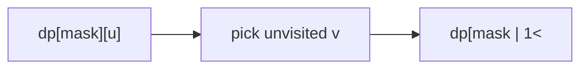

# Travelling Salesman Problem (TSP)

> dp[mask][u] = min cost visiting `mask`, ending at `u`. Classic · 🔴 Hard

## Problem
Given an `n × n` distance matrix, find the shortest tour that starts at city 0, visits every city exactly once, and returns to 0.

## 🧮 Math / Recurrence
`dp[mask][u]` = min cost of a path that has visited exactly the set `mask` and currently sits at city `u`:

$$
dp[mask \,|\, (1 \ll v)][v] = \min_{u \in mask}\big(dp[mask][u] + dist[u][v]\big)
$$

Answer: $\min_u dp[2^n-1][u] + dist[u][0]$.

## 🧠 Logic
The state records **which** cities are visited (`mask`) and **where** we are (`u`); the order doesn't matter for future cost, only the visited set does — that's the optimal-substructure that collapses `n!` permutations into `2ⁿ · n` states. We extend a path to an unvisited `v`, adding edge `dist[u][v]`. Finally we close the loop back to city 0.



## 🔢 Iteration trace (`dist = [[0,10,15],[10,0,20],[15,20,0]]`)
- 0→1→2→0 = 10+20+15 = 45; 0→2→1→0 = 15+20+10 = 45 → **45**.

## 🐍 Python
```python
def tsp(dist: list[list[int]]) -> int:
    n = len(dist)
    INF = float("inf")
    dp = [[INF] * n for _ in range(1 << n)]
    dp[1][0] = 0
    for mask in range(1 << n):
        for u in range(n):
            if dp[mask][u] == INF or not (mask >> u) & 1:
                continue
            for v in range(n):
                if (mask >> v) & 1:
                    continue
                nm = mask | (1 << v)
                dp[nm][v] = min(dp[nm][v], dp[mask][u] + dist[u][v])
    full = (1 << n) - 1
    return min(dp[full][u] + dist[u][0] for u in range(n))


if __name__ == "__main__":
    print(tsp([[0, 10, 15], [10, 0, 20], [15, 20, 0]]))   # 45
```

## ⚙️ C++
```cpp
#include <algorithm>
#include <iostream>
#include <vector>
using namespace std;

int tsp(vector<vector<int>>& dist) {
    int n = dist.size();
    const int INF = 1e9;
    vector<vector<int>> dp(1 << n, vector<int>(n, INF));
    dp[1][0] = 0;
    for (int mask = 0; mask < (1 << n); ++mask)
        for (int u = 0; u < n; ++u) {
            if (dp[mask][u] == INF || !((mask >> u) & 1)) continue;
            for (int v = 0; v < n; ++v) {
                if ((mask >> v) & 1) continue;
                int nm = mask | (1 << v);
                dp[nm][v] = min(dp[nm][v], dp[mask][u] + dist[u][v]);
            }
        }
    int full = (1 << n) - 1, best = INF;
    for (int u = 0; u < n; ++u) best = min(best, dp[full][u] + dist[u][0]);
    return best;
}

int main() {
    vector<vector<int>> dist = {{0, 10, 15}, {10, 0, 20}, {15, 20, 0}};
    cout << tsp(dist) << "\n";   // 45
}
```

## ⏱️ Complexity
- **Time:** `O(2ⁿ · n²)`.
- **Space:** `O(2ⁿ · n)`.
