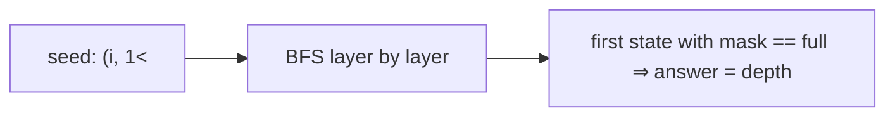

# Shortest Path Visiting All Nodes

> BFS over (node, mask) — unit edges. LC 847 · 🔴 Hard

## Problem
Given an undirected, connected graph as an adjacency list, return the length of the shortest walk that visits **every** node. You may start and stop anywhere and revisit nodes/edges.

## 🧮 Math / Recurrence
State `(u, mask)` = currently at `u` having visited set `mask`. Because every edge has weight 1, BFS finds the shortest distance:

$$
(u, mask) \to (v, mask \,|\, (1 \ll v)) \quad \text{for each neighbor } v
$$

The first dequeued state with `mask = 2ⁿ − 1` gives the answer.

## 🧠 Logic
Allowing revisits means a pure DP can loop, so we use **BFS** over the state graph instead — each layer adds one edge of cost 1, guaranteeing the first time a full mask appears is optimal. We seed the queue with all `n` starting nodes (`(i, 1<<i)`), since the start is free. A `visited` set on `(u, mask)` prevents reprocessing.



## 🔢 Iteration trace (`graph = [[1,2,3],[0],[0],[0]]`)
- Star centered at 0; visit all leaves → **4**.

## 🐍 Python
```python
from collections import deque

def shortest_path_length(graph: list[list[int]]) -> int:
    n = len(graph)
    full = (1 << n) - 1
    if n == 1:
        return 0
    queue: deque[tuple[int, int]] = deque((i, 1 << i) for i in range(n))
    seen = {(i, 1 << i) for i in range(n)}
    steps = 0
    while queue:
        for _ in range(len(queue)):
            u, mask = queue.popleft()
            if mask == full:
                return steps
            for v in graph[u]:
                nm = mask | (1 << v)
                if (v, nm) not in seen:
                    seen.add((v, nm))
                    queue.append((v, nm))
        steps += 1
    return -1


if __name__ == "__main__":
    print(shortest_path_length([[1, 2, 3], [0], [0], [0]]))   # 4
```

## ⚙️ C++
```cpp
#include <iostream>
#include <queue>
#include <vector>
using namespace std;

int shortestPathLength(vector<vector<int>>& graph) {
    int n = graph.size(), full = (1 << n) - 1;
    if (n == 1) return 0;
    vector<vector<bool>> seen(n, vector<bool>(1 << n, false));
    queue<pair<int, int>> q;
    for (int i = 0; i < n; ++i) { q.push({i, 1 << i}); seen[i][1 << i] = true; }
    int steps = 0;
    while (!q.empty()) {
        for (int sz = q.size(); sz > 0; --sz) {
            auto [u, mask] = q.front(); q.pop();
            if (mask == full) return steps;
            for (int v : graph[u]) {
                int nm = mask | (1 << v);
                if (!seen[v][nm]) { seen[v][nm] = true; q.push({v, nm}); }
            }
        }
        ++steps;
    }
    return -1;
}

int main() {
    vector<vector<int>> graph = {{1, 2, 3}, {0}, {0}, {0}};
    cout << shortestPathLength(graph) << "\n";   // 4
}
```

## ⏱️ Complexity
- **Time:** `O(2ⁿ · n²)`.
- **Space:** `O(2ⁿ · n)`.
