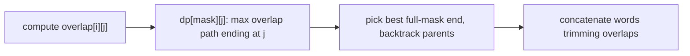

# Find the Shortest Superstring

> TSP on an overlap graph. LC 943 · 🔴 Hard

## Problem
Given a list of strings (none a substring of another), return the shortest string that contains every input string as a substring.

## 🧮 Math / Recurrence
Let `overlap[i][j]` = length of the longest suffix of `words[i]` equal to a prefix of `words[j]`. Maximize total overlap with a TSP-style DP:

$$
dp[mask \,|\, (1\ll j)][j] = \max_{i \in mask}\big(dp[mask][i] + overlap[i][j]\big)
$$

## 🧠 Logic
Concatenating in some order and merging overlaps, total length = `Σ len − Σ overlaps used`. Minimizing length ⇔ **maximizing** the overlap collected along a Hamiltonian path — exactly TSP on the overlap graph. We track `dp[mask][j]` (best overlap ending at word `j`) plus a parent pointer to rebuild the order, then stitch the strings using the recorded overlaps.



## 🔢 Iteration trace (`["alex","loves","leetcode"]`)
- e.g. "alexlovesleetcode" (one valid shortest) → length 17.

## 🐍 Python
```python
def shortest_superstring(words: list[str]) -> str:
    n = len(words)
    overlap = [[0] * n for _ in range(n)]
    for i in range(n):
        for j in range(n):
            if i != j:
                m = min(len(words[i]), len(words[j]))
                for k in range(m, 0, -1):
                    if words[i].endswith(words[j][:k]):
                        overlap[i][j] = k
                        break

    dp = [[0] * n for _ in range(1 << n)]
    parent = [[-1] * n for _ in range(1 << n)]
    for mask in range(1, 1 << n):
        for j in range(n):
            if not (mask >> j) & 1:
                continue
            pmask = mask ^ (1 << j)
            if pmask == 0:
                continue
            for i in range(n):
                if (pmask >> i) & 1 and dp[pmask][i] + overlap[i][j] > dp[mask][j]:
                    dp[mask][j] = dp[pmask][i] + overlap[i][j]
                    parent[mask][j] = i

    full = (1 << n) - 1
    last = max(range(n), key=lambda j: dp[full][j])
    order: list[int] = []
    mask = full
    j = last
    while j != -1:
        order.append(j)
        nj = parent[mask][j]
        mask ^= (1 << j)
        j = nj
    order.reverse()

    res = words[order[0]]
    for k in range(1, len(order)):
        i, j = order[k - 1], order[k]
        res += words[j][overlap[i][j]:]
    return res


if __name__ == "__main__":
    print(shortest_superstring(["alex", "loves", "leetcode"]))   # alexlovesleetcode
```

## ⚙️ C++
```cpp
#include <iostream>
#include <string>
#include <vector>
using namespace std;

string shortestSuperstring(vector<string>& words) {
    int n = words.size();
    vector<vector<int>> overlap(n, vector<int>(n, 0));
    for (int i = 0; i < n; ++i)
        for (int j = 0; j < n; ++j)
            if (i != j) {
                int m = min(words[i].size(), words[j].size());
                for (int k = m; k > 0; --k)
                    if (words[i].compare(words[i].size() - k, k, words[j], 0, k) == 0) {
                        overlap[i][j] = k; break;
                    }
            }

    vector<vector<int>> dp(1 << n, vector<int>(n, 0)), par(1 << n, vector<int>(n, -1));
    for (int mask = 1; mask < (1 << n); ++mask)
        for (int j = 0; j < n; ++j) {
            if (!((mask >> j) & 1)) continue;
            int pmask = mask ^ (1 << j);
            if (!pmask) continue;
            for (int i = 0; i < n; ++i)
                if ((pmask >> i) & 1 && dp[pmask][i] + overlap[i][j] > dp[mask][j]) {
                    dp[mask][j] = dp[pmask][i] + overlap[i][j];
                    par[mask][j] = i;
                }
        }

    int full = (1 << n) - 1, last = 0;
    for (int j = 1; j < n; ++j) if (dp[full][j] > dp[full][last]) last = j;
    vector<int> order;
    int mask = full, j = last;
    while (j != -1) { order.push_back(j); int nj = par[mask][j]; mask ^= (1 << j); j = nj; }
    reverse(order.begin(), order.end());

    string res = words[order[0]];
    for (size_t k = 1; k < order.size(); ++k)
        res += words[order[k]].substr(overlap[order[k - 1]][order[k]]);
    return res;
}

int main() {
    vector<string> words = {"alex", "loves", "leetcode"};
    cout << shortestSuperstring(words) << "\n";   // alexlovesleetcode
}
```

## ⏱️ Complexity
- **Time:** `O(2ⁿ · n² + n² · L)` where `L` = max word length.
- **Space:** `O(2ⁿ · n)`.
