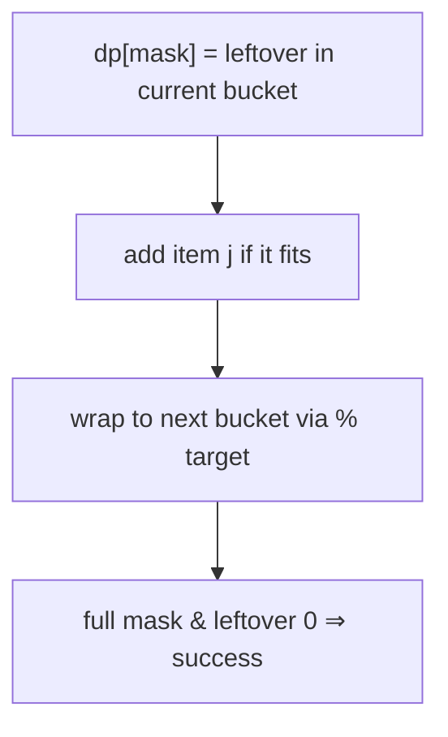

# Partition to K Equal Sum Subsets

> dp[mask] = leftover in current bucket; wrap with % target. LC 698 · 🔴 Hard

> Bitmask sibling of the backtracking version in [01-recursion-backtracking](../01-recursion-backtracking/) and the knapsack split in [03-knapsack-subset](../03-knapsack-subset/).

## Problem
Can `nums` be partitioned into `k` subsets all with the same sum?

## 🧮 Math / Recurrence
`target = sum/k`. `dp[mask]` = leftover capacity in the **current** bucket after using exactly the elements in `mask`. Reachable masks satisfy:

$$
dp[mask \,|\, (1 \ll j)] = (dp[mask] + nums[j]) \bmod target,\quad \text{if } dp[mask] + nums[j] \le target
$$

## 🧠 Logic
We greedily fill one bucket at a time. `dp[mask]` stores only how much of the current bucket is already used (modulo `target`): whenever it hits exactly `target`, the `% target` wraps it to `0`, automatically starting a fresh bucket. If the full mask is reachable with leftover `0`, all `k` buckets closed perfectly. Storing leftover (not bucket index) keeps the state one-dimensional.



## 🔢 Iteration trace (`nums=[4,3,2,3,5,2,1]`, `k=4`, target 6)
- Buckets {5,1},{4,2},{3,3},{2,2,...} → reachable, leftover 0 → **True**.

## 🐍 Python
```python
def can_partition_k(nums: list[int], k: int) -> bool:
    total = sum(nums)
    if total % k:
        return False
    target = total // k
    n = len(nums)
    nums.sort(reverse=True)
    if nums[0] > target:
        return False
    dp = [-1] * (1 << n)
    dp[0] = 0
    for mask in range(1 << n):
        if dp[mask] == -1:
            continue
        for j in range(n):
            if not (mask >> j) & 1 and dp[mask] + nums[j] <= target:
                nm = mask | (1 << j)
                dp[nm] = (dp[mask] + nums[j]) % target
    return dp[(1 << n) - 1] == 0


if __name__ == "__main__":
    print(can_partition_k([4, 3, 2, 3, 5, 2, 1], 4))   # True
```

## ⚙️ C++
```cpp
#include <algorithm>
#include <iostream>
#include <numeric>
#include <vector>
using namespace std;

bool canPartitionK(vector<int>& nums, int k) {
    int total = accumulate(nums.begin(), nums.end(), 0);
    if (total % k) return false;
    int target = total / k, n = nums.size();
    sort(nums.rbegin(), nums.rend());
    if (nums[0] > target) return false;
    vector<int> dp(1 << n, -1);
    dp[0] = 0;
    for (int mask = 0; mask < (1 << n); ++mask) {
        if (dp[mask] == -1) continue;
        for (int j = 0; j < n; ++j)
            if (!((mask >> j) & 1) && dp[mask] + nums[j] <= target) {
                int nm = mask | (1 << j);
                dp[nm] = (dp[mask] + nums[j]) % target;
            }
    }
    return dp[(1 << n) - 1] == 0;
}

int main() {
    vector<int> nums = {4, 3, 2, 3, 5, 2, 1};
    cout << boolalpha << canPartitionK(nums, 4) << "\n";   // true
}
```

## ⏱️ Complexity
- **Time:** `O(2ⁿ · n)`.
- **Space:** `O(2ⁿ)`.
