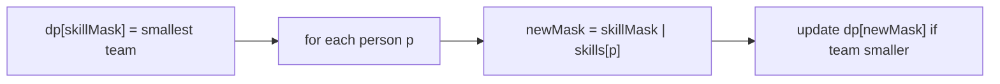

# Smallest Sufficient Team

> Skills as a bitmask goal; min people. LC 1125 · 🔴 Hard

## Problem
Given `req_skills` and a list of `people` (each with a skill subset), return the indices of a **smallest** team that collectively covers every required skill.

## 🧮 Math / Recurrence
Encode each person's skills as a bitmask over `req_skills`. `dp[skillMask]` = a smallest team covering exactly the skills in `skillMask`:

$$
dp[skillMask \,|\, p_{mask}] \leftarrow dp[skillMask] + \{p\} \quad \text{if it shrinks the team}
$$

## 🧠 Logic
The state is the **set of skills already covered** (≤ 16 skills ⇒ `2¹⁶` states), not which people are chosen — that's the bitmask insight. Each person ORs their skills into the current mask; we keep the team list of minimum size for every reachable skill set. Iterating people over all masks and only updating when the new team is strictly smaller yields the optimum at the full-skill mask.



## 🔢 Iteration trace (`req=["java","nodejs","reactjs"]`, people=[["java"],["nodejs"],["nodejs","reactjs"]])
- Pick person 0 and person 2 → indices **[0, 2]**.

## 🐍 Python
```python
def smallest_sufficient_team(
    req_skills: list[str], people: list[list[str]]
) -> list[int]:
    idx = {s: i for i, s in enumerate(req_skills)}
    n = len(req_skills)
    full = (1 << n) - 1
    skill_mask = [sum(1 << idx[s] for s in p if s in idx) for p in people]

    dp: dict[int, list[int]] = {0: []}
    for i, pm in enumerate(skill_mask):
        if pm == 0:
            continue
        for cur, team in list(dp.items()):
            nm = cur | pm
            if nm == cur:
                continue
            if nm not in dp or len(dp[nm]) > len(team) + 1:
                dp[nm] = team + [i]
    return dp[full]


if __name__ == "__main__":
    req = ["java", "nodejs", "reactjs"]
    ppl = [["java"], ["nodejs"], ["nodejs", "reactjs"]]
    print(smallest_sufficient_team(req, ppl))   # [0, 2]
```

## ⚙️ C++
```cpp
#include <iostream>
#include <unordered_map>
#include <vector>
using namespace std;

vector<int> smallestSufficientTeam(vector<string>& reqSkills,
                                   vector<vector<string>>& people) {
    unordered_map<string, int> idx;
    int n = reqSkills.size();
    for (int i = 0; i < n; ++i) idx[reqSkills[i]] = i;
    int full = (1 << n) - 1;

    unordered_map<int, vector<int>> dp;
    dp[0] = {};
    for (int i = 0; i < (int)people.size(); ++i) {
        int pm = 0;
        for (auto& s : people[i]) pm |= 1 << idx[s];
        if (pm == 0) continue;
        for (auto it = dp.begin(); it != dp.end(); ) {
            int cur = it->first;
            vector<int> team = it->second;
            ++it;
            int nm = cur | pm;
            if (nm == cur) continue;
            if (!dp.count(nm) || dp[nm].size() > team.size() + 1) {
                team.push_back(i);
                dp[nm] = team;
            }
        }
    }
    return dp[full];
}

int main() {
    vector<string> req = {"java", "nodejs", "reactjs"};
    vector<vector<string>> ppl = {{"java"}, {"nodejs"}, {"nodejs", "reactjs"}};
    for (int i : smallestSufficientTeam(req, ppl)) cout << i << " ";  // 0 2
    cout << "\n";
}
```

## ⏱️ Complexity
- **Time:** `O(people · 2ⁿ)` skill states.
- **Space:** `O(2ⁿ)`.
