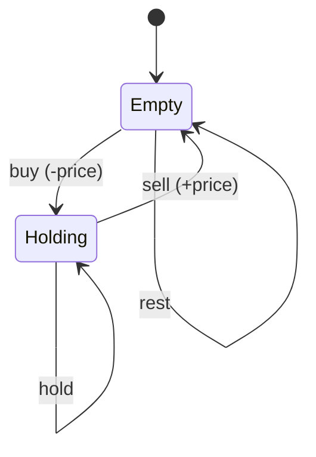
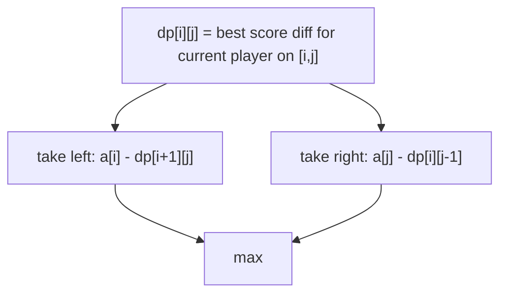
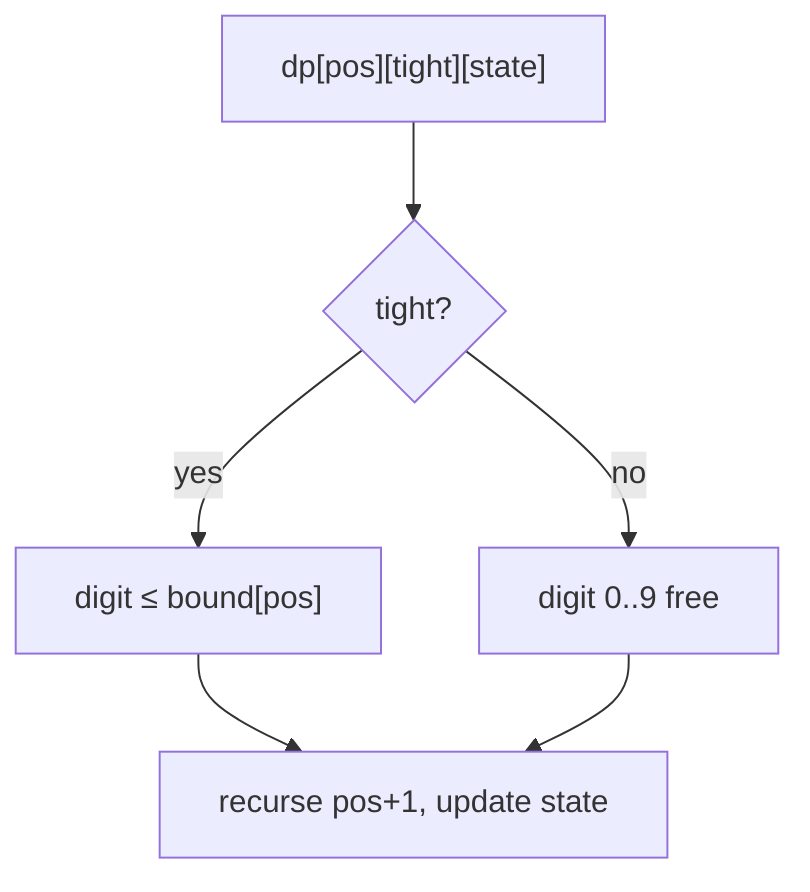
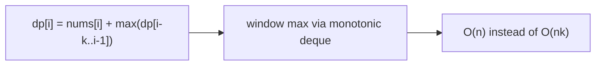
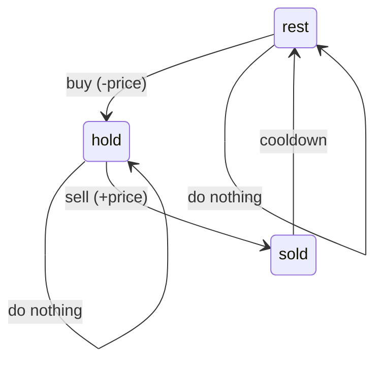
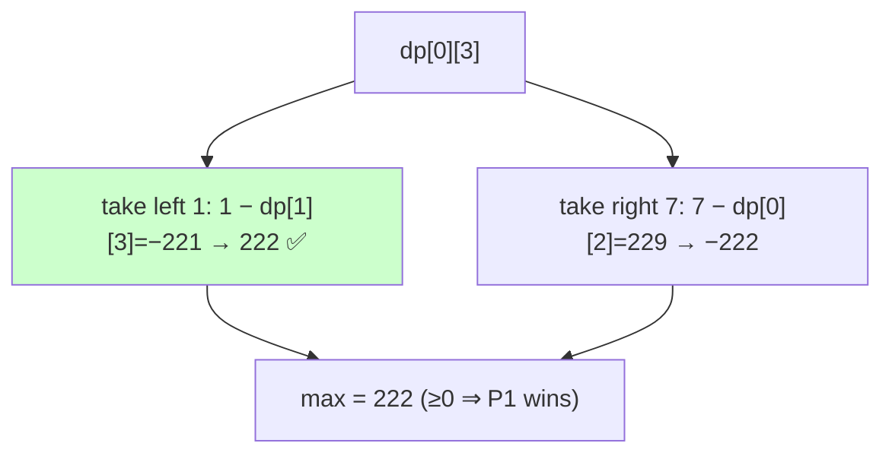

# 10 — Advanced DP Problems

> Specialized but high‑value patterns: state‑machine (stocks), game theory, digit DP, probability/expectation, and DP optimizations (binary search, monotonic, Knuth, matrix exponentiation).

---

## A. State‑machine DP (stocks)



| # | Problem | Src | Diff | Idea |
|---|---|---|---|---|
| 1 | Best Time to Buy/Sell Stock | LC 121 | 🟢 | one transaction; track min price |
| 2 | …II (unlimited) | LC 122 | 🟡 | sum of positive deltas |
| 3 | …III (≤2 txns) | LC 123 | 🔴 | 4 states |
| 4 | …IV (≤k txns) | LC 188 | 🔴 | `dp[k][hold]` |
| 5 | …with Cooldown | LC 309 | 🟡 | 3 states: hold/empty/cooldown |
| 6 | …with Transaction Fee | LC 714 | 🟡 | subtract fee on sell |

```python
def max_profit_k(k, prices):
    if not prices: return 0
    if k >= len(prices)//2:                 # unlimited case
        return sum(max(0, prices[i+1]-prices[i]) for i in range(len(prices)-1))
    buy = [float('-inf')]*(k+1)
    sell = [0]*(k+1)
    for p in prices:
        for t in range(1, k+1):
            buy[t]  = max(buy[t], sell[t-1] - p)
            sell[t] = max(sell[t], buy[t] + p)
    return sell[k]
```

### 💡 Problem-by-problem
1. **Best Time to Buy/Sell Stock** — one transaction: scan tracking the minimum price so far and the best `price − min` profit.
2. **…II (unlimited)** — capture every upward move: sum all positive consecutive differences `max(0, p[i+1]−p[i])`.
3. **…III (≤2 transactions)** — four interleaved states (buy1, sell1, buy2, sell2) updated daily, since the second buy builds on the first sell's profit.
4. **…IV (≤k transactions)** — generalize to `buy[t]/sell[t]` arrays; if `k ≥ n/2` it's effectively unlimited (code above).
5. **…with Cooldown** — three states hold/sold/rest, because the post-sell ban makes "can I buy?" depend on whether I sold yesterday (Deep Dive 1).
6. **…with Transaction Fee** — like unlimited, but subtract the fee on each sell so tiny gains aren't worth taking.

---

## B. Game theory DP (minimax)



| # | Problem | Src | Diff | Idea |
|---|---|---|---|---|
| 7 | Predict the Winner | LC 486 | 🟡 | score-diff DP |
| 8 | Stone Game | LC 877 | 🟡 | same; first player wins (even n) |
| 9 | Stone Game II | LC 1140 | 🔴 | `dp[i][M]` with variable take |
| 10 | Stone Game III | LC 1406 | 🔴 | take 1‑3, score-diff |
| 11 | Nim Game | LC 292 | 🟢 | `n%4!=0` (Sprague‑Grundy) |
| 12 | Can I Win | LC 464 | 🔴 | bitmask memo of used numbers |
| 13 | Divisor Game | LC 1025 | 🟢 | parity argument |
| 14 | Flip Game II | LC 294 | 🟡 | memo over board states |

```python
def predict_winner(nums):
    n = len(nums)
    dp = nums[:]
    for i in range(n-1, -1, -1):
        nxt = dp[:]
        for j in range(i+1, n):
            nxt[j] = max(nums[i]-nxt[j], nums[j]-dp[j-1])
        dp = nxt
    return dp[n-1] >= 0
```

### 💡 Problem-by-problem
7. **Predict the Winner** — `dp[i][j]` = best score *difference* the current player can force; take an end and subtract the opponent's best on the rest (Deep Dive 2).
8. **Stone Game** — identical score-difference DP; with even piles and a known total the first player can always win (a parity/colour argument).
9. **Stone Game II** — state `dp[i][M]` where the allowed take is `1..2M`; the player maximizes their share of the suffix sum.
10. **Stone Game III** — take 1–3 stones from the front: `dp[i]=max over t of (sum(i..i+t) − dp[i+t])`, the classic take-and-subtract minimax.
11. **Nim Game** — pure combinatorial game theory: you lose iff `n % 4 == 0` (Sprague–Grundy).
12. **Can I Win** — memoize over a **bitmask** of used numbers; the current player wins if any move forces the opponent into a losing state.
13. **Divisor Game** — a parity argument: the player facing an even number wins, so the answer is just `N % 2 == 0`.
14. **Flip Game II** — memoize over board strings; a position wins if some `++→--` move leaves the opponent in a losing position.

---

## C. Digit DP (count numbers with a property)



| # | Problem | Src | Diff | Idea |
|---|---|---|---|---|
| 15 | Count Numbers with Unique Digits | LC 357 | 🟡 | combinatorial / digit dp |
| 16 | Numbers At Most N Given Digit Set | LC 902 | 🔴 | digit dp over allowed set |
| 17 | Non-negative Integers w/o Consecutive Ones | LC 600 | 🔴 | digit dp on binary |
| 18 | Count of Integers (digit-sum range) | LC 2719 | 🔴 | digit dp with sum state |
| 19 | Classy Numbers (CF) | CF 1036C | 🔴 | ≤3 non-zero digits |
| 20 | Windy Numbers / count w/ gap | Classic | 🔴 | track previous digit |

```python
def count_le(n_str, ok):                    # count x in [0, N] with property ok(state)
    from functools import lru_cache
    digits = list(map(int, n_str))
    L = len(digits)
    @lru_cache(None)
    def go(pos, tight, state, started):
        if pos == L:
            return 1 if ok(state, started) else 0
        hi = digits[pos] if tight else 9
        total = 0
        for d in range(0, hi+1):
            total += go(pos+1, tight and d==hi,
                        new_state(state, d, started), started or d>0)
        return total
    return go(0, True, init_state, False)
# answer for [L,R] = count_le(R) - count_le(L-1)
```

### 💡 The digit-DP state explained
Digit DP counts integers in a range with some property by building the number **one digit at a time**, carrying three pieces of state:
- **`pos`** — index of the digit being chosen (most-significant first).
- **`tight`** — whether the prefix so far exactly equals `N`'s prefix. If `tight`, this digit may only go up to `N[pos]` (else we'd exceed `N`); once a smaller digit is picked, `tight` turns false and remaining digits range freely `0..9`.
- **`started`** — whether a nonzero digit has been placed yet, to handle **leading zeros** (so `007` isn't treated as 3 digits); some properties only "switch on" after the number starts.

Plus any **property state** (digit sum, last digit, count of nonzero digits…). Then count `[L,R]` as `count(R) − count(L−1)`.

### Problem-by-problem
15. **Count Numbers with Unique Digits** — count integers whose digits never repeat; track a used-digit set (or a closed-form combinatorial product) as the property state.
16. **Numbers At Most N Given Digit Set** — digit DP where each position uses only the allowed digit set, respecting `tight` against `N`.
17. **Non-negative Integers w/o Consecutive Ones** — digit DP over the **binary** representation; the property state is the previous bit, forbidding two adjacent 1s.
18. **Count of Integers (digit-sum range)** — carry the running **digit sum** as state and accept only final sums within `[min, max]`.
19. **Classy Numbers (CF)** — count numbers with at most 3 nonzero digits; the property state is how many nonzero digits have been placed.
20. **Windy Numbers / gap** — track the **previous digit** so adjacent digits differ by at least the required gap.

---

## D. Probability / Expected value DP

| # | Problem | Src | Diff | Idea |
|---|---|---|---|---|
| 21 | Knight Probability in Chessboard | LC 688 | 🟡 | dp board, /8 per move |
| 22 | Soup Servings | LC 808 | 🟡 | expectation recursion + memo |
| 23 | New 21 Game | LC 837 | 🟡 | sliding-window probability dp |
| 24 | Dice Roll Simulation | LC 1223 | 🔴 | dp with run-length constraint |
| 25 | Airplane Seat Probability | LC 1227 | 🟢 | math → 0.5 |
| 26 | Toss Strange Coins | LC 1230 | 🟡 | dp over heads count |

```python
def knight_probability(n, k, r, c):
    moves = [(1,2),(2,1),(-1,2),(-2,1),(1,-2),(2,-1),(-1,-2),(-2,-1)]
    dp = [[0]*n for _ in range(n)]; dp[r][c] = 1.0
    for _ in range(k):
        ndp = [[0]*n for _ in range(n)]
        for i in range(n):
            for j in range(n):
                if dp[i][j]:
                    for di,dj in moves:
                        x,y = i+di, j+dj
                        if 0<=x<n and 0<=y<n:
                            ndp[x][y] += dp[i][j]/8
        dp = ndp
    return sum(map(sum, dp))
```

### 💡 Problem-by-problem
21. **Knight Probability in Chessboard** — `dp[i][j]` = probability of being on `(i,j)`; each of the 8 moves carries `1/8`, and off-board moves lose probability (code above).
22. **Soup Servings** — expected-value recursion over remaining (A,B) volumes with memoization; for large `n` the probability →1, so cap `n` and shortcut.
23. **New 21 Game** — probability of stopping at ≤ `K`-related points; a **sliding-window** sum over the last `W` reachable states keeps it `O(n)`.
24. **Dice Roll Simulation** — `dp[i][face][run]` counts sequences where no face repeats beyond its limit; the run-length is part of the state.
25. **Airplane Seat Probability** — a classic that collapses to `0.5` for `n ≥ 2` by symmetry (the math shortcut beats any DP).
26. **Toss Strange Coins** — `dp[i][h]` = probability of exactly `h` heads after `i` coins: `dp = dp_prev·(1−p) + shift(dp_prev)·p`.

---

## E. DP optimizations (recognize the trigger)

```mermaid
mindmap
  root((Optimizations))
    Binary search
      LIS n log n
    Monotonic deque
      windowed transition
    Prefix sums
      O(1) range cost
    Convex Hull Trick
      dp[i]=min(m*x+b)
    Knuth
      interval O(n^3)->O(n^2)
    Matrix expo
      linear recurrence O(log n)
    SOS DP
      sum over subsets
```

| # | Problem | Src | Diff | Optimization |
|---|---|---|---|---|
| 27 | Frog Jump K distances (AtCoder DP-C/D) | AtCoder | 🟡 | windowed/prefix |
| 28 | Jump Game VI | LC 1696 | 🟡 | monotonic deque max in window |
| 29 | Constrained Subsequence Sum | LC 1425 | 🔴 | deque-optimized dp |
| 30 | Cutting Sticks (Knuth) | Classic | 🔴 | quadrangle inequality |
| 31 | Fibonacci mod m / fast | Classic/CF | 🟡 | matrix exponentiation |
| 32 | Count vowel strings of length n | LC 1641 | 🟢 | linear / combinatorics |
| 33 | Sum over Subsets (SOS) | CF | 🔴 | superset/subset aggregation |

```python
# Jump Game VI: max score, jump up to k, monotonic deque
from collections import deque
def max_result(nums, k):
    n = len(nums)
    dp = [0]*n; dp[0] = nums[0]
    dq = deque([0])                    # indices, decreasing dp
    for i in range(1, n):
        while dq and dq[0] < i-k: dq.popleft()
        dp[i] = nums[i] + dp[dq[0]]
        while dq and dp[dq[-1]] <= dp[i]: dq.pop()
        dq.append(i)
    return dp[-1]
```



### 💡 Problem-by-problem
27. **Frog Jump K distances** — `dp[i]=min over last k of dp[j]+cost`; a sliding window / prefix structure avoids the `O(nk)` naive scan.
28. **Jump Game VI** — `dp[i]=nums[i]+max(dp[i−k..i−1])`; a **monotonic deque** gives the window maximum in `O(1)` amortized (code above).
29. **Constrained Subsequence Sum** — same deque trick: `dp[i]=nums[i]+max(0, window max)` over the previous `k` indices.
30. **Cutting Sticks (Knuth)** — interval DP whose optimal split point is monotonic (quadrangle inequality), cutting `O(n³)` to `O(n²)`.
31. **Fibonacci mod m / fast** — express the linear recurrence as a matrix power and use **fast exponentiation** for `O(log n)`.
32. **Count vowel strings** — a tiny linear DP (or direct combinatorics) counting non-decreasing vowel sequences.
33. **Sum over Subsets (SOS)** — aggregate a value over all subsets of each mask in `O(n·2ⁿ)` by summing one bit dimension at a time.

---

## 🔬 Deep Dive 1 — Stock with cooldown, state machine traced

**Problem:** `prices = [1, 2, 3, 0, 2]`. Unlimited transactions, but after a sell you must **cooldown one day** before buying again. Maximize profit. Answer: `3`.

### Three states and *why*
On each day you are in exactly one of three states:

- **hold** — currently own a share (best profit while holding).
- **sold** — just sold today (must cooldown tomorrow).
- **rest** — not holding, free to buy.

$$\begin{aligned} hold_i &= \max(hold_{i-1},\ rest_{i-1} - price_i) \\ sold_i &= hold_{i-1} + price_i \\ rest_i &= \max(rest_{i-1},\ sold_{i-1}) \end{aligned}$$

Answer = `max(sold_last, rest_last)` (never end while holding).

> **Why three states?** The cooldown rule means "can I buy today?" depends on whether I **sold yesterday**. A plain "holding / not-holding" pair can't express that one-day ban, so we split "not holding" into *just sold* (blocked) and *rested* (free). Each state captures the maximum profit reachable in that situation — a finite **state machine**.



### Day-by-day trace (`-∞` shown as `-`)

| day | price | hold = max(hold, rest−p) | sold = hold_prev + p | rest = max(rest, sold) |
|-----|-------|--------------------------|----------------------|------------------------|
| 0 | 1 | max(−, 0−1) = **−1** | **0** | **0** |
| 1 | 2 | max(−1, 0−2) = **−1** | −1+2 = **1** | max(0,0) = **0** |
| 2 | 3 | max(−1, 0−3) = **−1** | −1+3 = **2** | max(0,1) = **1** |
| 3 | 0 | max(−1, 1−0) = **1** | −1+0 = **−1** | max(1,2) = **2** |
| 4 | 2 | max(1, 2−2) = **1** | 1+2 = **3** | max(2,−1) = **2** |

**Answer = `max(sold₄, rest₄) = max(3, 2) = 3`** → buy@1, sell@3 (profit 2), cooldown, buy@0, sell@2 (profit 2)… optimal trimmed to total **3**.

---

## 🔬 Deep Dive 2 — Predict the Winner, score-difference minimax

**Problem:** `nums = [1, 5, 233, 7]`. Two players alternately take from either **end**; each grabs that value. Does Player 1 (going first) win or tie? Answer: **true** (P1 wins).

### Recurrence and reasoning
Let `dp[i][j]` = the **maximum score difference (current player − opponent)** achievable on subarray `nums[i..j]`, assuming both play optimally. The current player takes one end; the opponent then plays optimally on the rest, so we **subtract** their resulting difference:

$$dp[i][j] = \max\big(\underbrace{nums_i - dp[i+1][j]}_{\text{take left}},\ \underbrace{nums_j - dp[i][j-1]}_{\text{take right}}\big)$$

$$dp[i][i] = nums_i$$

Player 1 wins (or ties) iff `dp[0][n-1] ≥ 0`.

> **Why track a *difference* and subtract?** It turns a two-player game into a single self-referential value. From the opponent's turn, *their* best difference is `dp[...]`; relative to me that is `−dp[...]`. Subtracting bakes the minimax "opponent maximizes too" directly into one formula — no separate min/max layers needed.

### Fill by increasing interval length

**Length 1:** `dp[0][0]=1, dp[1][1]=5, dp[2][2]=233, dp[3][3]=7`.

**Length 2:**
| (i,j) | take left | take right | dp |
|-------|-----------|-----------|-----|
| (0,1) | `1 − 5 = −4` | `5 − 1 = 4` | **4** |
| (1,2) | `5 − 233 = −228` | `233 − 5 = 228` | **228** |
| (2,3) | `233 − 7 = 226` | `7 − 233 = −226` | **226** |

**Length 3:**
| (i,j) | take left `nums[i]−dp[i+1][j]` | take right `nums[j]−dp[i][j-1]` | dp |
|-------|-------------------------------|--------------------------------|-----|
| (0,2) | `1 − 228 = −227` | `233 − 4 = 229` | **229** |
| (1,3) | `5 − 226 = −221` | `7 − 228 = −221` | **−221** |

**Length 4 (full):**
| take left | take right |
|-----------|-----------|
| `nums[0] − dp[1][3] = 1 − (−221) = 222` | `nums[3] − dp[0][2] = 7 − 229 = −222` |

`dp[0][3] = max(222, −222) = 222`.

**Answer: `dp[0][3] = 222 ≥ 0` → Player 1 wins.** ✅ (P1 grabs the `7` on the right? No — the max came from *take left* = 222, i.e. P1 takes `1` first, steering the opponent into the bad `[5,233,7]` position.)



> 🔑 The counter-intuitive optimal first move (taking the small `1`, not the huge `233`) falls out automatically because the difference formula accounts for what the opponent can do **next**.

---

## 🔑 Advanced DP checklist
- [ ] Stocks → enumerate discrete **states** and transitions.
- [ ] Two‑player optimal → **score difference** minimax DP.
- [ ] "Count numbers in [L,R] with property" → **digit DP** (`count(R)−count(L−1)`).
- [ ] "Probability/expected" → dp of probabilities, weight transitions.
- [ ] Transition is "min/max over a window/line" → look for **deque / CHT / Knuth** speed‑ups.

---

🎓 You've reached the end of the problem set. Cycle back through the [guides](../guide) and re‑solve anything that felt shaky. Mastery comes from spaced repetition across patterns.
