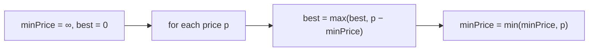

# Best Time to Buy and Sell Stock

> One transaction; track the minimum price. LC 121 · 🟢 Easy

## Problem
Given daily prices, buy on one day and sell on a later day to maximize profit. Return the best profit, or 0 if none.

## 🧮 Math / Recurrence
Track the minimum price seen so far; the best profit ending at day `i`:

$$
profit = \max_i\big(price[i] - \min_{j \le i} price[j]\big)
$$

## 🧠 Logic
The optimal sell day pairs with the lowest price that came **before** it. Scanning left to right, we keep the running minimum buy price and the best `price − min` difference. One pass, constant memory — no need for a 2D table.



## 🔢 Iteration trace (`[7,1,5,3,6,4]`)
| p | minPrice | best |
|---|----------|------|
| 7 | 7 | 0 |
| 1 | 1 | 0 |
| 5 | 1 | 4 |
| 3 | 1 | 4 |
| 6 | 1 | **5** |
| 4 | 1 | 5 |

## 🐍 Python
```python
def max_profit(prices: list[int]) -> int:
    min_price = float("inf")
    best = 0
    for p in prices:
        best = max(best, p - min_price)
        min_price = min(min_price, p)
    return best


if __name__ == "__main__":
    print(max_profit([7, 1, 5, 3, 6, 4]))   # 5
```

## ⚙️ C++
```cpp
#include <algorithm>
#include <climits>
#include <iostream>
#include <vector>
using namespace std;

int maxProfit(vector<int>& prices) {
    int minPrice = INT_MAX, best = 0;
    for (int p : prices) {
        best = max(best, p - minPrice);
        minPrice = min(minPrice, p);
    }
    return best;
}

int main() {
    vector<int> prices = {7, 1, 5, 3, 6, 4};
    cout << maxProfit(prices) << "\n";   // 5
}
```

## ⏱️ Complexity
- **Time:** `O(n)`.
- **Space:** `O(1)`.
