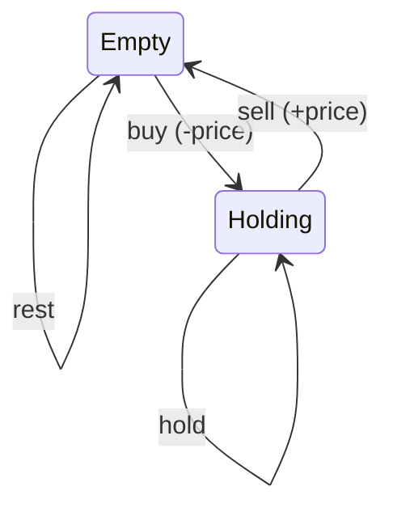

# Best Time to Buy and Sell Stock II

> Unlimited transactions; sum positive deltas. LC 122 · 🟡 Medium

## Problem
You may complete as many buy/sell transactions as you like (one at a time). Maximize total profit.

## 🧮 Math / Recurrence
Capture every upward move:

$$
profit = \sum_{i} \max\big(0,\ price[i+1] - price[i]\big)
$$

Equivalently, the state-machine form: $hold = \max(hold, empty - p)$, $empty = \max(empty, hold + p)$.

## 🧠 Logic
With unlimited transactions, any rising segment can be harvested by buying at its bottom and selling at its top. Summing all positive day-to-day differences `p[i+1] − p[i]` captures exactly that total (telescoping over each rise). The greedy is provably optimal because consecutive gains can always be decomposed into single-day steps.



## 🔢 Iteration trace (`[7,1,5,3,6,4]`)
- (5−1) + (6−3) = 4 + 3 = **7**.

## 🐍 Python
```python
def max_profit(prices: list[int]) -> int:
    return sum(max(0, prices[i + 1] - prices[i]) for i in range(len(prices) - 1))


if __name__ == "__main__":
    print(max_profit([7, 1, 5, 3, 6, 4]))   # 7
```

## ⚙️ C++
```cpp
#include <algorithm>
#include <iostream>
#include <vector>
using namespace std;

int maxProfit(vector<int>& prices) {
    int profit = 0;
    for (size_t i = 1; i < prices.size(); ++i)
        profit += max(0, prices[i] - prices[i - 1]);
    return profit;
}

int main() {
    vector<int> prices = {7, 1, 5, 3, 6, 4};
    cout << maxProfit(prices) << "\n";   // 7
}
```

## ⏱️ Complexity
- **Time:** `O(n)`.
- **Space:** `O(1)`.
