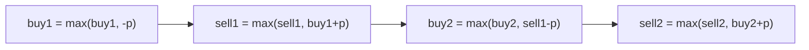

# Best Time to Buy and Sell Stock III

> At most 2 transactions; 4 interleaved states. LC 123 · 🔴 Hard

## Problem
Maximize profit with **at most two** buy/sell transactions (you must sell before buying again).

## 🧮 Math / Recurrence
Track four running states per day:

$$
\begin{aligned}
buy_1 &= \max(buy_1,\ -p) \\
sell_1 &= \max(sell_1,\ buy_1 + p) \\
buy_2 &= \max(buy_2,\ sell_1 - p) \\
sell_2 &= \max(sell_2,\ buy_2 + p)
\end{aligned}
$$

## 🧠 Logic
The second buy builds on whatever profit the first sale banked, so `buy2` subtracts the price from `sell1`. Updating the four states in order each day lets a later state immediately use the just-improved earlier state (valid because doing both on the same day is a no-op). `sell2` is the answer — it also covers the "use only one transaction" case since `sell2 ≥ sell1`.



## 🔢 Iteration trace (`[3,3,5,0,0,3,1,4]`)
- Buy 3→sell 5 (2), buy 0→sell 4 (4) → **6**.

## 🐍 Python
```python
def max_profit(prices: list[int]) -> int:
    buy1 = buy2 = float("-inf")
    sell1 = sell2 = 0
    for p in prices:
        buy1 = max(buy1, -p)
        sell1 = max(sell1, buy1 + p)
        buy2 = max(buy2, sell1 - p)
        sell2 = max(sell2, buy2 + p)
    return sell2


if __name__ == "__main__":
    print(max_profit([3, 3, 5, 0, 0, 3, 1, 4]))   # 6
```

## ⚙️ C++
```cpp
#include <algorithm>
#include <climits>
#include <iostream>
#include <vector>
using namespace std;

int maxProfit(vector<int>& prices) {
    int buy1 = INT_MIN, buy2 = INT_MIN, sell1 = 0, sell2 = 0;
    for (int p : prices) {
        buy1 = max(buy1, -p);
        sell1 = max(sell1, buy1 + p);
        buy2 = max(buy2, sell1 - p);
        sell2 = max(sell2, buy2 + p);
    }
    return sell2;
}

int main() {
    vector<int> prices = {3, 3, 5, 0, 0, 3, 1, 4};
    cout << maxProfit(prices) << "\n";   // 6
}
```

## ⏱️ Complexity
- **Time:** `O(n)`.
- **Space:** `O(1)`.
