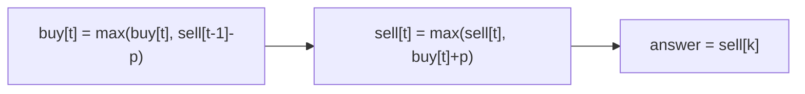

# Best Time to Buy and Sell Stock IV

> At most k transactions; dp[k][hold]. LC 188 · 🔴 Hard

## Problem
Maximize profit with **at most `k`** buy/sell transactions.

## 🧮 Math / Recurrence
Generalize the 4-state version to `k` levels of `buy[t]`/`sell[t]`:

$$
buy[t] = \max(buy[t],\ sell[t-1] - p),\qquad sell[t] = \max(sell[t],\ buy[t] + p)
$$

If `k ≥ n/2`, transactions are effectively unlimited.

## 🧠 Logic
Each transaction tier `t` reuses the profit from tier `t−1` (its `sell[t-1]`). We sweep prices, updating tiers `1..k` so a later buy can build on an earlier sell. When `k` is at least half the days, no constraint binds, so we shortcut to the "sum of positive deltas" unlimited solution to avoid an `O(nk)` blowup.



## 🔢 Iteration trace (`k=2`, `[3,2,6,5,0,3]`)
- Buy 2→sell 6 (4), buy 0→sell 3 (3) → **7**.

## 🐍 Python
```python
def max_profit(k: int, prices: list[int]) -> int:
    if not prices:
        return 0
    if k >= len(prices) // 2:               # unlimited
        return sum(max(0, prices[i + 1] - prices[i]) for i in range(len(prices) - 1))
    buy = [float("-inf")] * (k + 1)
    sell = [0] * (k + 1)
    for p in prices:
        for t in range(1, k + 1):
            buy[t] = max(buy[t], sell[t - 1] - p)
            sell[t] = max(sell[t], buy[t] + p)
    return sell[k]


if __name__ == "__main__":
    print(max_profit(2, [3, 2, 6, 5, 0, 3]))   # 7
```

## ⚙️ C++
```cpp
#include <algorithm>
#include <climits>
#include <iostream>
#include <vector>
using namespace std;

int maxProfit(int k, vector<int>& prices) {
    int n = prices.size();
    if (n == 0) return 0;
    if (k >= n / 2) {
        int profit = 0;
        for (int i = 1; i < n; ++i) profit += max(0, prices[i] - prices[i - 1]);
        return profit;
    }
    vector<int> buy(k + 1, INT_MIN), sell(k + 1, 0);
    for (int p : prices)
        for (int t = 1; t <= k; ++t) {
            buy[t] = max(buy[t], sell[t - 1] - p);
            sell[t] = max(sell[t], buy[t] + p);
        }
    return sell[k];
}

int main() {
    vector<int> prices = {3, 2, 6, 5, 0, 3};
    cout << maxProfit(2, prices) << "\n";   // 7
}
```

## ⏱️ Complexity
- **Time:** `O(n · k)`.
- **Space:** `O(k)`.
