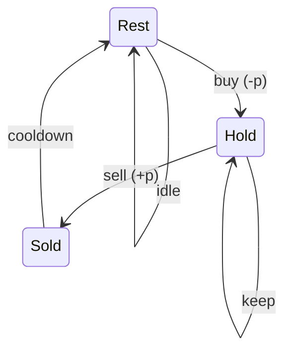

# Best Time to Buy and Sell Stock with Cooldown

> 3 states: hold / sold / rest. LC 309 · 🟡 Medium

## Problem
Unlimited transactions, but after you **sell** you must cool down one day before buying again. Maximize profit.

## 🧮 Math / Recurrence
Three daily states:

$$
\begin{aligned}
hold &= \max(hold,\ rest - p) \\
sold &= hold + p \\
rest &= \max(rest,\ sold)
\end{aligned}
$$

Answer: $\max(sold, rest)$.

## 🧠 Logic
The cooldown makes "can I buy today?" depend on whether I **sold yesterday**. Splitting the empty state into `sold` (just sold, must rest tomorrow) and `rest` (idle, free to buy) captures this: you may only buy from `rest`. Computing `sold` from the *previous* `hold` and `rest` from the previous `sold`/`rest` enforces the one-day gap.



## 🔢 Iteration trace (`[1,2,3,0,2]`)
- Buy 1→sell 2 (1), cooldown, buy 0→sell 2 (2) → **3**.

## 🐍 Python
```python
def max_profit(prices: list[int]) -> int:
    hold = float("-inf")
    sold = 0
    rest = 0
    for p in prices:
        prev_sold = sold
        sold = hold + p
        hold = max(hold, rest - p)
        rest = max(rest, prev_sold)
    return max(sold, rest)


if __name__ == "__main__":
    print(max_profit([1, 2, 3, 0, 2]))   # 3
```

## ⚙️ C++
```cpp
#include <algorithm>
#include <climits>
#include <iostream>
#include <vector>
using namespace std;

int maxProfit(vector<int>& prices) {
    int hold = INT_MIN, sold = 0, rest = 0;
    for (int p : prices) {
        int prevSold = sold;
        sold = hold + p;
        hold = max(hold, rest - p);
        rest = max(rest, prevSold);
    }
    return max(sold, rest);
}

int main() {
    vector<int> prices = {1, 2, 3, 0, 2};
    cout << maxProfit(prices) << "\n";   // 3
}
```

## ⏱️ Complexity
- **Time:** `O(n)`.
- **Space:** `O(1)`.
