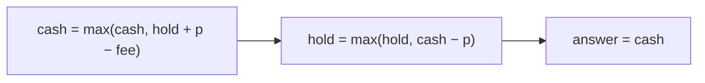

# Best Time to Buy and Sell Stock with Transaction Fee

> Unlimited transactions, fee on each sell. LC 714 · 🟡 Medium

## Problem
Unlimited transactions, but each completed transaction costs a fixed `fee`. Maximize net profit.

## 🧮 Math / Recurrence
Two states, `cash` (no stock) and `hold` (own stock):

$$
\begin{aligned}
cash &= \max(cash,\ hold + p - fee) \\
hold &= \max(hold,\ cash - p)
\end{aligned}
$$

## 🧠 Logic
Like the unlimited case, but we subtract `fee` once per sell (folded into the `cash` transition). `cash` is the best profit holding nothing; `hold` the best while owning a share. Charging the fee on sale (rather than buy) avoids double counting and naturally discourages taking gains smaller than the fee.



## 🔢 Iteration trace (`[1,3,2,8,4,9]`, fee 2)
- Buy 1→sell 8 (5), buy 4→sell 9 (3) → **8**.

## 🐍 Python
```python
def max_profit(prices: list[int], fee: int) -> int:
    cash = 0
    hold = -prices[0]
    for p in prices[1:]:
        cash = max(cash, hold + p - fee)
        hold = max(hold, cash - p)
    return cash


if __name__ == "__main__":
    print(max_profit([1, 3, 2, 8, 4, 9], 2))   # 8
```

## ⚙️ C++
```cpp
#include <algorithm>
#include <iostream>
#include <vector>
using namespace std;

int maxProfit(vector<int>& prices, int fee) {
    int cash = 0, hold = -prices[0];
    for (size_t i = 1; i < prices.size(); ++i) {
        cash = max(cash, hold + prices[i] - fee);
        hold = max(hold, cash - prices[i]);
    }
    return cash;
}

int main() {
    vector<int> prices = {1, 3, 2, 8, 4, 9};
    cout << maxProfit(prices, 2) << "\n";   // 8
}
```

## ⏱️ Complexity
- **Time:** `O(n)`.
- **Space:** `O(1)`.
