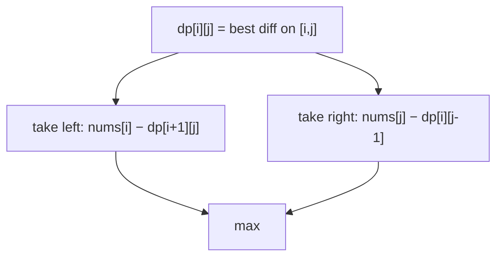

# Predict the Winner

> Score-difference minimax DP. LC 486 · 🟡 Medium

## Problem
Two players alternately take a number from either **end** of `nums`, adding it to their score. Player 1 moves first. Return `true` if player 1 can guarantee a win (tie counts as a win).

## 🧮 Math / Recurrence
`dp[i][j]` = best score **difference** (current player − opponent) achievable on subarray `[i, j]`:

$$
dp[i][j] = \max\big(nums[i] - dp[i+1][j],\ nums[j] - dp[i][j-1]\big)
$$

Player 1 wins iff `dp[0][n-1] ≥ 0`.

## 🧠 Logic
Modeling the **difference** turns the two-player optimization into a single recurrence: whatever the current player gains, the opponent then plays optimally on the remainder, so we subtract the opponent's best difference. Taking the left end gives `nums[i] − dp[i+1][j]`; the right end gives `nums[j] − dp[i][j-1]`. We fill by increasing interval length since `dp[i][j]` needs shorter intervals.



## 🔢 Iteration trace (`[1,5,2]`)
- Player 1 best diff = −2 < 0 → **False**.

## 🐍 Python
```python
def predict_the_winner(nums: list[int]) -> bool:
    n = len(nums)
    dp = nums[:]                              # dp[j] for length-1 intervals
    for i in range(n - 1, -1, -1):
        nxt = dp[:]
        for j in range(i + 1, n):
            nxt[j] = max(nums[i] - nxt[j], nums[j] - dp[j - 1])
        dp = nxt
    return dp[n - 1] >= 0


if __name__ == "__main__":
    print(predict_the_winner([1, 5, 2]))   # False
```

## ⚙️ C++
```cpp
#include <algorithm>
#include <iostream>
#include <vector>
using namespace std;

bool predictTheWinner(vector<int>& nums) {
    int n = nums.size();
    vector<int> dp(nums);
    for (int i = n - 1; i >= 0; --i) {
        vector<int> nxt = dp;
        for (int j = i + 1; j < n; ++j)
            nxt[j] = max(nums[i] - nxt[j], nums[j] - dp[j - 1]);
        dp = nxt;
    }
    return dp[n - 1] >= 0;
}

int main() {
    vector<int> nums = {1, 5, 2};
    cout << boolalpha << predictTheWinner(nums) << "\n";   // false
}
```

## ⏱️ Complexity
- **Time:** `O(n²)`.
- **Space:** `O(n)`.
