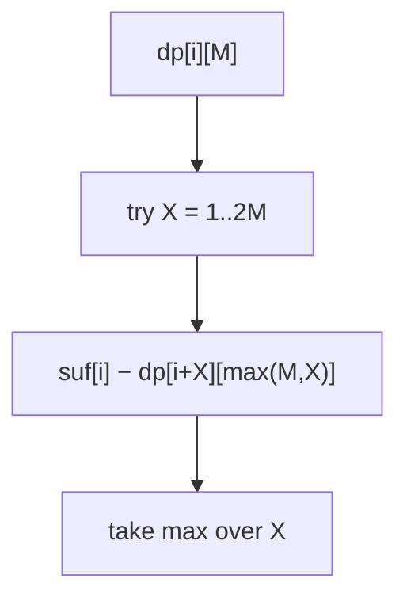

# Stone Game II

> dp[i][M] with variable take size. LC 1140 · 🔴 Hard

## Problem
Piles in a row. On each turn a player may take the first `X` piles where `1 ≤ X ≤ 2M`; then `M` becomes `max(M, X)`. Both play optimally. Return the maximum stones Alice can get.

## 🧮 Math / Recurrence
Use suffix sums `suf[i]`. `dp[i][M]` = the **maximum** stones the current player can secure from piles `i..` with parameter `M`:

$$
dp[i][M] = \max_{1 \le X \le 2M}\big(suf[i] - dp[i+X][\max(M, X)]\big)
$$

## 🧠 Logic
Taking `X` piles, the current player collects `suf[i] − suf[i+X]` now, then the opponent optimally plays `dp[i+X][max(M,X)]` on the rest. Maximizing "my total" = `suf[i] − (opponent's optimum)`, since the opponent will take the best they can from the remaining suffix. `M` can only grow, bounded by `n`, so the state space is `O(n²)`.



## 🔢 Iteration trace (`[2,7,9,4,4]`)
- Optimal play → Alice gets **10**.

## 🐍 Python
```python
from functools import lru_cache

def stone_game_ii(piles: list[int]) -> int:
    n = len(piles)
    suf = [0] * (n + 1)
    for i in range(n - 1, -1, -1):
        suf[i] = suf[i + 1] + piles[i]

    @lru_cache(maxsize=None)
    def dp(i: int, m: int) -> int:
        if i >= n:
            return 0
        if i + 2 * m >= n:                    # can take everything
            return suf[i]
        best = 0
        for x in range(1, 2 * m + 1):
            best = max(best, suf[i] - dp(i + x, max(m, x)))
        return best

    return dp(0, 1)


if __name__ == "__main__":
    print(stone_game_ii([2, 7, 9, 4, 4]))   # 10
```

## ⚙️ C++
```cpp
#include <algorithm>
#include <iostream>
#include <vector>
using namespace std;

int n;
vector<int> suf;
vector<vector<int>> memo;

int dp(int i, int m) {
    if (i >= n) return 0;
    if (i + 2 * m >= n) return suf[i];
    int& res = memo[i][m];
    if (res != -1) return res;
    res = 0;
    for (int x = 1; x <= 2 * m; ++x)
        res = max(res, suf[i] - dp(i + x, max(m, x)));
    return res;
}

int stoneGameII(vector<int>& piles) {
    n = piles.size();
    suf.assign(n + 1, 0);
    for (int i = n - 1; i >= 0; --i) suf[i] = suf[i + 1] + piles[i];
    memo.assign(n + 1, vector<int>(n + 1, -1));
    return dp(0, 1);
}

int main() {
    vector<int> piles = {2, 7, 9, 4, 4};
    cout << stoneGameII(piles) << "\n";   // 10
}
```

## ⏱️ Complexity
- **Time:** `O(n³)` (states `n²`, each transition `O(n)`).
- **Space:** `O(n²)`.
