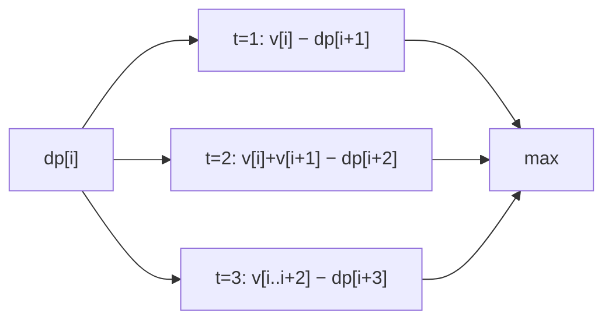

# Stone Game III

> Take 1–3 from the front; score-diff. LC 1406 · 🔴 Hard

## Problem
Stones in a row with values (may be negative). Each turn a player takes the first **1, 2, or 3** stones. Both play optimally. Return `"Alice"`, `"Bob"`, or `"Tie"`.

## 🧮 Math / Recurrence
`dp[i]` = best score **difference** (current player − opponent) on the suffix starting at `i`:

$$
dp[i] = \max_{t \in \{1,2,3\}}\Big(\sum_{k=i}^{i+t-1} v[k] - dp[i+t]\Big)
$$

## 🧠 Logic
Take-and-subtract minimax on a one-dimensional suffix: the player grabs a prefix of 1–3 stones (gaining their sum) and hands the opponent the optimal `dp[i+t]` on the rest, which we subtract. `dp[0] > 0` ⇒ Alice; `< 0` ⇒ Bob; `0` ⇒ Tie. Computed right to left in `O(n)` since each state looks at the next three.



## 🔢 Iteration trace (`[1,2,3,7]`)
- Best diff for Alice is negative → **"Bob"**.

## 🐍 Python
```python
def stone_game_iii(stone_value: list[int]) -> str:
    n = len(stone_value)
    dp = [0] * (n + 1)
    for i in range(n - 1, -1, -1):
        take = 0
        best = float("-inf")
        for t in range(3):
            if i + t < n:
                take += stone_value[i + t]
                best = max(best, take - dp[i + t + 1])
        dp[i] = best
    if dp[0] > 0:
        return "Alice"
    if dp[0] < 0:
        return "Bob"
    return "Tie"


if __name__ == "__main__":
    print(stone_game_iii([1, 2, 3, 7]))   # Bob
```

## ⚙️ C++
```cpp
#include <algorithm>
#include <iostream>
#include <string>
#include <vector>
using namespace std;

string stoneGameIII(vector<int>& stoneValue) {
    int n = stoneValue.size();
    vector<int> dp(n + 1, 0);
    for (int i = n - 1; i >= 0; --i) {
        int take = 0, best = INT_MIN;
        for (int t = 0; t < 3 && i + t < n; ++t) {
            take += stoneValue[i + t];
            best = max(best, take - dp[i + t + 1]);
        }
        dp[i] = best;
    }
    if (dp[0] > 0) return "Alice";
    if (dp[0] < 0) return "Bob";
    return "Tie";
}

int main() {
    vector<int> v = {1, 2, 3, 7};
    cout << stoneGameIII(v) << "\n";   // Bob
}
```

## ⏱️ Complexity
- **Time:** `O(n)`.
- **Space:** `O(n)`.
