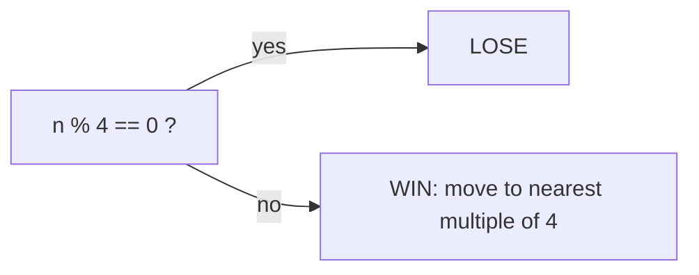

# Nim Game

> Sprague–Grundy: lose iff n % 4 == 0. LC 292 · 🟢 Easy

## Problem
A heap of `n` stones; on each turn remove 1, 2, or 3 stones. The player who removes the last stone **wins**. You move first. Can you win with optimal play?

## 🧮 Math / Recurrence
The losing (P) positions are exactly the multiples of 4:

$$
win(n) = (n \bmod 4 \ne 0)
$$

Inductively, $win(n) = \neg\big(win(n-1) \land win(n-2) \land win(n-3)\big)$.

## 🧠 Logic
A position is a **win** if at least one move leads to a losing position for the opponent. Base: `n=0` is a loss (no move). For `n=1,2,3` you take all → win. For `n=4`, every move (leaving 1/2/3) hands the opponent a winning position, so `n=4` loses. The pattern repeats every 4 — whoever faces a multiple of 4 loses. Constant time via `n % 4`.



## 🔢 Iteration trace
- `n=4` → lose; `n=7` → take 3, leave 4 → **win**.

## 🐍 Python
```python
def can_win_nim(n: int) -> bool:
    return n % 4 != 0


if __name__ == "__main__":
    print(can_win_nim(4))   # False
    print(can_win_nim(7))   # True
```

## ⚙️ C++
```cpp
#include <iostream>
using namespace std;

bool canWinNim(int n) {
    return n % 4 != 0;
}

int main() {
    cout << boolalpha << canWinNim(4) << "\n";   // false
    cout << boolalpha << canWinNim(7) << "\n";   // true
}
```

## ⏱️ Complexity
- **Time:** `O(1)`.
- **Space:** `O(1)`.
