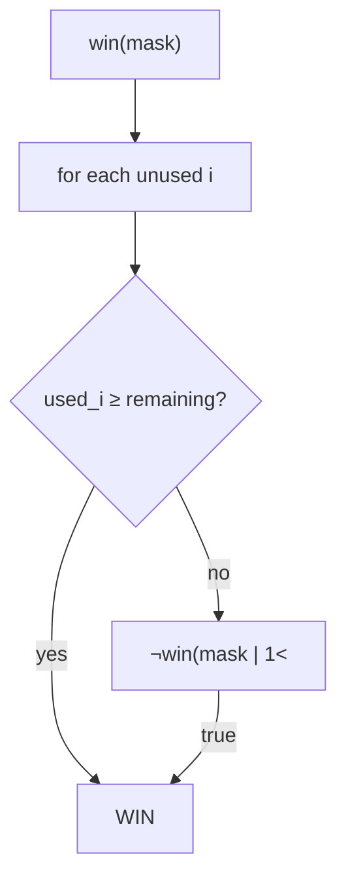

# Can I Win

> Bitmask memo of used numbers. LC 464 · 🔴 Hard

## Problem
Two players draw (without replacement) from integers `1..maxChoosable`, adding to a shared running total. The player who makes the total reach or exceed `desiredTotal` **wins**. Can the first player force a win?

## 🧮 Math / Recurrence
State = bitmask of already-used numbers. The current player wins if some unused `i` either reaches the target or forces the opponent to lose:

$$
win(mask) = \exists\, i \notin mask : \big(used_i \ge remaining\big) \lor \neg\, win(mask \,|\, (1 \ll i))
$$

## 🧠 Logic
The remaining total needed is determined by the chosen set, so the mask fully captures the state. The current player tries each unused number `i`: if `i` immediately meets the remaining target, they win; otherwise they win if it leaves the opponent in a losing position. Memoizing over the `2^{maxChoosable}` masks avoids recomputation. Early-out: if the sum of all numbers `< desiredTotal`, nobody can win → `False`.



## 🔢 Iteration trace (`maxChoosable=10`, `desiredTotal=11`)
- First player cannot force a win → **False**.

## 🐍 Python
```python
from functools import lru_cache

def can_i_win(max_choosable: int, desired_total: int) -> bool:
    if desired_total <= 0:
        return True
    if max_choosable * (max_choosable + 1) // 2 < desired_total:
        return False

    @lru_cache(maxsize=None)
    def win(mask: int, remaining: int) -> bool:
        for i in range(1, max_choosable + 1):
            bit = 1 << i
            if not (mask & bit):
                if i >= remaining or not win(mask | bit, remaining - i):
                    return True
        return False

    return win(0, desired_total)


if __name__ == "__main__":
    print(can_i_win(10, 11))   # False
```

## ⚙️ C++
```cpp
#include <iostream>
#include <unordered_map>
using namespace std;

int maxC;
unordered_map<int, bool> memo;

bool win(int mask, int remaining) {
    if (memo.count(mask)) return memo[mask];
    for (int i = 1; i <= maxC; ++i) {
        int bit = 1 << i;
        if (!(mask & bit))
            if (i >= remaining || !win(mask | bit, remaining - i))
                return memo[mask] = true;
    }
    return memo[mask] = false;
}

bool canIWin(int maxChoosable, int desiredTotal) {
    if (desiredTotal <= 0) return true;
    if (maxChoosable * (maxChoosable + 1) / 2 < desiredTotal) return false;
    maxC = maxChoosable;
    memo.clear();
    return win(0, desiredTotal);
}

int main() {
    cout << boolalpha << canIWin(10, 11) << "\n";   // false
}
```

## ⏱️ Complexity
- **Time:** `O(2^{maxChoosable} · maxChoosable)`.
- **Space:** `O(2^{maxChoosable})`.
