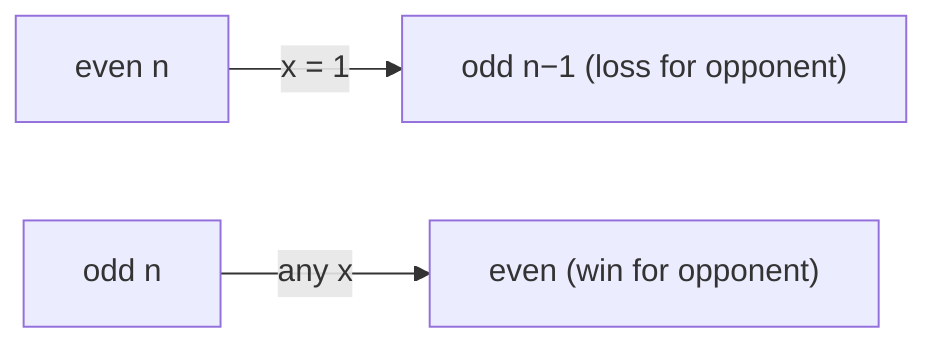

# Divisor Game

> Parity argument. LC 1025 · 🟢 Easy

## Problem
Starting with integer `n`, players alternate choosing `0 < x < n` with `n % x == 0`, then replace `n` with `n − x`. A player who cannot move **loses**. Alice moves first. Does Alice win?

## 🧮 Math / Recurrence
Alice wins iff `n` is even:

$$
win(n) = (n \bmod 2 == 0)
$$

Inductively, `win(n) = ∃ x | n, x<n : ¬win(n−x)`.

## 🧠 Logic
From an **even** `n`, choosing `x = 1` leaves an **odd** `n−1` for the opponent. From any **odd** `n`, every divisor `x` is odd, so `n − x` is even — the opponent always receives an even number. Since `n=1` (odd) is an immediate loss, even positions are wins and odd positions are losses. Hence the answer is simply the parity of `n`.



## 🔢 Iteration trace
- `n=2` → Alice picks 1, Bob stuck → **True**. `n=3` → **False**.

## 🐍 Python
```python
def divisor_game(n: int) -> bool:
    return n % 2 == 0


if __name__ == "__main__":
    print(divisor_game(2))   # True
    print(divisor_game(3))   # False
```

## ⚙️ C++
```cpp
#include <iostream>
using namespace std;

bool divisorGame(int n) {
    return n % 2 == 0;
}

int main() {
    cout << boolalpha << divisorGame(2) << "\n";   // true
    cout << boolalpha << divisorGame(3) << "\n";   // false
}
```

## ⏱️ Complexity
- **Time:** `O(1)`.
- **Space:** `O(1)`.
