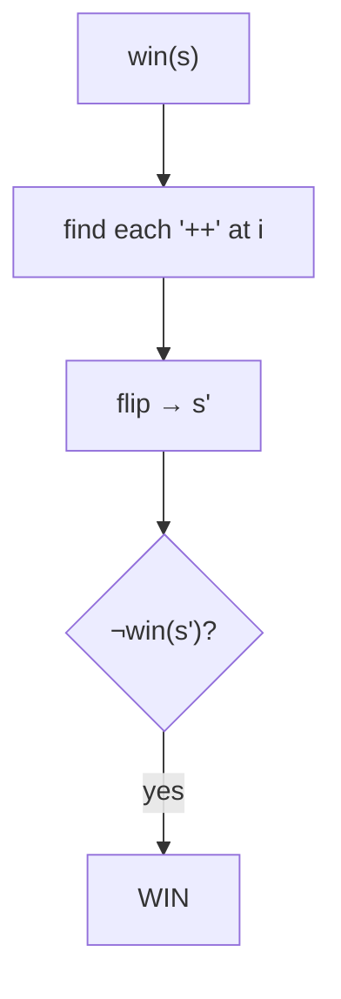

# Flip Game II

> Memo over board states. LC 294 · 🟡 Medium

## Problem
Given a string of `'+'` and `'-'`, a move flips any `"++"` into `"--"`. Players alternate; a player who cannot move loses. Return `true` if the **first** player can guarantee a win.

## 🧮 Math / Recurrence
The current player wins if some move leaves the opponent in a losing position:

$$
win(s) = \exists\, i : s[i{:}i{+}2] = \texttt{"++"} \ \land\ \neg\, win(\text{flip}(s, i))
$$

## 🧠 Logic
Each board string is a game state. The current player scans for every `"++"`, flips it to `"--"`, and recurses; if **any** resulting position is a loss for the opponent, the current player wins. Memoizing on the string prunes repeated states. (For tighter bounds one can use Sprague–Grundy on segment lengths, but the direct memoized search is clear and sufficient.)



## 🔢 Iteration trace (`"++++"`)
- First player can force a win → **True**.

## 🐍 Python
```python
from functools import lru_cache

def can_win(current_state: str) -> bool:
    @lru_cache(maxsize=None)
    def win(s: str) -> bool:
        for i in range(len(s) - 1):
            if s[i] == "+" and s[i + 1] == "+":
                nxt = s[:i] + "--" + s[i + 2:]
                if not win(nxt):
                    return True
        return False

    return win(current_state)


if __name__ == "__main__":
    print(can_win("++++"))   # True
```

## ⚙️ C++
```cpp
#include <iostream>
#include <string>
#include <unordered_map>
using namespace std;

unordered_map<string, bool> memo;

bool win(string s) {
    auto it = memo.find(s);
    if (it != memo.end()) return it->second;
    for (size_t i = 0; i + 1 < s.size(); ++i)
        if (s[i] == '+' && s[i + 1] == '+') {
            string nxt = s;
            nxt[i] = nxt[i + 1] = '-';
            if (!win(nxt)) return memo[s] = true;
        }
    return memo[s] = false;
}

int main() {
    cout << boolalpha << win("++++") << "\n";   // true
}
```

## ⏱️ Complexity
- **Time:** exponential in the number of `'+'` positions (mitigated by memoization).
- **Space:** `O(\text{distinct states})`.
