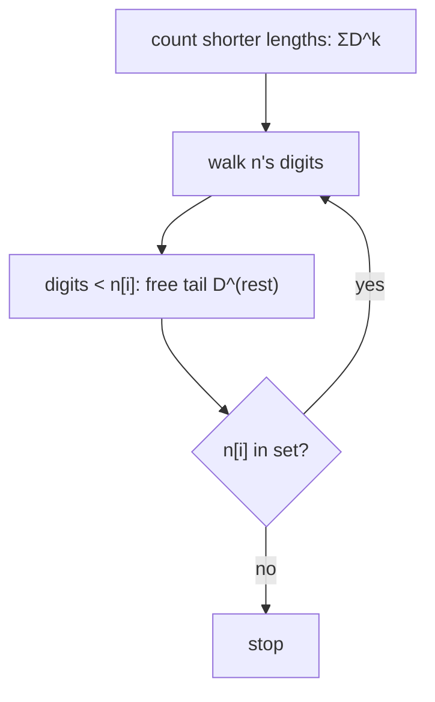

# Numbers At Most N Given Digit Set

> Digit DP over an allowed set. LC 902 · 🔴 Hard

## Problem
Given a sorted set of digit characters `digits` and integer `n`, count positive integers (any length ≥ 1) formed only from those digits whose value is `≤ n`.

## 🧮 Math / Recurrence
Let `L` = number of digits in `n`, `D = |digits|`. Numbers with fewer digits than `L` are all valid:

$$
\sum_{k=1}^{L-1} D^{k}
$$

Plus a tight count for exactly `L` digits, processing `n`'s digits left to right.

## 🧠 Logic
Shorter numbers can't exceed `n`, contributing `D^k` each. For equal length we walk `n`'s digits keeping a `tight` prefix: at position `i`, digits strictly **less** than `n[i]` let the remaining `L-1-i` positions range freely (`D^{L-1-i}` each). If `n[i]` itself is in the set we continue tight to the next position; if not, we stop. If we survive all positions tight, `n` itself (if buildable) counts as one more.



## 🔢 Iteration trace (`digits=["1","3","5","7"]`, `n=100`)
- Lengths 1 (4) + 2 (16) = **20** (no 3-digit number ≤ 100 is buildable).

## 🐍 Python
```python
def at_most_n_given_digit_set(digits: list[str], n: int) -> int:
    s = str(n)
    L = len(s)
    D = len(digits)
    digit_set = set(digits)

    total = sum(D ** k for k in range(1, L))   # shorter lengths

    for i, ch in enumerate(s):
        smaller = sum(1 for d in digits if d < ch)
        total += smaller * (D ** (L - i - 1))
        if ch not in digit_set:
            return total
    return total + 1                            # n itself is buildable


if __name__ == "__main__":
    print(at_most_n_given_digit_set(["1", "3", "5", "7"], 100))   # 20
```

## ⚙️ C++
```cpp
#include <iostream>
#include <string>
#include <vector>
using namespace std;

int atMostNGivenDigitSet(vector<string>& digits, int n) {
    string s = to_string(n);
    int L = s.size(), D = digits.size(), total = 0;
    for (int k = 1; k < L; ++k) {
        int p = 1;
        for (int j = 0; j < k; ++j) p *= D;
        total += p;
    }
    for (int i = 0; i < L; ++i) {
        int smaller = 0; bool match = false;
        for (auto& d : digits) {
            if (d[0] < s[i]) ++smaller;
            else if (d[0] == s[i]) match = true;
        }
        int p = 1;
        for (int j = 0; j < L - i - 1; ++j) p *= D;
        total += smaller * p;
        if (!match) return total;
    }
    return total + 1;
}

int main() {
    vector<string> digits = {"1", "3", "5", "7"};
    cout << atMostNGivenDigitSet(digits, 100) << "\n";   // 20
}
```

## ⏱️ Complexity
- **Time:** `O(L · D)`.
- **Space:** `O(1)`.
