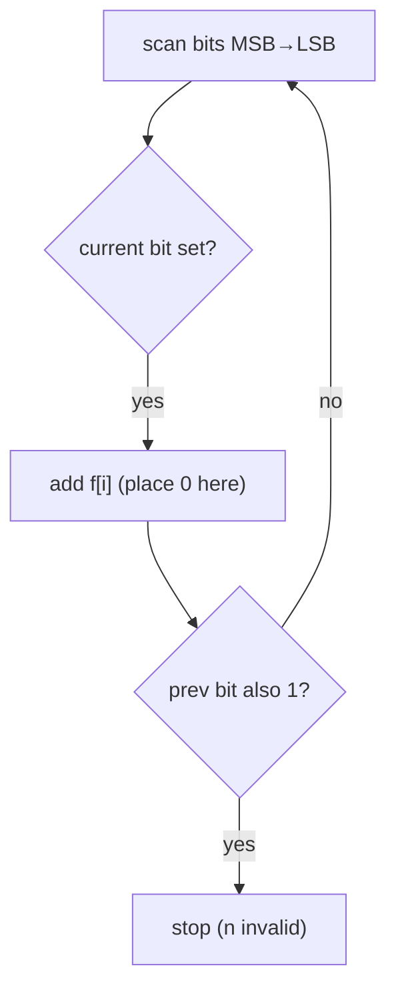

# Non-negative Integers without Consecutive Ones

> Digit DP on the binary representation. LC 600 · 🔴 Hard

## Problem
Given `n`, count integers `x` with `0 ≤ x ≤ n` whose **binary** representation has no two adjacent 1 bits.

## 🧮 Math / Recurrence
Let `f[i]` be Fibonacci-like counts of `i`-bit strings with no consecutive ones (`f[0]=1, f[1]=2, f[i]=f[i-1]+f[i-2]`). Scan `n`'s bits from MSB; whenever a set bit is found, add `f[i]` (fixing this bit to 0 frees the rest):

$$
answer = \sum_{\text{bit } i \text{ set in } n} f[i] \ (+1 \text{ if no consecutive ones in } n)
$$

## 🧠 Logic
Think of building `x` bit by bit, tighter than `n`. At a position where `n` has a `1`, we may instead place a `0` and let the remaining `i` lower bits be any valid no-consecutive-ones string — there are exactly `f[i]` of them (the Fibonacci recurrence counts such strings). We then continue assuming `x` matches `n`'s bit; if `n` itself has two consecutive 1s, that path dies (so we don't add the final `+1`). Tracking the previous bit detects the `11` break.



## 🔢 Iteration trace (`n=5` = 101b)
- Valid: 0,1,2,4,5 → **5**.

## 🐍 Python
```python
def find_integers(n: int) -> int:
    fib = [1, 2]
    for i in range(2, 32):
        fib.append(fib[-1] + fib[-2])
    result = 0
    prev_bit = 0
    for i in range(30, -1, -1):
        if n & (1 << i):
            result += fib[i]
            if prev_bit == 1:           # two consecutive 1s in n itself
                return result
            prev_bit = 1
        else:
            prev_bit = 0
    return result + 1                   # include n itself


if __name__ == "__main__":
    print(find_integers(5))   # 5
```

## ⚙️ C++
```cpp
#include <iostream>
#include <vector>
using namespace std;

int findIntegers(int n) {
    vector<int> fib(32);
    fib[0] = 1; fib[1] = 2;
    for (int i = 2; i < 32; ++i) fib[i] = fib[i - 1] + fib[i - 2];
    int result = 0, prevBit = 0;
    for (int i = 30; i >= 0; --i) {
        if (n & (1 << i)) {
            result += fib[i];
            if (prevBit == 1) return result;
            prevBit = 1;
        } else {
            prevBit = 0;
        }
    }
    return result + 1;
}

int main() {
    cout << findIntegers(5) << "\n";   // 5
}
```

## ⏱️ Complexity
- **Time:** `O(32)`.
- **Space:** `O(32)`.
