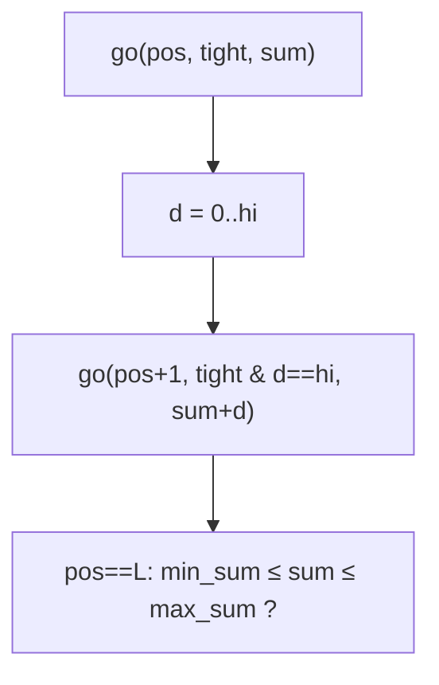

# Count of Integers (Digit-Sum in Range)

> Digit DP with a running sum state. LC 2719 · 🔴 Hard

## Problem
Count integers `x` with `num1 ≤ x ≤ num2` (given as strings) whose decimal **digit sum** lies in `[min_sum, max_sum]`, modulo `10^9 + 7`.

## 🧮 Math / Recurrence
Standard digit-DP carrying the running digit sum:

$$
go(pos, tight, sum) = \sum_{d=0}^{hi} go(pos+1,\ tight \land d{=}hi,\ sum+d)
$$

Answer for `[L, R]` = `count(R) − count(L−1)` filtered by `min_sum ≤ final_sum ≤ max_sum`.

## 🧠 Logic
We build the number digit by digit (MSB first), tracking `tight` (does the prefix equal the bound?) and the accumulated `sum`. At each position the digit ranges `0..hi` where `hi = bound[pos]` if tight else `9`. At the end we accept iff the sum is in range. Using the difference trick `f(num2) − f(num1 − 1)` handles the lower bound; here we compute `f(num2) − f(num1)` then add back `x = num1` if it qualifies (avoids big-int subtraction on the string).



## 🔢 Iteration trace (`num1="1"`, `num2="12"`, `min_sum=1`, `max_sum=8`)
- Valid x in [1,12] with digit-sum in [1,8] → **11**.

## 🐍 Python
```python
from functools import lru_cache

MOD = 10**9 + 7

def count(bound: str, min_sum: int, max_sum: int) -> int:
    digits = list(map(int, bound))
    L = len(digits)

    @lru_cache(maxsize=None)
    def go(pos: int, tight: bool, s: int) -> int:
        if s > max_sum:
            return 0
        if pos == L:
            return 1 if s >= min_sum else 0
        hi = digits[pos] if tight else 9
        total = 0
        for d in range(hi + 1):
            total += go(pos + 1, tight and d == hi, s + d)
        return total % MOD

    res = go(0, True, 0)
    go.cache_clear()
    return res

def count_of_integers(num1: str, num2: str, min_sum: int, max_sum: int) -> int:
    upper = count(num2, min_sum, max_sum)
    lower = count(num1, min_sum, max_sum)
    incl = 1 if min_sum <= sum(map(int, num1)) <= max_sum else 0
    return (upper - lower + incl) % MOD


if __name__ == "__main__":
    print(count_of_integers("1", "12", 1, 8))   # 11
```

## ⚙️ C++
```cpp
#include <cstring>
#include <iostream>
#include <string>
using namespace std;
const long long MOD = 1e9 + 7;

string B;
int Ln, MIN_S, MAX_S;
long long memo[24][2][400];
bool vis[24][2][400];

long long go(int pos, int tight, int s) {
    if (s > MAX_S) return 0;
    if (pos == Ln) return s >= MIN_S ? 1 : 0;
    if (vis[pos][tight][s]) return memo[pos][tight][s];
    vis[pos][tight][s] = true;
    int hi = tight ? B[pos] - '0' : 9;
    long long total = 0;
    for (int d = 0; d <= hi; ++d)
        total = (total + go(pos + 1, tight && d == hi, s + d)) % MOD;
    return memo[pos][tight][s] = total;
}

long long count(const string& bound, int mn, int mx) {
    B = bound; Ln = bound.size(); MIN_S = mn; MAX_S = mx;
    memset(vis, 0, sizeof vis);
    return go(0, 1, 0);
}

int countOfIntegers(string num1, string num2, int minSum, int maxSum) {
    long long upper = count(num2, minSum, maxSum);
    long long lower = count(num1, minSum, maxSum);
    int ds = 0; for (char c : num1) ds += c - '0';
    long long incl = (ds >= minSum && ds <= maxSum) ? 1 : 0;
    return (int)((upper - lower + incl + MOD) % MOD);
}

int main() {
    cout << countOfIntegers("1", "12", 1, 8) << "\n";   // 11
}
```

## ⏱️ Complexity
- **Time:** `O(L · 2 · maxSum · 10)`.
- **Space:** `O(L · maxSum)`.
