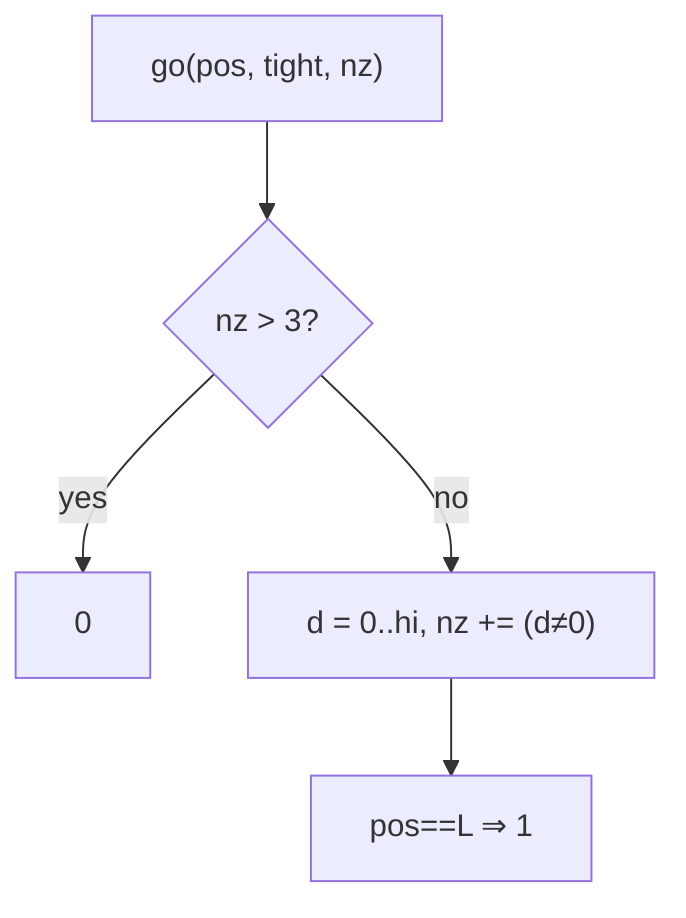

# Classy Numbers

> Digit DP: at most 3 nonzero digits. CF 1036C · 🔴 Hard

## Problem
A number is **classy** if it has at most **3** nonzero digits. For each query `[L, R]`, count classy integers in the range.

## 🧮 Math / Recurrence
Digit DP carrying the count of nonzero digits placed so far:

$$
go(pos, tight, nz) = \sum_{d=0}^{hi} go\big(pos+1,\ tight \land d{=}hi,\ nz + [d \ne 0]\big),\quad nz \le 3
$$

Answer for `[L, R]` = `count(R) − count(L−1)`.

## 🧠 Logic
Build the number digit by digit, tracking how many nonzero digits we've used (`nz`). Any digit that would push `nz` above 3 is pruned. `tight` bounds the current digit by the prefix of `N`. Leading zeros don't increment `nz`, so they're handled automatically. The range answer uses the prefix-count difference.



## 🔢 Iteration trace (`[1, 100]`)
- Every number ≤ 100 has ≤ 3 nonzero digits → **100**.

## 🐍 Python
```python
from functools import lru_cache

def count_classy(n: int) -> int:
    if n < 0:
        return 0
    digits = list(map(int, str(n)))
    L = len(digits)

    @lru_cache(maxsize=None)
    def go(pos: int, tight: bool, nz: int) -> int:
        if nz > 3:
            return 0
        if pos == L:
            return 1
        hi = digits[pos] if tight else 9
        total = 0
        for d in range(hi + 1):
            total += go(pos + 1, tight and d == hi, nz + (1 if d else 0))
        return total

    res = go(0, True, 0)
    go.cache_clear()
    return res

def classy_in_range(lo: int, hi: int) -> int:
    return count_classy(hi) - count_classy(lo - 1)


if __name__ == "__main__":
    print(classy_in_range(1, 100))   # 100
```

## ⚙️ C++
```cpp
#include <cstring>
#include <iostream>
#include <string>
#include <vector>
using namespace std;

vector<int> D;
int Ln;
long long memo[20][2][5];
bool vis[20][2][5];

long long go(int pos, int tight, int nz) {
    if (nz > 3) return 0;
    if (pos == Ln) return 1;
    if (vis[pos][tight][nz]) return memo[pos][tight][nz];
    vis[pos][tight][nz] = true;
    int hi = tight ? D[pos] : 9;
    long long total = 0;
    for (int d = 0; d <= hi; ++d)
        total += go(pos + 1, tight && d == hi, nz + (d ? 1 : 0));
    return memo[pos][tight][nz] = total;
}

long long countClassy(long long n) {
    if (n < 0) return 0;
    string s = to_string(n);
    D.assign(s.begin(), s.end());
    for (auto& c : D) c -= '0';
    Ln = D.size();
    memset(vis, 0, sizeof vis);
    return go(0, 1, 0);
}

int main() {
    cout << countClassy(100) - countClassy(0) << "\n";   // 100
}
```

## ⏱️ Complexity
- **Time:** `O(L · 4 · 10)` per query.
- **Space:** `O(L)`.
